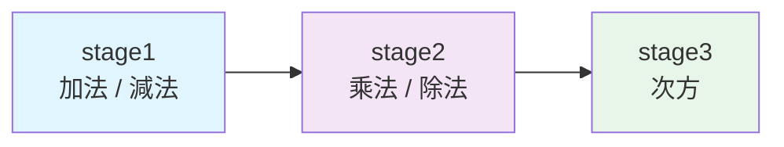

# 管線（Pipeline）概念說明

> **目標讀者**: 沒有硬體背景的軟體工程師

## 什麼是管線？

管線（pipeline）是一種將**複雜工作拆成多個階段，讓每個階段同時處理不同資料**的架構。

### 汽車工廠類比

想像一條汽車組裝線：

| 工作站 | 工作 | 耗時 |
|---|---|---|
| 站 1 | 焊接車架 | 1 小時 |
| 站 2 | 安裝引擎 | 1 小時 |
| 站 3 | 烤漆 | 1 小時 |

**不用管線**（一個工人做全部）：
- 完成一輛車需要 3 小時
- 每 3 小時才能出一輛車
- 吞吐量：0.33 輛/小時

**用管線**（三個工作站同時運作）：
- 完成**第一輛**車仍需 3 小時（延遲不變）
- 之後每 1 小時出一輛車（三個站同時處理不同的車）
- 吞吐量：1 輛/小時（提升 3 倍）

## 為什麼硬體需要管線？

在硬體中，管線的動機和工廠一樣：**不用更快的 clock 就能提升吞吐量**。

假設你有一個運算要花 30 ns 完成：

- **不用管線**：clock 週期至少 30 ns（33 MHz），每個 clock 完成一筆
- **拆成 3 級管線**：每級 10 ns，clock 週期 10 ns（100 MHz），穩定後每個 clock 完成一筆

吞吐量提升了 3 倍，但每筆資料從進入到出來仍然需要 30 ns（3 級 x 10 ns）。

## 管線時序圖

以本範例的三級管線為例，觀察三筆資料如何流過管線：

```mermaid
gantt
    title 三級管線時序 -- 三筆資料 (D1, D2, D3)
    dateFormat X
    axisFormat %s

    section D1（第一筆）
    stage1 (加減法)  : d1s1, 0, 1
    stage2 (乘除法)  : d1s2, 1, 2
    stage3 (次方)    : d1s3, 2, 3

    section D2（第二筆）
    等待              : d2w, 0, 1
    stage1 (加減法)  : d2s1, 1, 2
    stage2 (乘除法)  : d2s2, 2, 3

    section D3（第三筆）
    等待              : d3w, 0, 2
    stage1 (加減法)  : d3s1, 2, 3
```



- **Clock 1**：D1 在 stage1，D2 和 D3 還沒進入
- **Clock 2**：D1 進入 stage2，D2 進入 stage1（兩個 stage 同時工作）
- **Clock 3**：D1 進入 stage3，D2 進入 stage2，D3 進入 stage1（三個 stage 全部忙碌）

從 Clock 3 開始，管線達到**滿載（fully utilized）**，每個 clock 都有一筆結果產出。

## 管線的代價與風險

### 1. 延遲增加

雖然吞吐量提升了，但單筆資料的**延遲（latency）**反而可能增加，因為每一級之間需要暫存器（register）來儲存中間結果，這些暫存器本身有微小的延遲。

軟體類比：HTTP/2 multiplexing 增加了吞吐量，但每個 request 需要額外的 framing overhead。

### 2. 管線危障（Pipeline Hazards）

在真實的硬體中（尤其是 CPU），管線會遇到三種危障：

#### Data Hazard（資料危障）

下一級需要的資料還沒算出來。

```
指令 1: x = a + b        // stage1 正在算
指令 2: y = x * 2        // stage2 需要 x，但 x 還沒算完
```

軟體類比：race condition -- 一個 thread 寫，另一個 thread 讀，結果取決於執行順序。

#### Control Hazard（控制危障）

遇到條件分支，不確定下一筆該處理哪個資料。

```
if (condition) {
    // 走 A 路線
} else {
    // 走 B 路線
}
// 管線已經預先載入了 A 路線的資料，但如果走 B 就要丟棄重來
```

軟體類比：branch prediction failure -- 預測性地開始執行某個路徑，猜錯就要 rollback。

#### Structural Hazard（結構危障）

兩個 stage 同時需要同一個硬體資源。

軟體類比：resource contention -- 兩個 thread 同時需要同一把 lock。

> 注意：本範例（`pipe`）是純算術管線，沒有分支和回饋，所以**不存在這些危障**。這是刻意簡化的教學設計。

## 軟體世界的管線應用

### CPU 指令管線

現代 CPU 的核心就是一條管線：

| Stage | 工作 |
|---|---|
| Fetch | 從記憶體讀取指令 |
| Decode | 解碼指令，確定操作類型 |
| Execute | 執行運算 |
| Memory | 讀寫記憶體 |
| Write Back | 將結果寫回暫存器 |

這就是為什麼 CPU 的「IPC（Instructions Per Clock）」可以接近 1，即使每條指令需要 5 個步驟。

### GPU Shader Pipeline

GPU 的渲染管線也是典型的管線架構：

```
Vertex Shader -> Geometry Shader -> Rasterization -> Fragment Shader -> Output
```

每一級處理不同三角形的不同階段，數百萬個三角形同時在管線中流動。

### 軟體管線

| 應用 | 管線階段 |
|---|---|
| Unix pipe | `grep \| sort \| uniq \| head` |
| ETL | Extract -> Transform -> Load |
| CI/CD | Build -> Test -> Deploy |
| HTTP | Request -> Auth -> Route -> Handler -> Response |
| Middleware | Logging -> Auth -> CORS -> Business Logic |
| Compiler | Lexer -> Parser -> Optimizer -> Code Generator |

### 網路封包處理

網路設備（路由器、防火牆）處理每個封包的流程也是管線化的：

```
接收 -> 解析 Header -> 查表路由 -> 套用規則 -> 轉發
```

高速路由器每秒處理數十億個封包，靠的就是深度管線化。

## 本範例中的管線

回到 `pipe` 範例，它的三級管線是：



每一級都是 SC_METHOD，在 clock 正緣觸發。透過 `sc_signal` 傳遞資料，signal 的 delta cycle 延遲自然地形成了管線暫存器的效果。

這不是一個「實用」的計算管線，而是一個教學範例，讓你看到：

1. 模組如何拆分
2. Port 和 signal 如何連接
3. Clock 如何驅動所有 stage 同步運作
4. 資料如何像流水線一樣逐級流動
