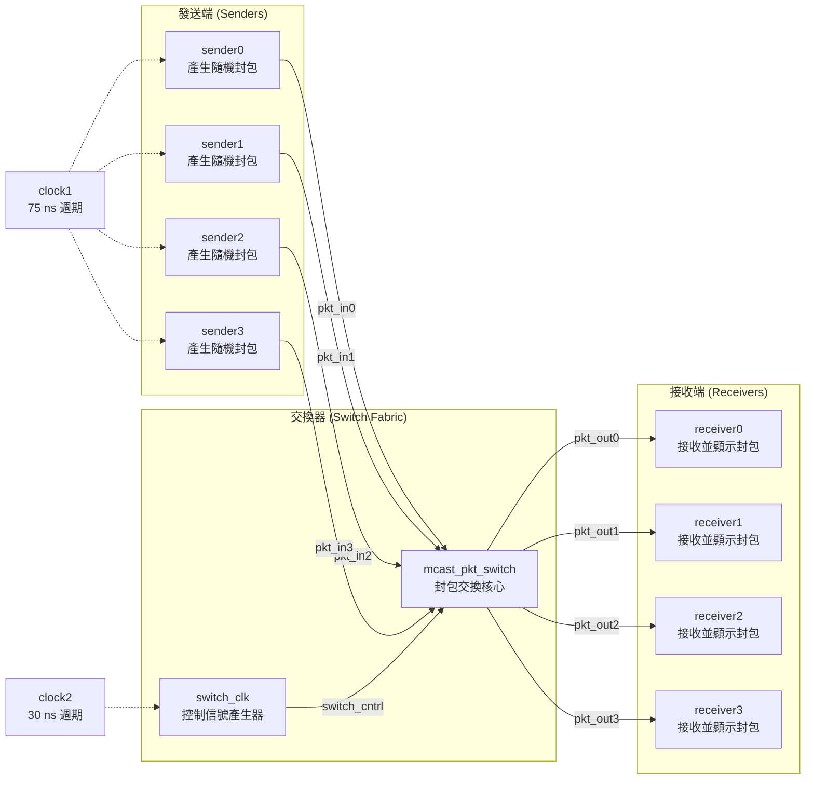
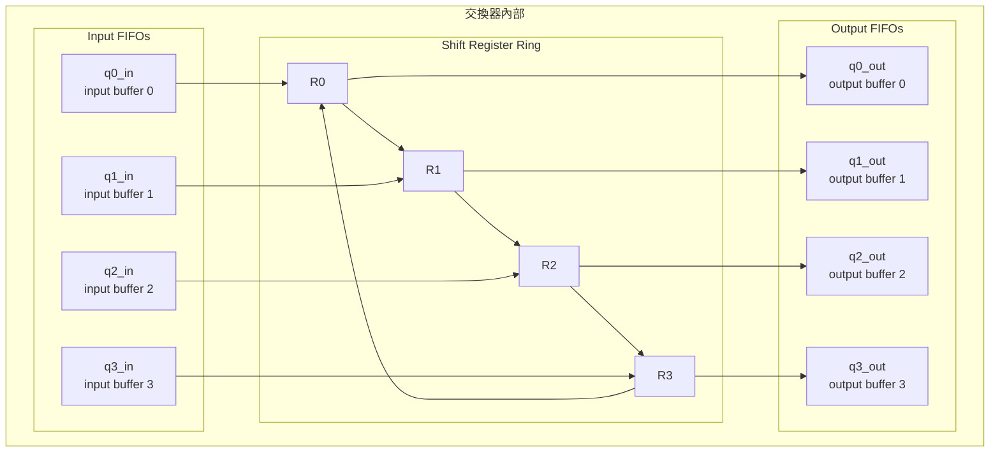

# Packet Switch 範例總覽 -- 4x4 多播封包交換器

## 軟體工程師的直覺

想像你正在設計一個 **訊息路由系統**（類似 RabbitMQ 的 exchange 搭配多個 queue）。你有 4 個生產者（producer）不斷送出訊息，每個訊息可以同時發送到 1 到 4 個消費者（consumer）。中間有一個路由器負責：

1. 接收來自所有生產者的訊息，暫存到 input buffer
2. 根據訊息上的目的地標記，將訊息分發到對應的 output buffer
3. 從 output buffer 送出訊息給消費者

這就是這個範例在做的事情 -- 用硬體的方式實作一個 **4x4 multicast packet switch**（多播封包交換器）。

**軟體類比**：這就像一個 **網路路由器** 或 **Ethernet switch**。每個 port 有 input/output buffer，中間的 switching fabric 負責將封包從來源 port 送到目的 port。與 RabbitMQ 的 fanout exchange 類似，一個封包可以同時被路由到多個目的地（multicast）。

## 系統架構

## Switch 內部架構 -- Helix Ring

交換器內部使用一個 **helix ring**（螺旋環）結構來路由封包。這個結構的核心是 4 個 shift register（R0-R3）組成的環形移位暫存器：

**運作原理**（用軟體的語言來說）：

1. **入列**：封包從 sender 進入對應的 input FIFO（就像訊息進入 queue）
2. **載入環**：如果 shift register 是空的，就從 input FIFO 取出封包放進去
3. **旋轉**：每個 switch clock 週期，4 個 register 的內容向下旋轉一格（R0->R1->R2->R3->R0）
4. **匹配輸出**：如果 R0 裡的封包要去 port 0，就複製一份到 output FIFO 0；R1 對 port 1 以此類推
5. **多播處理**：封包在 dest bit 被清除前會一直留在環中旋轉，直到所有目的地都送達
6. **出列**：output FIFO 將封包送給 receiver

## 檔案清單

| 檔案 | 用途 | 說明文件 |
|------|------|---------|
| [`pkt.h`](pkt.md) | 封包資料結構 | 定義 `pkt` struct，包含 data、sender id、destination bits |
| [`fifo.h`](fifo.md) / `fifo.cpp` | FIFO 佇列 | 4 格深度的封包緩衝區，用於 input/output buffering |
| [`switch_reg.h`](switch.md) | Shift register 結構 | 環形暫存器中每個位置的資料結構 |
| [`switch.h`](switch.md) / `switch.cpp` | 封包交換核心 | 主要的路由邏輯：input buffering、ring rotation、output matching |
| [`switch_clk.h`](switch.md) / `switch_clk.cpp` | Switch 時脈控制 | 產生交換器的控制信號（每隔一個 clock 觸發一次 rotation） |
| [`sender.h`](sender.md) / `sender.cpp` | 封包發送器 | 隨機產生封包並寫入 switch input port |
| [`receiver.h`](receiver.md) / `receiver.cpp` | 封包接收器 | 從 switch output port 讀取封包並印出 |
| [`main.cpp`](main.md) | 頂層測試平台 | 實例化所有模組、連接信號、啟動模擬 |

## 展示的關鍵概念

| SystemC 概念 | 在本範例中的用法 | 軟體類比 |
|-------------|----------------|---------|
| `SC_CTHREAD` | Sender 使用 clocked thread，在 clock 正緣觸發 | 定時排程的 worker thread |
| `SC_METHOD` | Receiver 和 switch_clk 使用 method，事件驅動 | Event callback / listener |
| `SC_THREAD` | Switch 使用 thread，可以 `wait()` 等待事件 | 長期運行的 Python coroutine (asyncio) |
| `sc_signal<pkt>` | 自定義 struct 作為信號型別 | Typed message channel |
| 多時脈域 | Sender 用 75ns clock，switch 用 30ns clock | 不同頻率的 event loop |
| `dont_initialize()` | Receiver 啟動時不執行（忽略初始值） | 延遲初始化 |
| FIFO buffering | Input/output 各有 4 格 FIFO | Bounded blocking queue |
| Multicast routing | 一個封包可以送到多個目的地 | Pub/sub fanout pattern |
