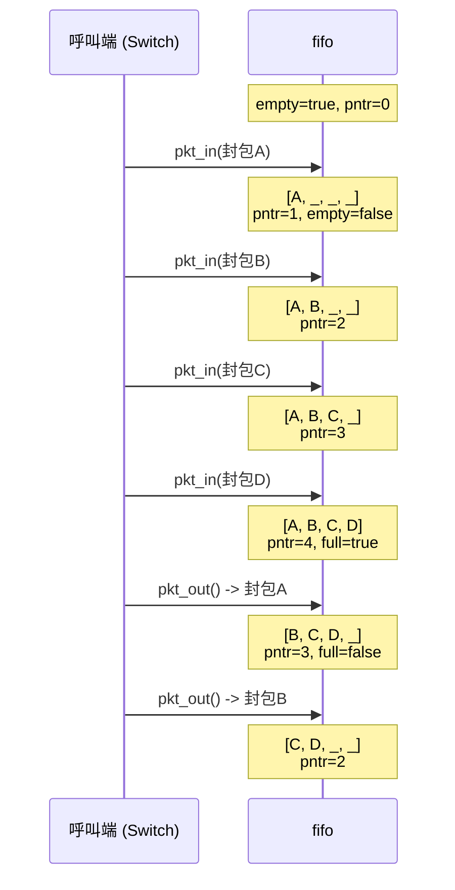

# FIFO -- 封包緩衝佇列

## 軟體類比

FIFO 就是一個 **固定大小的 queue**（bounded queue），容量為 4。它的行為跟 Python 的 `queue.Queue(maxsize=4)` 幾乎一樣：

- 空間還有就放進去，滿了就拒絕（由呼叫端決定 drop 或 block）
- 取出時按照先進先出的順序

不同的是，這個 FIFO 是硬體風格的實作 -- 沒有 mutex、沒有 condition variable，靠 `full` / `empty` 旗標來管理狀態。

## 資料結構

```
struct fifo {
    pkt regs[4];       -- 4 格的封包陣列（底層儲存）
    bool full;         -- 是否已滿
    bool empty;        -- 是否為空
    sc_uint<3> pntr;   -- 寫入指標（指向下一個空位）
};
```

### 記憶體配置圖

```
pntr = 2 的狀態：
+--------+--------+--------+--------+
| regs[0]| regs[1]| regs[2]| regs[3]|
|  封包A  |  封包B  |  (空)  |  (空)  |
+--------+--------+--------+--------+
                    ^
                    pntr（下一個寫入位置）

full = false, empty = false
目前有 2 個封包
```

## 方法

### `pkt_in()` -- 寫入封包

```cpp
void fifo::pkt_in(const pkt& data_pkt) {
    regs[pntr++] = data_pkt;    // 在 pntr 位置寫入，然後 pntr 加 1
    empty = false;                // 寫入後一定不是空的
    if (pntr == 4) full = true;  // pntr 到 4 表示 4 格全滿
}
```

**軟體類比**：`list.append(item)` 然後檢查 `if len(list) == capacity: full = True`。

注意：呼叫端（switch）在呼叫 `pkt_in()` 之前必須先檢查 `full`。這裡沒有溢位保護。

### `pkt_out()` -- 讀取封包

```cpp
pkt fifo::pkt_out() {
    pkt temp;
    temp = regs[0];              // 讀取最前面的封包
    if (--pntr == 0) empty = true;  // pntr 減 1，如果歸零就是空了
    else {
        regs[0] = regs[1];      // 所有元素往前移一格
        regs[1] = regs[2];
        regs[2] = regs[3];
        full = false;            // 取出後一定不滿了
    }
    return temp;
}
```

**軟體類比**：`list.pop(0)` -- 取出第一個元素，後面的元素往前補。

### 操作示意



## 效能觀察

這個 FIFO 實作用了「shift 所有元素」的方式來維持 FIFO 順序，是 O(n) 操作。在軟體中我們會用 circular buffer（ring buffer）來做到 O(1)。但在硬體中，shift register 是一個非常自然且高效的結構 -- 所有元素可以在同一個 clock 週期內同時移動。

| 比較 | 軟體 FIFO (Ring Buffer) | 硬體 FIFO (Shift Register) |
|------|----------------------|--------------------------|
| 入列 | O(1) | O(1) |
| 出列 | O(1)（移動 pointer） | O(1)（所有 register 同時 shift） |
| 空間 | 需要額外的 head/tail pointer | 只需一個 write pointer |
| 實現方式 | Modular arithmetic | 平行 wire 連接 |

## 在交換器中的角色

Switch 模組一共使用 8 個 FIFO：

- `q0_in` .. `q3_in`：每個 input port 一個，緩衝來自 sender 的封包
- `q0_out` .. `q3_out`：每個 output port 一個，緩衝要送給 receiver 的封包

當 input FIFO 滿了而有新封包到達時，封包會被丟棄（drop）。這就是 switch 統計中「dropped packets」的來源。增加 FIFO 深度可以降低丟包率，但會增加硬體面積和延遲。
