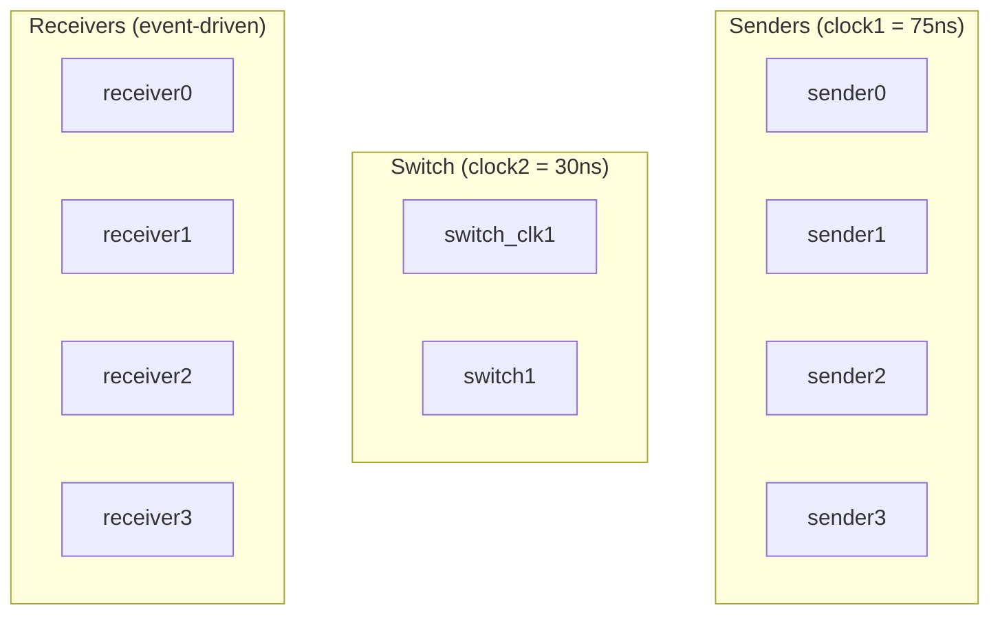
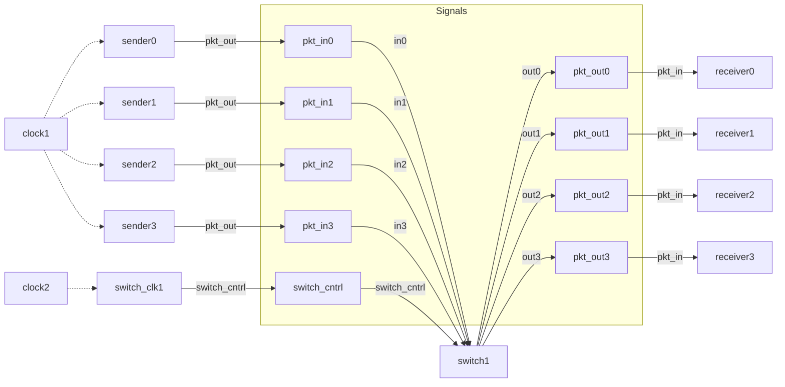

# Main -- 頂層測試平台

## 軟體類比

`main.cpp` 就像一個 **應用程式的啟動檔（bootstrap / composition root）**。它的工作是：

1. 建立所有元件（dependency injection container 的角色）
2. 把元件之間的連線接好（wiring）
3. 設定初始參數
4. 啟動系統

類似 dependency injection (like Python's inject library) 的 configuration，或 Docker Compose 的 `docker-compose.yml` -- 定義有哪些 service、它們之間怎麼連接。

## 系統組成

### 信號宣告

```cpp
sc_signal<pkt> pkt_in0, pkt_in1, pkt_in2, pkt_in3;    // sender -> switch
sc_signal<pkt> pkt_out0, pkt_out1, pkt_out2, pkt_out3; // switch -> receiver
sc_signal<sc_int<4>> id0, id1, id2, id3;                // ID 信號
sc_signal<bool> switch_cntrl;                            // switch 控制信號
```

**軟體類比**：信號就是元件之間的 **通訊管道（channel）**。`pkt_in0` 就像連接 sender0 和 switch 的一條 pipe。

### 時脈

```cpp
sc_clock clock1("CLOCK1", 75, SC_NS, 0.5, 0.0, SC_NS);  // sender 時脈
sc_clock clock2("CLOCK2", 30, SC_NS, 0.5, 10.0, SC_NS);  // switch 控制時脈
```

| 時脈 | 週期 | 驅動的模組 | 軟體類比 |
|------|------|-----------|---------|
| `clock1` | 75 ns | 4 個 sender | 每 75ns 觸發一次的 timer |
| `clock2` | 30 ns | switch_clk | 每 30ns 觸發一次的 timer |

Switch 的控制時脈比 sender 快（30ns vs 75ns），確保 switch 有足夠的處理速度來消化 4 個 sender 的封包。

### 模組實例化

系統共有 10 個模組實例：



### 連接方式

範例展示了兩種 port 綁定方式：

#### 方式一：By Name（具名綁定）

```cpp
sender0.pkt_out(pkt_in0);
sender0.source_id(id0);
sender0.CLK(clock1);
```

明確指定每個 port 連到哪個 signal。類似 Python 的 keyword argument：`func(pkt_out=pkt_in0, source_id=id0)`。

#### 方式二：By Position（位置綁定）

```cpp
sender1(pkt_in1, id1, clock1);
```

按照 port 宣告的順序連接。類似 Python 的 positional argument：`func(pkt_in1, id1, clock1)`。

兩種方式效果完全相同。By name 可讀性較好，by position 寫起來較簡潔。

### ID 初始化

```cpp
sc_start(0, SC_NS);    // 先跑 0 時間，完成 elaboration
id0.write(0);
id1.write(1);
id2.write(2);
id3.write(3);
sc_start();             // 開始正式模擬
```

`sc_start(0, SC_NS)` 是一個 SystemC 慣用法：先執行「零時間」的模擬，讓所有模組完成初始化（elaboration phase），然後才設定 ID 值。

**為什麼不在宣告時就設定 ID？** 因為 `sc_signal` 在 elaboration phase 完成前不能寫入。必須等 `sc_start()` 被呼叫後才能操作信號。

## 完整連線圖



## 模擬行為

1. `sc_start(0, SC_NS)` -- 完成 elaboration，所有模組構造完成
2. 寫入 ID 信號（0, 1, 2, 3）
3. `sc_start()` -- 開始無限期模擬
4. Sender 在 clock1 驅動下持續產生封包
5. Switch 在 clock2 / switch_cntrl 驅動下處理路由
6. Receiver 在收到封包時印出資訊
7. Switch 在 500 個週期後呼叫 `sc_stop()` 結束模擬
