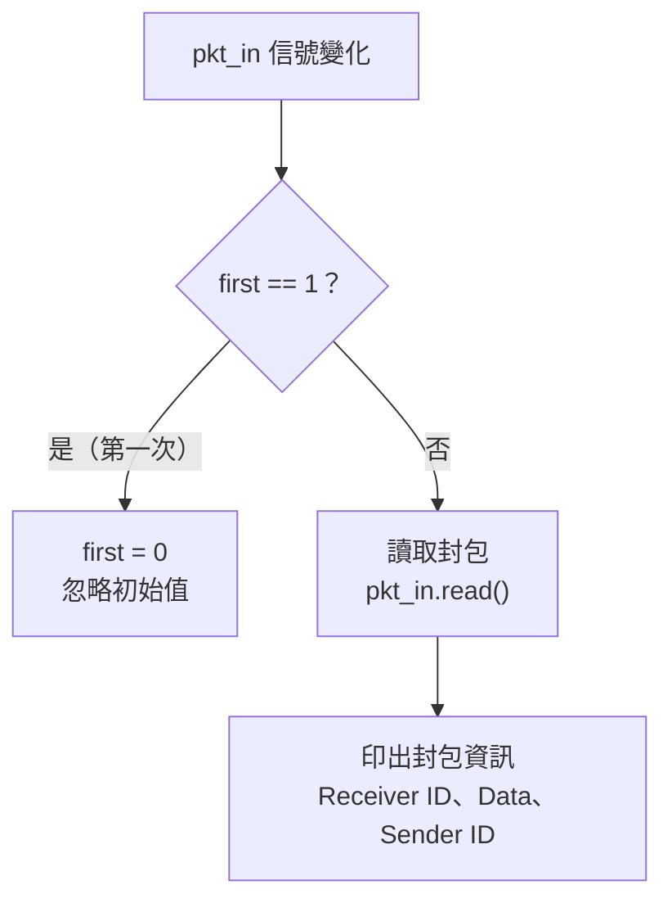

# Receiver -- 封包接收器

## 軟體類比

Receiver 就像一個 **事件監聽器（event listener）**。它不主動輪詢，而是「有新封包到達時自動被呼叫」。類似 JavaScript 的 `element.addEventListener('message', callback)` -- 你註冊一個 callback，事件發生時框架幫你呼叫。

## 介面

```
sc_in<pkt>           pkt_in    -- 封包輸入 port（來自 switch 的 output）
sc_in<sc_int<4>>     sink_id   -- 此 receiver 的識別碼（0-3）
```

模組使用 `SC_METHOD`，對 `pkt_in` 的變化敏感。

## 行為



### 忽略第一次觸發

```cpp
int first;
SC_CTOR(receiver) {
    SC_METHOD(entry);
    dont_initialize();
    sensitive << pkt_in;
    first = 1;
}
```

Receiver 使用 `first` 旗標跳過第一次呼叫。這是因為 `sc_signal` 在模擬開始時有初始值，會觸發一次事件。這個初始值不是真正的封包，需要忽略。

**軟體類比**：就像 RxJS 的 `observable.pipe(skip(1))` -- 跳過第一個（初始化造成的）事件。

### 輸出格式

Receiver 印出每個收到封包的資訊：

```
                                  ..........................
                                  New Packet Received
                                  Receiver ID: 1
                                  Packet Value: 42
                                  Sender ID: 3
                                  ..........................
```

注意 ID 印出時加了 1（`sink_id.read() + 1`），所以顯示的 ID 是 1-4 而不是 0-3。

## 重要的 SystemC 概念

### `SC_METHOD` vs `SC_CTHREAD`

| 特性 | `SC_METHOD`（Receiver 使用） | `SC_CTHREAD`（Sender 使用） |
|------|--------------------------|--------------------------|
| 執行模式 | 每次觸發執行整個函式 | 有自己的 call stack，可暫停 |
| 可否 `wait()` | 不可以 | 可以 |
| 觸發條件 | 任意信號變化 | 只有 clock edge |
| 記憶體用量 | 較少（無 stack） | 較多（有 stack） |
| 軟體類比 | Event callback | Coroutine / async function |

Receiver 用 `SC_METHOD` 是合理的，因為它的邏輯很簡單：收到封包、印出資訊、結束。不需要 `wait()` 也不需要維持狀態（除了 `first` 旗標）。

### `dont_initialize()`

```cpp
dont_initialize();
```

預設情況下，SystemC 會在模擬一開始就呼叫所有 `SC_METHOD` 一次（即使沒有事件觸發）。`dont_initialize()` 告訴模擬器「不要在開始時呼叫我，等真正有事件再說」。

**軟體類比**：就像設定一個 lazy listener，只在第一個真正的事件到達時才啟動，而不是在註冊時就觸發。
