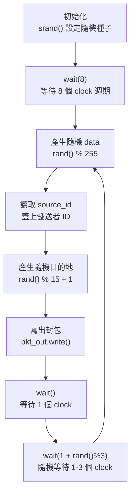

# Sender -- 封包發送器

## 軟體類比

Sender 就像一個 **訊息生產者（message producer）**，定期產生隨機資料並送出。類似一個不斷呼叫 `queue.push(randomMessage())` 的 worker thread，但每次送完後會隨機 sleep 1-3 個 tick。

## 介面

```
sc_out<pkt>           pkt_out     -- 封包輸出 port
sc_in<sc_int<4>>      source_id   -- 此 sender 的識別碼（0-3）
sc_in_clk             CLK         -- 輸入 clock（75 ns 週期）
```

模組使用 `SC_CTHREAD`，在 clock 正緣觸發。

**`SC_CTHREAD` vs `SC_THREAD`**：`SC_CTHREAD`（clocked thread）只在指定的 clock edge 被喚醒，就像一個被 timer 驅動的 scheduled task。相比之下，`SC_THREAD` 可以等待任意事件。

## 行為流程



### 封包產生邏輯

1. **Data**：`rand() % 255` 產生 0-254 的隨機 8-bit 值
2. **ID**：從 `source_id` port 讀取，由 `main.cpp` 在模擬開始時設定（0, 1, 2, 3）
3. **Destination**：`rand() % 15 + 1` 產生 1-15 的值，對應 4 個 dest bit 的組合

### 目的地編碼

目的地是一個 4-bit bitmask，每個 bit 代表一個接收端：

| dest 值 | dest3 | dest2 | dest1 | dest0 | 目的地 |
|---------|-------|-------|-------|-------|--------|
| 1 | 0 | 0 | 0 | 1 | 只送 receiver 0 |
| 5 | 0 | 1 | 0 | 1 | 送 receiver 0 和 2 |
| 15 | 1 | 1 | 1 | 1 | 廣播到所有 receiver |

因為 `dest` 的範圍是 1-15（排除 0），所以每個封包至少會送到一個目的地。

**軟體類比**：這就像 pub/sub 系統中的 **topic bitmask**。每個 bit 代表訂閱了某個 topic 的 consumer，一個訊息可以同時發到多個 topic。

### 發送節奏

- 初始等待 8 個 clock 週期（讓系統穩定）
- 每次發送後等待 1 個 clock（讓信號傳播）
- 再隨機等待 1-3 個 clock（模擬不均勻的流量）

以 75ns clock 計算，平均每 225ns 發一個封包。4 個 sender 加起來，switch 大約每 56ns 收到一個封包。

## 重要的 SystemC 概念

### `SC_CTHREAD` 與 `wait()`

```cpp
SC_CTHREAD(entry, CLK.pos());
```

`SC_CTHREAD` 是 clocked thread 的意思。`entry()` 函式在每個 clock 正緣會被「喚醒」一次。裡面的 `wait()` 表示「暫停到下一個 clock 正緣」，`wait(n)` 表示「暫停 n 個 clock 正緣」。

**軟體類比**：就像 Python 的 `async def` 配合 `await asyncio.sleep()`。`wait()` 是讓出控制權，等下一個 clock tick 再繼續。
