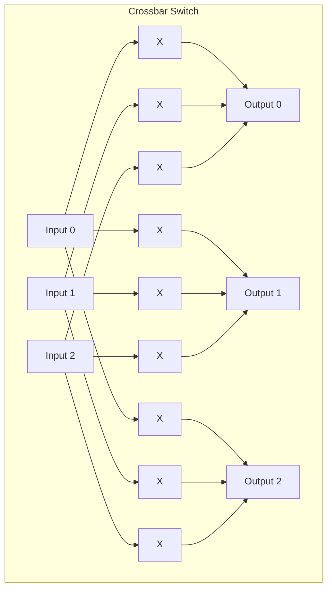
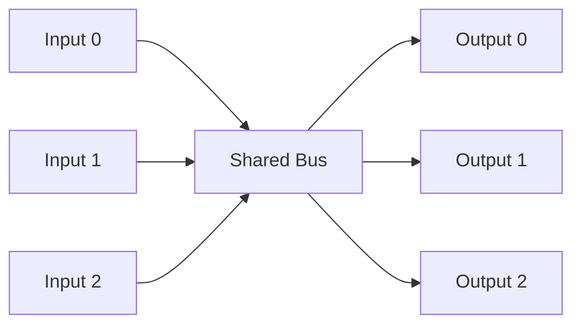
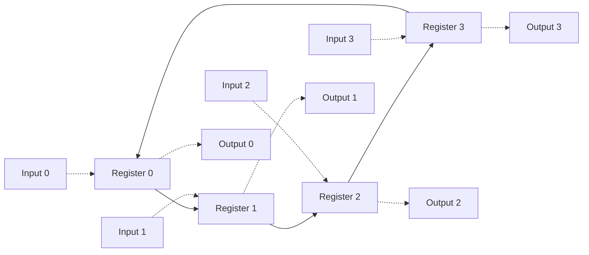
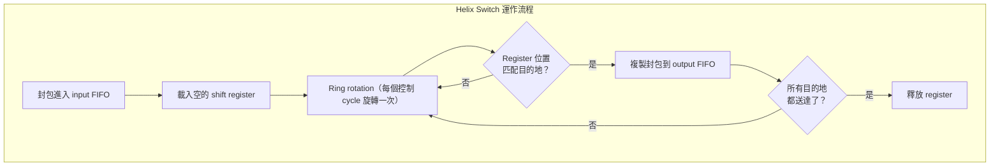
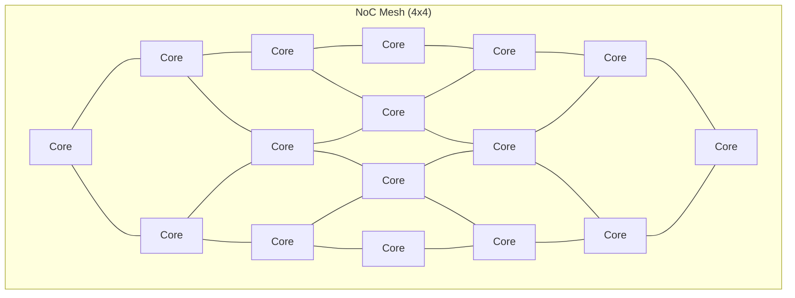

# 硬體規格解說 -- 封包交換器 (Packet Switch)

> 本文為軟體工程師撰寫，解釋封包交換器的硬體背景知識。

## 什麼是封包交換器？

封包交換器是一種硬體裝置，負責將資料封包從一個輸入 port 轉送到一個或多個輸出 port。

**日常生活中的例子**：
- 你辦公桌下的 **Ethernet switch**（網路交換器）就是一個封包交換器
- 家裡的 **WiFi router** 內部也有一個封包交換器
- 資料中心的 **Top-of-Rack switch** 處理機架內所有伺服器的流量

**軟體類比**：

| 硬體概念 | 軟體類比 |
|---------|---------|
| Packet switch | Load balancer（如 Nginx、HAProxy） |
| Input port | Incoming TCP connection |
| Output port | Backend server |
| Routing table | Nginx `upstream` 設定 |
| Multicast | Pub/sub fanout（如 RabbitMQ exchange） |
| Buffer overflow (drop) | HTTP 503 Service Unavailable |

## 為什麼需要硬體交換器？

軟體路由器（如 Linux 的 iptables）可以做到同樣的事情，但硬體交換器有壓倒性的效能優勢：

| 比較項目 | 軟體路由 | 硬體交換器 |
|---------|---------|-----------|
| 延遲 | 微秒 ~ 毫秒等級 | 奈秒等級（數百倍差距） |
| 吞吐量 | Gbps 等級 | 數十 Tbps 等級 |
| CPU 消耗 | 高（每個封包都要跑軟體） | 零（專用電路處理） |
| 能耗 | 高 | 低（固定功率） |
| 彈性 | 高（可以隨時改程式） | 低（電路固定） |

**關鍵差異**：硬體交換器可以達到 **wire-speed routing** -- 封包進來的速度就是它處理的速度，不會造成瓶頸。軟體無法做到這一點，因為每個封包都需要 CPU 的介入。

## 交換器架構比較

### Crossbar（交叉開關）

- **原理**：每個 input 到每個 output 都有一條直接的通路。像一個 NxN 的開關矩陣。
- **優點**：Non-blocking（任何 input 到任何 output 都不會互相干擾）、低延遲
- **缺點**：硬體成本為 O(N^2)，port 數增加時成本爆炸
- **軟體類比**：Full mesh topology，每對 service 之間都有直接連線

### Shared Bus（共用匯流排）

- **原理**：所有 port 共用一條資料通道，同一時間只有一個 port 可以傳送
- **優點**：硬體成本低（O(N)）
- **缺點**：頻寬瓶頸（所有流量搶一條路）、需要仲裁機制
- **軟體類比**：單一的 message queue，所有 producer 都往同一個 queue 寫入

### Ring（環形）-- 本範例使用的架構

- **原理**：封包在環上旋轉，經過每個 output port 時檢查是否匹配。匹配就複製一份送出。
- **優點**：硬體成本適中（O(N)）、天然支援 multicast（封包繞一圈就能送到所有目的地）
- **缺點**：延遲較高（最多需要 N 個 cycle 才能到達目的地）
- **軟體類比**：Token ring network，或 Kafka 的 partition rebalance -- 訊息在一組 consumer 之間輪流傳遞

### 架構比較總結

| 架構 | 硬體成本 | 延遲 | 頻寬 | Multicast | 軟體類比 |
|------|---------|------|------|-----------|---------|
| Crossbar | O(N^2) | 1 cycle | 最高 | 需要額外邏輯 | Full mesh |
| Shared Bus | O(N) | 變動大 | 最低 | 容易（broadcast） | Single queue |
| Ring | O(N) | 1~N cycles | 中等 | 天然支援 | Token ring |

## 本範例的 Helix Packet Switch

本範例實作的是一種 **Helix（螺旋）封包交換器**，是 ring 架構的一個變體：

**Helix 的巧妙之處**：

1. **Self-routing**：不需要集中式路由表。封包自己帶著目的地資訊，register 的位置就決定了它可以寫入哪個 output。
2. **Pipelined**：多個封包可以同時在環中流動，不需要等前一個處理完。
3. **Non-blocking multicast**：封包留在環中旋轉直到所有目的地送達，不會阻塞其他封包。

## 真實世界的應用

### Ethernet Switch

你辦公桌下的 Ethernet switch 就是最常見的封包交換器。它的 port 數通常是 4、8、24 或 48。企業級交換器使用 crossbar 或更複雜的多級架構。

### Network-on-Chip (NoC)

現代的多核心處理器（如 AMD EPYC、Intel Xeon）內部有數十個 CPU core，它們之間的通訊就是透過 NoC -- 一種晶片內部的封包交換網路。常見的 NoC 拓撲就是 ring（Intel 早期的多核）和 mesh（AMD 的 chiplet 架構）。

### PCIe Switch

連接 GPU、NVMe SSD、網卡等高速裝置的 PCIe switch 也是一種封包交換器。它讓多個裝置可以共用 PCIe lanes。

### 軟體中的類似概念

如果你在寫分散式系統，這些概念你可能已經很熟悉了：

| 硬體 | 軟體 |
|------|------|
| Packet switch | Service mesh sidecar (Envoy) |
| Input FIFO | Request queue |
| Output FIFO | Response buffer |
| Multicast | gRPC server streaming / Kafka topic fanout |
| Packet drop (FIFO full) | Circuit breaker / backpressure / HTTP 429 |
| Wire-speed routing | Kernel bypass networking (DPDK, io_uring) |

## 為什麼用 SystemC 模擬？

設計一個封包交換器的流程通常是：

1. **演算法探索**（SystemC / C++ 模型）-- 本範例所在的階段
2. **RTL 設計**（Verilog / VHDL）
3. **驗證**（用 SystemC 模型作為 golden reference）
4. **合成**（轉成實際的邏輯閘電路）
5. **製造**（送到晶圓廠）

SystemC 讓硬體設計師可以用 C++ 快速驗證交換器的行為：不同的 buffer 大小、不同的路由策略、不同的流量模式下的丟包率等。這比直接寫 RTL 快很多，也更容易除錯。
