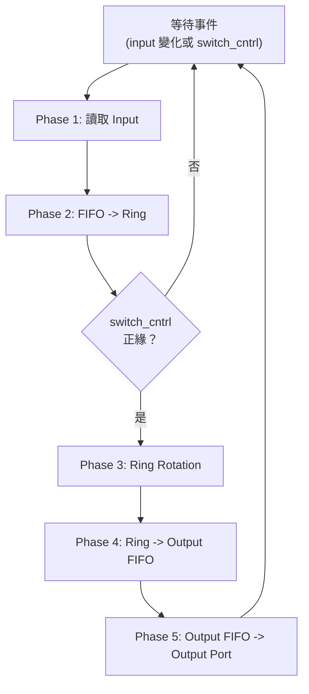
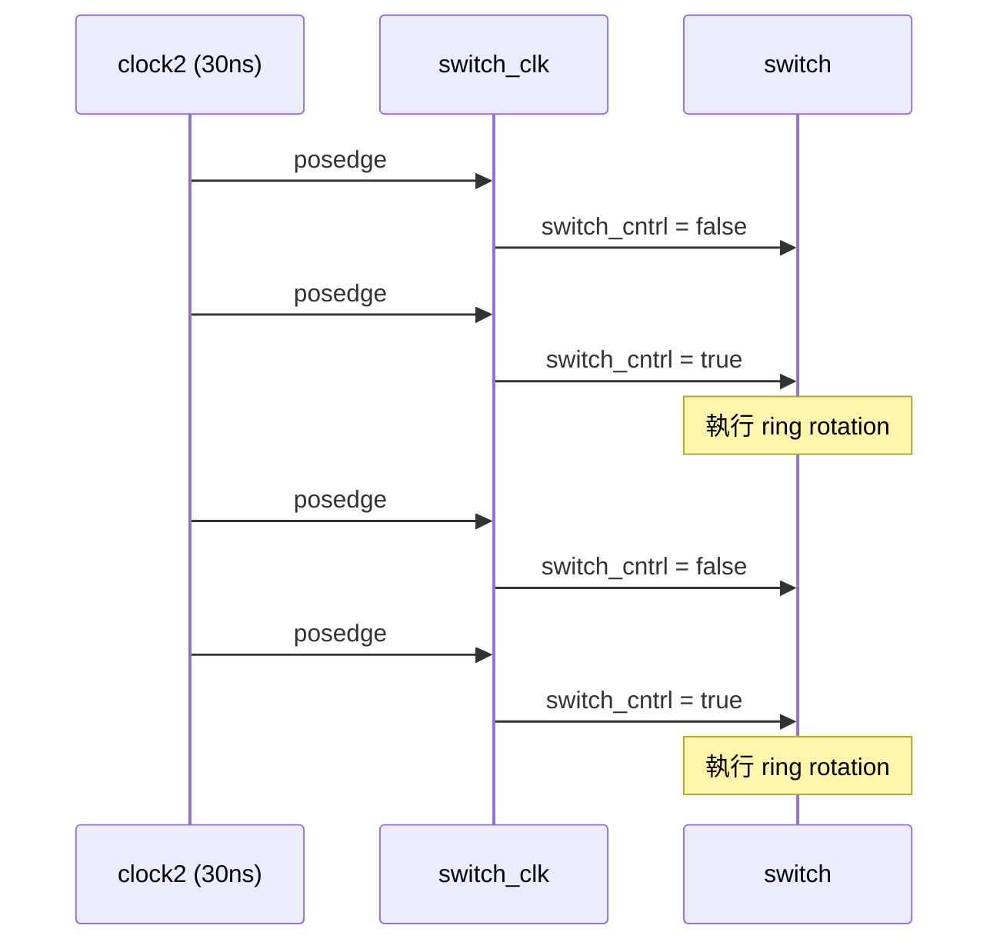

# Switch Fabric -- 封包交換核心

## 軟體類比

想像你在寫一個 **訊息路由器**，它有 4 個 input queue 和 4 個 output queue。你的路由邏輯是：

1. 從 input queue 取出訊息
2. 檢查訊息上的「目的地」標籤
3. 把訊息放到對應的 output queue
4. 如果是 multicast（多播），同一個訊息要放到多個 output queue

這個 switch 模組就是在做這件事，但它用了一個巧妙的「旋轉環」機制來處理路由。

## 涉及的檔案

- `switch.h` / `switch.cpp` -- 主要的交換邏輯（`mcast_pkt_switch` 模組）
- `switch_reg.h` -- 環形暫存器的資料結構（`switch_reg`）
- `switch_clk.h` / `switch_clk.cpp` -- 控制信號產生器（`switch_clk` 模組）

## mcast_pkt_switch 模組

### 介面

```
sc_in<bool>   switch_cntrl   -- 控制信號（觸發 ring rotation）
sc_in<pkt>    in0..in3       -- 4 個 input port（來自 sender）
sc_out<pkt>   out0..out3     -- 4 個 output port（送往 receiver）
```

模組使用 `SC_THREAD`，對所有 input port 和 `switch_cntrl` 的正緣敏感。

**軟體類比**：這像一個同時 `select()` 監聽多個 socket 的 event loop，任何一個 input 有新資料或收到控制信號時就被喚醒。

### 內部結構

Switch 內部維護以下資料結構：

| 資料結構 | 型別 | 數量 | 用途 |
|---------|------|------|------|
| `q0_in` .. `q3_in` | `fifo` | 4 | Input FIFO，每個 port 一個 |
| `q0_out` .. `q3_out` | `fifo` | 4 | Output FIFO，每個 port 一個 |
| `R0` .. `R3` | `switch_reg` | 4 | 組成 ring 的 shift register |
| `pkt_count` | `int` | 1 | 收到的封包總數 |
| `drop_count` | `int` | 1 | 因 FIFO 滿而丟棄的封包數 |

### 運作流程

每個模擬週期，switch 執行以下步驟：



#### Phase 1: 讀取 Input

```cpp
if (in0.event()) {
    pkt_count++;
    if (q0_in.full == true) drop_count++;  // FIFO 滿了，丟棄封包
    else q0_in.pkt_in(in0.read());         // 存入 input FIFO
}
```

**軟體類比**：就像 `if (poll(fd, POLLIN))` 檢查每個 socket 是否有新資料。如果 buffer 滿了就 drop，否則 enqueue。

#### Phase 2: FIFO 到 Ring

```cpp
if ((!q0_in.empty) && R0.free) {
    R0.val  = q0_in.pkt_out();  // 從 FIFO 取出封包
    R0.free = false;             // 標記 register 為佔用
}
```

只有當 register 是空的（`free == true`）才會從 FIFO 載入新封包。

#### Phase 3: Ring Rotation

```cpp
temp = R0;
R0 = R1;
R1 = R2;
R2 = R3;
R3 = temp;
```

4 個 register 的值「向前旋轉一格」。這就像一個 **circular buffer 的旋轉操作**。旋轉後：
- 原本在 R0 的封包現在在 R3
- 原本在 R1 的封包現在在 R0
- 以此類推

**為什麼要旋轉？** 因為每個 register 只能寫入對應編號的 output FIFO（R0 寫 q0_out，R1 寫 q1_out...）。透過旋轉，一個封包最多經過 4 次旋轉就能經過所有 4 個位置，從而被送到所有目的地。

#### Phase 4: Ring 到 Output FIFO

```cpp
if ((!R0.free) && (R0.val.dest0) && (!q0_out.full)) {
    q0_out.pkt_in(R0.val);       // 複製封包到 output FIFO
    R0.val.dest0 = false;         // 清除已送達的目的地 bit
    if (!(R0.val.dest0|R0.val.dest1|R0.val.dest2|R0.val.dest3))
        R0.free = true;           // 所有目的地都送達了，釋放 register
}
```

**關鍵的多播機制**：封包的 `dest0`..`dest3` bit 就像一個 checklist。每送到一個目的地就打勾（清除 bit）。全部打勾後，register 就可以被新封包使用了。

**軟體類比**：這就像 `reference counting`。每個目的地是一個 reference，送達一個就 decrement。count 歸零時釋放資源。

#### Phase 5: 輸出

```cpp
if (!q0_out.empty) out0.write(q0_out.pkt_out());
```

從 output FIFO 取出封包寫到 output port，送給 receiver。

### 模擬結束

Switch 執行 500 個週期（`SIM_NUM = 500`）後呼叫 `sc_stop()` 結束模擬，並印出統計資訊：收到的封包數、丟棄數、丟棄百分比。

## switch_reg 結構

```cpp
struct switch_reg {
    pkt val;     // 儲存的封包
    bool free;   // 是否可用（true = 空的）
};
```

非常簡單的資料結構，就像一個 `Optional<Packet>` -- 要嘛有值，要嘛是空的。

## switch_clk 模組

### 介面

```
sc_out<bool>  switch_cntrl   -- 控制信號輸出
sc_in_clk     CLK            -- 輸入 clock（30 ns 週期）
```

### 行為

每個 clock 正緣，`switch_cntrl` 在 `true` 和 `false` 之間切換。效果是 switch 的 ring rotation **每隔一個 clock 才執行一次**（只有 `switch_cntrl` 為 `true` 且有事件時才觸發 rotation）。

**軟體類比**：這就像一個 **rate limiter** 或 **tick divider**。用 30ns clock 產生 60ns 的 rotation 週期，確保 switch 有足夠時間處理路由。


