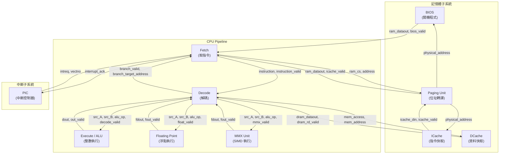

# RISC CPU -- SystemC 範例總覽

## 軟體類比

如果你曾經寫過直譯器 (interpreter) -- 例如 JVM、V8 引擎、或者 Python bytecode VM -- 你已經具備理解這個範例的基礎。這個 RISC CPU 模擬器本質上就是一個**指令直譯器加上快取層**：

| CPU 概念 | 軟體類比 |
|----------|----------|
| Fetch 階段 | 讀取腳本的下一行 (`readline()`) |
| Decode 階段 | 解析/分詞一個命令字串 (`parse()`, `tokenize()`) |
| Execute 階段 | 執行運算 (`eval()`) |
| Instruction Cache | 程式碼的 in-memory cache (如 Redis 快取 SQL query) |
| Data Cache | 資料的 in-memory cache (如 Memcached) |
| BIOS | 開機載入程式 / 初始化腳本 (如 `bootstrap.js`) |
| Paging Unit | 虛擬記憶體映射 (如 memory-mapped files) |
| PIC 中斷控制器 | 事件迴圈 / signal handler (如 Python asyncio event loop) |
| FPU 浮點運算單元 | 專用數學運算函式庫 (如 `math.h`) |
| MMX 單元 | SIMD 向量化運算 (如 numpy 的向量操作) |

## 架構圖

## 資料流概述

1. **開機階段 (Boot)**：BIOS 模組從 `bios.img` 載入前 5 筆指令，供 Fetch 單元讀取。
2. **取指令 (Fetch)**：Fetch 單元透過 Paging 模組將邏輯位址轉為實體位址，從 ICache 讀取指令。
3. **解碼 (Decode)**：Decode 單元解析指令格式 -- opcode、暫存器編號、立即值 -- 並讀取暫存器檔案。
4. **執行 (Execute)**：根據指令類型，將運算分派到 ALU (整數)、FPU (浮點)、或 MMX (SIMD) 單元。
5. **記憶體存取 (Memory)**：Load/Store 指令透過 DCache 存取資料記憶體。
6. **寫回 (Writeback)**：執行結果寫回 Decode 中的暫存器檔案。
7. **中斷處理**：PIC 接收外部中斷請求，通知 Fetch 跳轉至中斷向量位址。

## 檔案列表

| 檔案名稱 | 說明 | 角色 |
|-----------|------|------|
| `main.cpp` | 頂層模組接線與模擬啟動 | 頂層 |
| `fetch.h` / `fetch.cpp` | 指令取得單元 (Instruction Fetch Unit) | Pipeline Stage 1 |
| `decode.h` / `decode.cpp` | 指令解碼單元 (Instruction Decode Unit) | Pipeline Stage 2 |
| `exec.h` / `exec.cpp` | 整數執行單元 (Integer ALU) | Pipeline Stage 3 |
| `floating.h` / `floating.cpp` | 浮點執行單元 (FPU) | Pipeline Stage 3 |
| `mmxu.h` / `mmxu.cpp` | MMX/SIMD 執行單元 | Pipeline Stage 3 |
| `icache.h` / `icache.cpp` | 指令快取 (Instruction Cache) | 記憶體子系統 |
| `dcache.h` / `dcache.cpp` | 資料快取 (Data Cache) | 記憶體子系統 |
| `paging.h` / `paging.cpp` | 分頁/位址轉譯單元 | 記憶體子系統 |
| `bios.h` / `bios.cpp` | BIOS 開機程式 | 記憶體子系統 |
| `pic.h` / `pic.cpp` | 可程式化中斷控制器 (PIC) | 中斷子系統 |
| `directive.h` | 除錯輸出開關 | 設定 |

## 關鍵概念

### Pipeline 管線化執行

CPU 的指令執行分為多個階段 (stage)，每個階段同時處理不同指令，就像工廠流水線。在軟體中，這類似於一個多階段的 producer-consumer 架構，每個階段都是一個獨立的 thread。

### 記憶體階層 (Memory Hierarchy)

指令和資料分別有各自的快取 (Harvard Architecture)。存取速度由快到慢：暫存器 > L1 Cache (ICache/DCache) > 主記憶體。軟體類比：本地變數 > Redis > Database。

### 中斷處理 (Interrupt Handling)

PIC 模組就像 Python asyncio event loop：當外部事件發生時，它不會直接中斷正在執行的程式碼，而是設定一個旗標 (flag)，讓 Fetch 單元在適當時機檢查並跳轉到中斷處理程式。

## 建議閱讀順序

1. **[spec.md](spec.md)** -- 先了解 RISC CPU 的硬體規格背景
2. **[main.md](main.md)** -- 看整體接線，了解模組之間如何連接
3. **[fetch.md](fetch.md)** -- Pipeline 第一階段
4. **[decode.md](decode.md)** -- Pipeline 第二階段（最複雜的模組）
5. **[exec.md](exec.md)** -- Pipeline 第三階段：整數運算
6. **[floating.md](floating.md)** -- 浮點運算
7. **[mmxu.md](mmxu.md)** -- SIMD 運算
8. **[cache.md](cache.md)** -- 指令快取與資料快取
9. **[bios.md](bios.md)** -- 開機流程
10. **[paging.md](paging.md)** -- 位址轉譯
11. **[pic.md](pic.md)** -- 中斷機制
