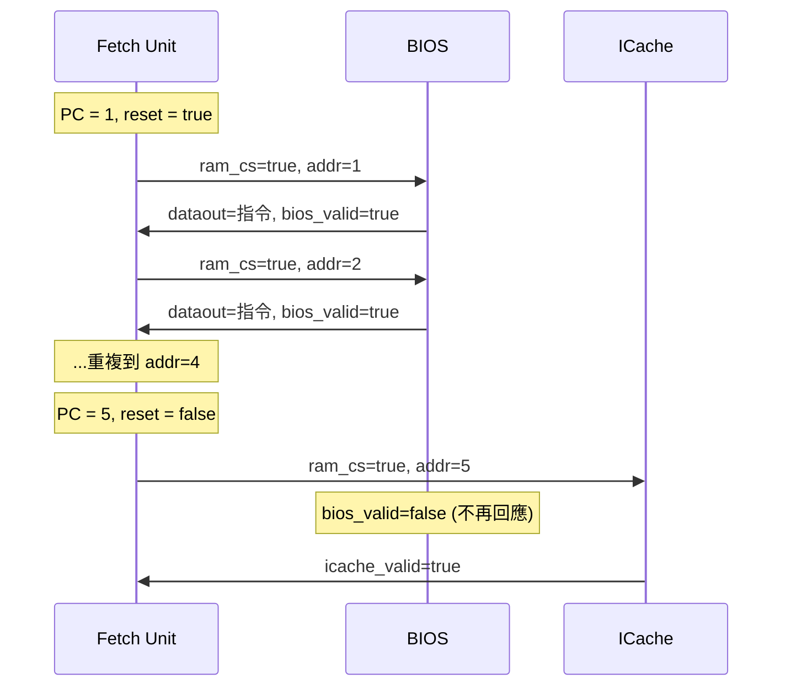

# BIOS -- 基本輸入輸出系統

## 軟體類比

BIOS 就是 CPU 的 **bootloader** 或初始化腳本。就像：

- Web 應用的 `bootstrap.js` / `main()` -- 在主程式邏輯運作前先進行環境初始化
- 作業系統的 GRUB bootloader -- 載入核心到記憶體後交出控制權
- Docker container 的 entrypoint script -- 設定環境後執行主程式

在這個 CPU 中，BIOS 負責前 5 筆指令的提供。一旦開機完成（PC >= 5），控制權就交給 ICache，BIOS 不再參與。

## 原始檔案

- `bios.h` -- 模組宣告
- `bios.cpp` -- 行為實作

## 模組介面

| 方向 | 信號名稱 | 類型 | 說明 |
|------|-----------|------|------|
| 輸入 | `datain` | `sc_in<unsigned>` | 寫入資料 |
| 輸入 | `cs` | `sc_in<bool>` | Chip Select |
| 輸入 | `we` | `sc_in<bool>` | Write Enable |
| 輸入 | `addr` | `sc_in<unsigned>` | 位址 |
| 輸出 | `dataout` | `sc_out<unsigned>` | 指令資料 |
| 輸出 | `bios_valid` | `sc_out<bool>` | 資料有效 |
| 輸出 | `stall_fetch` | `sc_out<bool>` | 暫停 Fetch |

## 內部結構

```cpp
unsigned *imemory;      // BIOS 程式記憶體 (4000 entries)
unsigned *itagmemory;   // Tag 記憶體 (未使用)
int wait_cycles;        // 存取延遲
```

初始化時從 `bios.img` 載入程式碼，未初始化的位置填入 `0xFFFFFFFF`。

## 行為邏輯

```
while true:
    等待 cs == true
    address = addr

    if address < BOOT_LENGTH (5):   # 只處理開機階段
        if 寫入:
            imemory[address] = datain
        else:
            等待 wait_cycles
            dataout = imemory[address]
            bios_valid = true
            等待一個週期後清除 bios_valid
    else:
        bios_valid = false    # 開機結束，不回應
```

## 開機流程



### BOOT_LENGTH = 5

前 5 筆指令由 BIOS 提供。`bios.img` 中通常包含系統初始化程式碼，例如設定暫存器初始值、載入 process ID 等。當 Fetch 的 PC 到達 5 時，`reset` 被解除，系統切換到由 ICache 供給指令。

## 與 ICache 的區別

| 特性 | BIOS | ICache |
|------|------|--------|
| 服務的位址範圍 | 0 ~ 4 | 5 ~ 499 |
| 初始化來源 | `bios.img` | `icache.img` |
| 角色 | 開機載入 | 正常執行 |
| 何時活躍 | reset = true | reset = false |
| 軟體類比 | bootloader | 程式碼快取 |

## 共用信號

BIOS 和 Paging/ICache 路徑共用 `ram_dataout` 信號（使用 `SC_MANY_WRITERS` 策略），因為兩者不會同時寫入 -- BIOS 只在開機時活躍，ICache 只在開機後活躍。

## SystemC 重點

- 在 `main.cpp` 中，BIOS 使用具名綁定 (named binding) 而非位置綁定 (positional binding)，語法更清晰。
- `init_param(delay_cycles)` 設定記憶體延遲 -- 這是一個透過函式呼叫傳遞參數的模式，因為 SystemC 建構子的參數受限。
