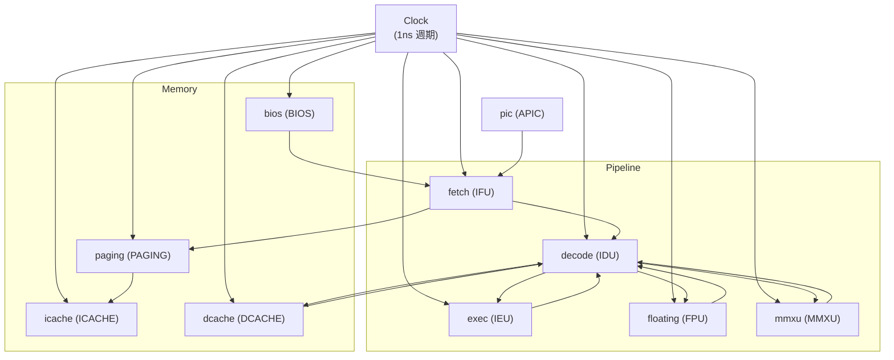

# Main -- 頂層接線與模擬啟動

## 軟體類比

`main.cpp` 就是整個 CPU 系統的 **dependency injection container** 或 **wiring configuration**。它不包含任何業務邏輯，只負責：

1. 宣告所有信號（通訊管道）
2. 建立所有模組（元件）
3. 將信號連接到模組的端口（接線）
4. 啟動模擬

就像一個 dependency injection (like Python's inject library) 的 configuration，或者一個 Docker Compose 的 `docker-compose.yml`。

## 原始檔案

- `main.cpp` -- 頂層接線
- `directive.h` -- 除錯輸出開關

## 架構總覽



## 信號宣告

`main.cpp` 宣告了大量的 `sc_signal`，每個信號就是模組之間的通訊管道。關鍵信號依子系統分組：

### BIOS / 記憶體信號
- `ram_cs`, `ram_we`, `addr`, `ram_datain` -- Fetch 到記憶體的控制和位址
- `ram_dataout` (SC_MANY_WRITERS) -- BIOS 和 Paging 都會寫入
- `bios_valid` -- BIOS 輸出有效

### Pipeline 信號
- `instruction`, `instruction_valid`, `program_counter` -- Fetch 到 Decode
- `src_A`, `src_B`, `alu_op`, `alu_src` -- Decode 到 Execute/FPU/MMX
- `decode_valid`, `float_valid`, `mmx_valid` -- 分派控制
- `dout`, `out_valid`, `destout` -- ALU 結果回寫
- `fdout`, `fout_valid`, `fdestout` (SC_MANY_WRITERS) -- FPU/MMX 共用

### 分支信號
- `branch_valid`, `branch_target_address` -- Decode 到 Fetch 的分支控制
- `branch_clear`, `next_pc` -- 分支完成後的控制

### 中斷信號
- `ireq0` ~ `ireq3` -- 四個中斷請求線
- `intreq`, `vectno`, `intack_cpu` -- PIC 與 CPU 之間

## 模組實例化與接線

### 兩種接線風格

程式碼展示了兩種 SystemC 接線方式：

**1. 位置綁定 (Positional Binding)**：使用 `<<` 運算子
```cpp
IFU << ram_dataout << branch_target_address << next_pc << branch_valid
    << stall_fetch << intreq << vectno << ...;
```
優點：簡潔。缺點：必須嚴格遵守宣告順序，容易出錯。

**2. 具名綁定 (Named Binding)**：使用 port 名稱
```cpp
BIOS.datain(ram_datain);
BIOS.cs(ram_cs);
BIOS.we(ram_we);
```
優點：自文件化，順序無關。缺點：較冗長。

### SC_MANY_WRITERS

三個信號使用 `SC_MANY_WRITERS` 策略：
- `ram_dataout` -- BIOS 和 Paging 共用
- `fdout`, `fout_valid`, `fdestout` -- FPU 和 MMX 共用
- `stall_fetch` -- BIOS 和 Paging 共用

這允許多個模組寫入同一個信號，但需要設計者確保不會同時寫入衝突的值。

## 時脈設定

```cpp
sc_clock clk("Clock", 1, SC_NS, 0.5, 0.0, SC_NS);
```

- 週期：1 ns
- Duty cycle：50% (0.5)
- 起始時間：0 ns

## 模組初始化參數

```cpp
const int delay_cycles = 2;
IFU.init_param(delay_cycles);
BIOS.init_param(delay_cycles);
ICACHE.init_param(delay_cycles);
DCACHE.init_param(delay_cycles);
```

所有記憶體相關模組共用相同的延遲參數 (2 cycles)。

## directive.h -- 除錯開關

```cpp
#define PRINT_IFU true     // Fetch Unit 輸出
#define PRINT_ID true      // Decode 輸出
#define PRINT_PU false     // Paging Unit 輸出
#define PRINT_BPU true     // Branch Prediction 輸出
#define PRINT_FPU true     // FPU 輸出
#define PRINT_ICU false    // ICache 輸出
#define PRINT_MMU false    // MMU 輸出
#define PRINT_BIOS false   // BIOS 輸出
#define TRACE false        // VCD 波形追蹤
```

這些 compile-time 開關控制各模組的 debug 輸出，類似軟體中的 log level 設定。

## 模擬執行

```cpp
sc_start();                    // 啟動模擬（直到 sc_stop() 被呼叫）
```

模擬由 Decode 中的 QUIT 指令 (opcode 0xFF) 呼叫 `sc_stop()` 終止。

## SystemC 重點

- `sc_main()` 是 SystemC 的程式進入點，取代一般 C++ 的 `main()`。
- 所有模組和信號都在 `sc_main()` 中以區域變數宣告，它們的生命週期與模擬相同。
- `sc_report_handler::set_actions("/IEEE_Std_1666/deprecated", SC_DO_NOTHING)` 抑制位置綁定的 deprecation 警告。
