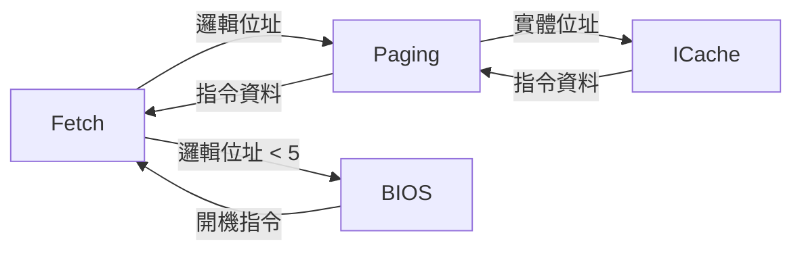

# Paging -- 分頁/位址轉譯單元

## 軟體類比

Paging 單元負責將**邏輯位址**轉換為**實體位址**，就像作業系統中的虛擬記憶體機制：

```python
# 軟體類比
class VirtualMemory:
    def translate(self, logical_addr):
        # 在真實系統中，這裡會查詢 page table
        physical_addr = self.page_table[logical_addr]
        return physical_addr

# 更貼切的類比：URL routing
def route(logical_url):
    # /api/users/123 -> 實際的 handler 和儲存位置
    return resolve_handler(logical_url)
```

在這個簡化的實作中，Paging 模組實際上是一個**直通 (pass-through) 模組** -- 邏輯位址直接等於實體位址，沒有真正的轉譯。但它扮演了一個重要的中介層角色：

- 在開機階段（位址 < 5），它不轉發請求，讓 BIOS 處理
- 在正常階段（位址 >= 5），它將請求轉發到 ICache

## 原始檔案

- `paging.h` -- 模組宣告
- `paging.cpp` -- 行為實作

## 模組介面

### 輸入（來自 Fetch）

| 信號名稱 | 類型 | 說明 |
|-----------|------|------|
| `paging_din` | `sc_in<unsigned>` | 寫入資料 |
| `paging_csin` | `sc_in<bool>` | Chip Select |
| `paging_wein` | `sc_in<bool>` | Write Enable |
| `logical_address` | `sc_in<unsigned>` | 邏輯位址 |

### 輸入（來自 ICache）

| 信號名稱 | 類型 | 說明 |
|-----------|------|------|
| `icache_din` | `sc_in<unsigned>` | ICache 回傳的資料 |
| `icache_validin` | `sc_in<bool>` | ICache 資料有效 |
| `icache_stall` | `sc_in<bool>` | ICache 忙碌 |

### 輸出（到 ICache）

| 信號名稱 | 類型 | 說明 |
|-----------|------|------|
| `paging_dout` | `sc_out<unsigned>` | 資料輸出 |
| `paging_csout` | `sc_out<bool>` | Chip Select 到 ICache |
| `paging_weout` | `sc_out<bool>` | Write Enable 到 ICache |
| `physical_address` | `sc_out<unsigned>` | 實體位址 |

### 輸出（回到 Fetch）

| 信號名稱 | 類型 | 說明 |
|-----------|------|------|
| `dataout` | `sc_out<unsigned>` | 指令資料 |
| `data_valid` | `sc_out<bool>` | 資料有效 |
| `stall_ifu` | `sc_out<bool>` | 暫停 Fetch |

## 行為邏輯

```
while true:
    等待 paging_csin == true
    address = logical_address

    if address >= 5:           # 不處理開機階段的位址
        if 寫入操作:
            轉發資料和位址到 ICache
        else:                  # 讀取操作
            向 ICache 發出讀取請求
            等待 icache_validin == true
            將 ICache 資料轉發回 Fetch
            設定 data_valid = true
```

## 在整體架構中的位置



Paging 位於 Fetch 和 ICache 之間，作為一個中介層。在更完整的實作中，這裡會包含：

- **Page Table 查詢**：將虛擬頁碼轉為實體頁框碼
- **TLB (Translation Lookaside Buffer)**：page table 的快取
- **Page Fault 處理**：當請求的頁面不在記憶體中時觸發異常

## Process ID

Paging 模組保有一個 `pid_reg`（Process ID），在多程序系統中用來區分不同程序的位址空間。在這個簡化的實作中未被完整使用。

## SystemC 重點

- 使用 `SC_CTHREAD` 在時脈正緣驅動。
- 讀取操作中，`do { wait(); } while (!(icache_validin == true))` 等待 ICache 回應，體現了 pipeline 中模組之間的同步等待。
- 這是一個典型的 adapter / proxy 模組 -- 它的主要功能是在兩個不同模組之間做協調和轉發。
