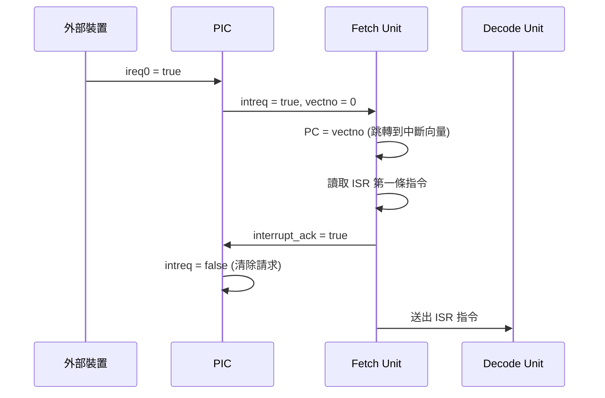

# PIC -- 可程式化中斷控制器

## 軟體類比

PIC (Programmable Interrupt Controller) 就是硬體版的**事件迴圈** (event loop)。它收集多個中斷來源的請求，排定優先順序，然後通知 CPU：

```python
# 軟體類比：事件分派器
class EventDispatcher:
    def on_event(self, irq0, irq1, irq2, irq3):
        if irq0:                      # 最高優先
            self.notify_cpu(vector=0)
        elif irq1:
            self.notify_cpu(vector=1)
        elif irq2:
            self.notify_cpu(vector=2)
        elif irq3:
            self.notify_cpu(vector=3)

        if cpu_acknowledged:
            self.clear_pending()
```

在 Python asyncio 中，event loop 類似地監聽多個事件來源（I/O、timer、signal），並在適當時機觸發對應的 callback。PIC 做的是同樣的事，只是觸發的是 CPU 跳轉到中斷處理程式 (ISR, Interrupt Service Routine)。

## 原始檔案

- `pic.h` -- 模組宣告
- `pic.cpp` -- 行為實作

## 模組介面

| 方向 | 信號名稱 | 類型 | 說明 |
|------|-----------|------|------|
| 輸入 | `ireq0` | `sc_in<bool>` | 中斷請求 0（最高優先） |
| 輸入 | `ireq1` | `sc_in<bool>` | 中斷請求 1 |
| 輸入 | `ireq2` | `sc_in<bool>` | 中斷請求 2 |
| 輸入 | `ireq3` | `sc_in<bool>` | 中斷請求 3 |
| 輸入 | `cs` | `sc_in<bool>` | Chip Select |
| 輸入 | `rd_wr` | `sc_in<bool>` | 讀寫控制 |
| 輸入 | `intack_cpu` | `sc_in<bool>` | CPU 的中斷確認 |
| 輸出 | `intreq` | `sc_out<bool>` | 向 CPU 發出中斷請求 |
| 輸出 | `intack` | `sc_out<bool>` | 向裝置發出中斷確認 |
| 輸出 | `vectno` | `sc_out<unsigned>` | 中斷向量編號 |

## 行為邏輯

PIC 的邏輯非常簡單 -- 它是一個**固定優先順序的中斷仲裁器**：

1. 檢查 `ireq0` (最高優先) 到 `ireq3` (最低優先)
2. 將第一個有效的中斷請求轉發給 CPU，並附上向量編號
3. 當 CPU 確認處理（`intack_cpu == true && cs == true`）後，清除中斷請求

### 優先順序

```
ireq0 > ireq1 > ireq2 > ireq3
```

軟體類比：這就像 UNIX signal 的優先順序 -- SIGKILL 優先於 SIGTERM，SIGTERM 優先於 SIGUSR1。

## 中斷處理完整流程



## SystemC 重點

### SC_METHOD vs SC_CTHREAD

PIC 使用 `SC_METHOD` 而非 `SC_CTHREAD`：

```cpp
SC_CTOR(pic) {
    SC_METHOD(entry);
    dont_initialize();
    sensitive << ireq0 << ireq1 << ireq2 << ireq3;
}
```

這是一個重要的設計選擇：

| 特性 | SC_METHOD | SC_CTHREAD |
|------|-----------|------------|
| 觸發方式 | 每當敏感信號變化時 | 每個時脈邊緣 |
| 能否呼叫 wait() | 不能 | 能 |
| 類比 | 事件 callback | 持續運行的 thread |
| 適用場景 | 組合邏輯 / 簡單回應 | 複雜的狀態機 |

PIC 不需要維護複雜狀態，它只是一個「收到中斷就轉發」的組合邏輯，所以 `SC_METHOD` 是正確的選擇。每當任何 `ireq` 信號變化時，`entry()` 函式被呼叫一次並立即完成。

### dont_initialize()

`dont_initialize()` 防止 PIC 在模擬開始時自動被呼叫一次。沒有這個設定，PIC 會在時間 0 產生一個假的中斷輸出。

### 設計觀察

這個 PIC 非常簡化。真實的 PIC（如 Intel 8259A）還支援：
- 可遮蔽中斷（masking）
- 中斷巢狀（nesting）
- 可調整的優先順序
- End-of-Interrupt (EOI) 命令
- 向量表重映射
