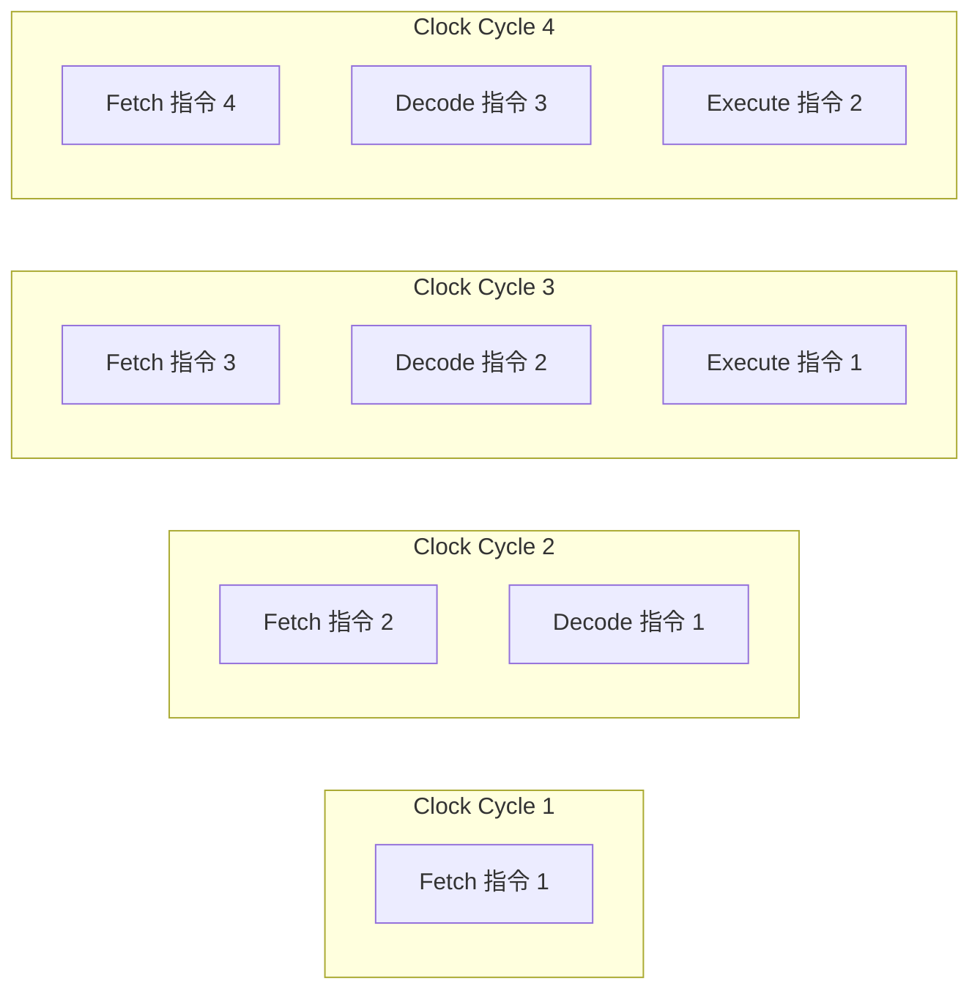
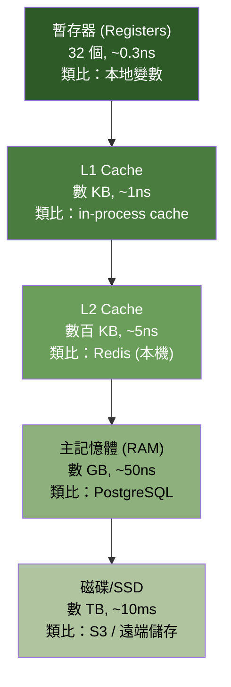
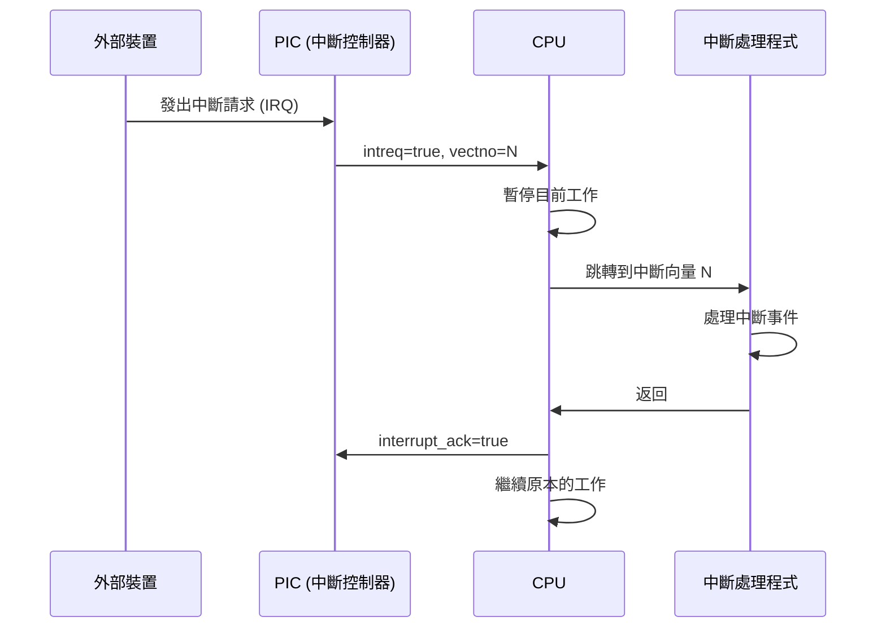
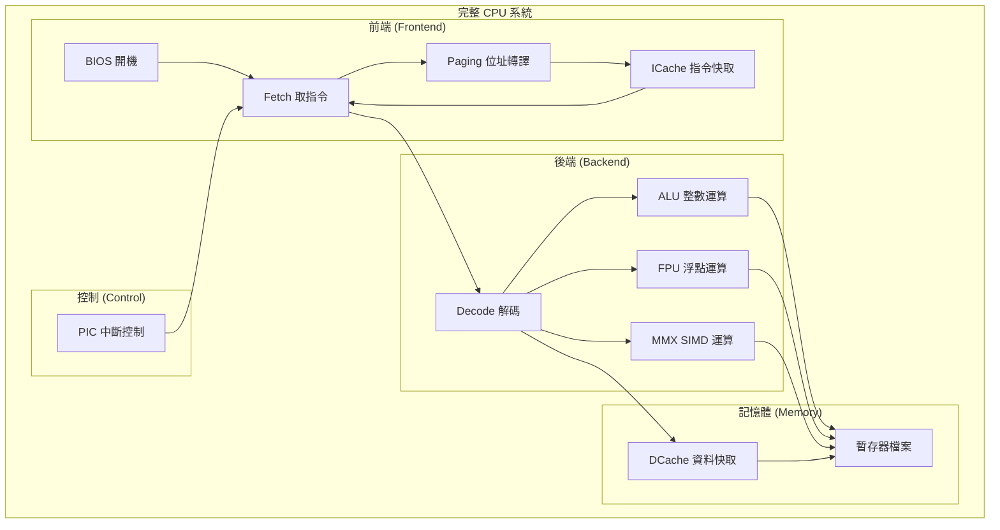

# RISC CPU 硬體規格 -- 軟體工程師導讀

本文為沒有硬體背景的軟體工程師介紹 RISC CPU 的核心概念，並以軟體類比幫助理解。

---

## 什麼是 RISC CPU？

RISC (Reduced Instruction Set Computer) 是一種 CPU 設計哲學：**使用少量簡單的指令，每條指令做一件事，而且盡量在一個時脈週期內完成**。

### RISC vs CISC

| 特性 | RISC | CISC |
|------|------|------|
| 指令數量 | 少 (~100) | 多 (~1000+) |
| 每條指令複雜度 | 低 | 高 |
| 指令長度 | 固定 (通常 32-bit) | 可變 |
| 記憶體存取 | 只有 Load/Store | 任何指令都可存取 |
| 暫存器數量 | 多 (32+) | 少 (~8) |
| 軟體類比 | 函式庫的小函式 | 一個函式做很多事 |
| 代表 | ARM, RISC-V, MIPS | x86, x64 |

軟體工程中有類似的哲學辯論：
- RISC 風格 = Unix 哲學（每個程式做好一件事，然後 pipe 組合）
- CISC 風格 = 瑞士刀程式（一個程式什麼都能做）

---

## CPU Pipeline（管線化執行）

Pipeline 是 CPU 效能的核心。就像工廠流水線，把指令的執行拆成多個階段，每個階段同時處理不同的指令。



### 軟體類比

想像一個三階段的 CI/CD pipeline：

| CPU 階段 | CI/CD 類比 | 說明 |
|----------|-----------|------|
| Fetch | git pull | 取得程式碼 |
| Decode | 語法分析 / lint | 解析並理解要做什麼 |
| Execute | 編譯 / 測試 | 實際執行運算 |
| Memory | 讀寫資料庫 | 存取外部資料 |
| Writeback | 儲存結果 | 將結果寫回 |

當 Pipeline 1 在執行測試時，Pipeline 2 同時在做語法分析，Pipeline 3 同時在 pull 程式碼。這就是 pipeline 的平行化效果。

### Pipeline Hazards（管線冒險）

Pipeline 並非總能順暢運作，有三種問題需要處理：

1. **Data Hazard（資料冒險）**：指令 B 需要指令 A 的結果，但 A 還沒算完
   - 軟體類比：Promise 還沒 resolve 就嘗試 `.then()`
   - 解決：Data Forwarding（將結果直接轉發）或 Stall（暫停等待）

2. **Control Hazard（控制冒險）**：分支指令改變了 PC，已經 fetch 的後續指令作廢
   - 軟體類比：`if` 判斷結果出來後，發現已經預載了錯誤的程式碼路徑
   - 解決：Branch Prediction（預測分支方向）

3. **Structural Hazard（結構冒險）**：兩條指令同時需要同一個硬體資源
   - 軟體類比：兩個 thread 競爭同一個鎖
   - 解決：資源複製（如分開的 ICache/DCache）

---

## 記憶體階層 (Memory Hierarchy)

記憶體系統是一個速度 vs 容量的 trade-off：越快的記憶體越小且越貴。



### 在本範例中

| 層級 | 實作 | 容量 | 初始化來源 |
|------|------|------|-----------|
| 暫存器 | `cpu_reg[32]` (Decode 模組中) | 32 個 | `register.img` |
| ICache | `icmemory[500]` | 500 entries | `icache.img` |
| DCache | `dmemory[4000]` | 4000 entries | `dcache.img` |
| BIOS ROM | `imemory[4000]` | 4000 entries | `bios.img` |

### Cache 的核心觀念

- **Cache Hit**：資料在快取中找到（Redis 命中），快速回傳
- **Cache Miss**：資料不在快取中（Redis miss），需要去慢速記憶體取得
- **Write-back / Write-through**：修改資料時，何時同步回主記憶體的策略

---

## 中斷 (Interrupts)

中斷是硬體的事件通知機制。軟體中最接近的概念是 **signal handler** 或 **event listener**。



### 軟體類比

```python
# Python asyncio 事件模型 = 中斷模型
import signal
import sys

def sigint_handler(signum, frame):  # 註冊中斷處理程式
    print('收到中斷')               # 執行 ISR
    cleanup()                       # 處理事件
    sys.exit(0)                     # 返回

signal.signal(signal.SIGINT, sigint_handler)

# 主程式持續執行，直到 signal 觸發
while True:
    do_work()  # CPU 正常執行指令
```

### 中斷 vs 輪詢 (Polling)

| 方式 | 說明 | 軟體類比 |
|------|------|----------|
| 中斷 | 事件發生時通知 CPU | WebSocket / Event Listener |
| 輪詢 | CPU 主動定期檢查 | setInterval / HTTP Polling |

中斷效率更高，因為 CPU 不需要浪費時間反覆檢查。

---

## 虛擬記憶體與分頁 (Virtual Memory and Paging)

虛擬記憶體讓每個程序以為自己擁有完整的位址空間，實際上由作業系統管理實體記憶體的分配。

### 軟體類比

```python
# 虛擬記憶體就像一個抽象層
class VirtualAddressSpace:
    def __init__(self, process_id):
        self.pid = process_id
        self.page_table = {}  # 邏輯頁 -> 實體頁框

    def access(self, virtual_addr):
        page = virtual_addr // PAGE_SIZE
        offset = virtual_addr % PAGE_SIZE

        if page in self.page_table:
            physical_page = self.page_table[page]
            return physical_memory[physical_page * PAGE_SIZE + offset]
        else:
            raise PageFault()  # 需要從磁碟載入
```

### 核心概念

- **邏輯位址 (Logical Address)**：程式使用的位址，每個程序有自己的空間
- **實體位址 (Physical Address)**：實際的硬體記憶體位址
- **Page Table**：邏輯頁碼到實體頁框碼的映射表
- **Page Fault**：存取的頁面不在記憶體中，需要從磁碟載入
- **TLB (Translation Lookaside Buffer)**：page table 的快取，加速位址轉譯

在本範例中，Paging 模組實作了簡化版本，邏輯位址直接等於實體位址（identity mapping）。

---

## 整體 CPU：精密的指令直譯器

把所有概念組合起來，一個 RISC CPU 就是一個**精密的指令直譯器**，具備：

- **Pipeline**：多階段平行處理 (類似多 worker 的任務佇列)
- **Cache**：多層快取加速資料存取 (類似 CDN + Redis + DB 架構)
- **中斷**：事件驅動的控制流 (類似 event loop)
- **虛擬記憶體**：位址空間抽象化 (類似 container 的 namespace 隔離)
- **多執行單元**：ALU、FPU、MMX 平行計算 (類似 thread pool 中的專用 worker)



## 真實世界的 RISC 處理器

| 處理器 | 用途 | 你可能在哪遇到 |
|--------|------|---------------|
| ARM Cortex | 手機、平板、Raspberry Pi | 你的 iPhone/Android，M1/M2 Mac |
| RISC-V | 開源處理器，嵌入式系統 | Arduino 相容開發板 |
| MIPS | 網路設備、遊戲機 | PlayStation 1/2, 舊款路由器 |
| SPARC | 伺服器 | Oracle/Sun 工作站 |

本範例的 ISA (指令集架構) 是作者自定義的，但概念與上述真實處理器相通。
