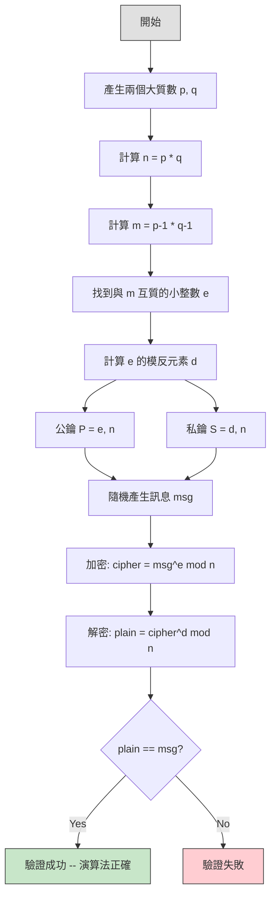

# rsa -- RSA 公鑰加密範例

> **難度**: 中級 | **軟體類比**: Python 原生大整數 (native big int) | **原始碼**: `ref/systemc/examples/sysc/rsa/rsa.cpp`

## 概述

`rsa` 範例展示了一個完全**非硬體**的應用：使用 SystemC 的 `sc_bigint<NBITS>` 任意精度整數型別，實作經典的 **RSA 公鑰加密演算法**。

這個範例的重點不在於模擬硬體，而是證明 SystemC 的資料型別也可以用於**純演算法建模**。就像你可以用 Python 的原生大整數來實作密碼學演算法一樣，SystemC 的 `sc_bigint` 提供了相同的能力。

### 為什麼這很重要？

在軟體世界中，你可能會說：「我直接用 Python 就好了，幹嘛用 SystemC？」答案是：**硬體設計師需要在同一個框架中同時描述演算法和硬體結構**。`sc_bigint` 讓他們可以先用高階的方式驗證演算法正確性，之後再逐步細化成硬體實作。

### 軟體工程師的直覺

如果你寫過 Python，RSA 實作大概長這樣：

```python
from Crypto.Util.number import getPrime, inverse

p, q = getPrime(128), getPrime(128)
n = p * q
e = 65537
d = inverse(e, (p-1)*(q-1))

encrypted = pow(message, e, n)    # 加密
decrypted = pow(encrypted, d, n)  # 解密
assert decrypted == message
```

SystemC 版本做的事情完全一樣，只是用 `sc_bigint<250>` 取代了 Python 的原生大整數。

## RSA 演算法流程



## 核心演算法

本範例涉及多個數論演算法，全部使用 `sc_bigint` 實作：

| 演算法 | 函式名稱 | 用途 | 軟體對應 |
| --- | --- | --- | --- |
| Euclid GCD | `gcd()` | 求最大公因數 | Python 的 `math.gcd()` |
| 擴展歐幾里得 | `euclid()` | 求 GCD 同時找 x, y 使得 ax + by = gcd | 手動實作或 `sympy.gcdex()` |
| 模冪運算 | `modular_exp()` | 計算 a^b mod n | Python 的 `pow(a, b, n)` |
| 模反元素 | `inverse()` | 求 a 的乘法反元素 mod n | `pow(a, -1, n)` (Python 3.8+) |
| 互質搜尋 | `find_rel_prime()` | 找與 n 互質的小奇數 | 通常直接用 65537 |
| Miller-Rabin 質數測試 | `miller_rabin()` | 機率性質數判定 | `sympy.isprime()` |
| 質數搜尋 | `find_prime()` | 隨機找大質數 | `Crypto.Util.number.getPrime()` |
| 加密 | `cipher()` | RSA 加密 | `pow(msg, e, n)` |
| 解密 | `decipher()` | RSA 解密 | `pow(msg, d, n)` |

## 檔案列表

| 檔案 | 說明 | 文件連結 |
| --- | --- | --- |
| `rsa.cpp` | 單一檔案包含所有函式定義與 `sc_main` | [rsa.md](rsa.md) |

## 核心概念速查

| SystemC 概念 | 軟體對應 | 在本範例中的角色 |
| --- | --- | --- |
| `sc_bigint<NBITS>` | Python native big int | 250-bit 任意精度整數，用於所有 RSA 運算 |
| `sc_main()` | `main()` | 程式進入點，呼叫 `rsa()` 函式 |
| 無 `sc_module` | 本範例沒有硬體模組 | 純粹的演算法示範，不使用 SystemC 模擬功能 |

## 學習路徑建議

1. 先讀 [rsa.md](rsa.md) 理解每個函式的作用與 RSA 流程
2. 如果對 SystemC channel 和模組感興趣，回頭看 [simple_fifo](../simple_fifo/_index.md) 範例
3. 如果想看效能建模，可以接著看 [simple_perf](../simple_perf/_index.md) 範例
