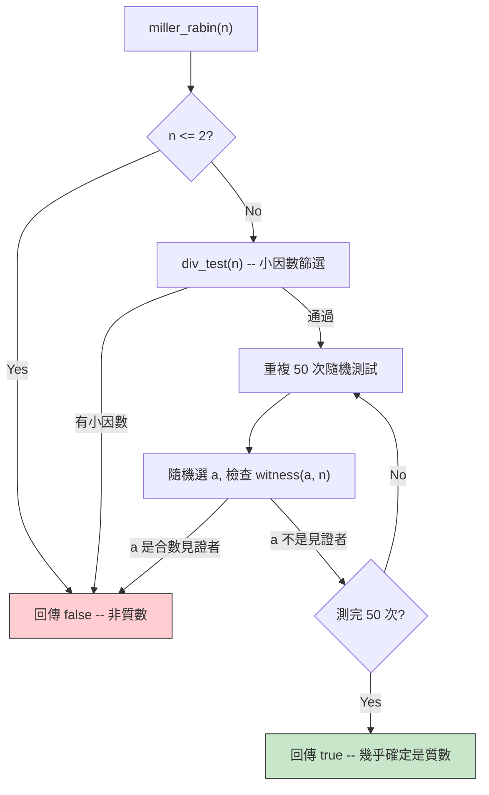
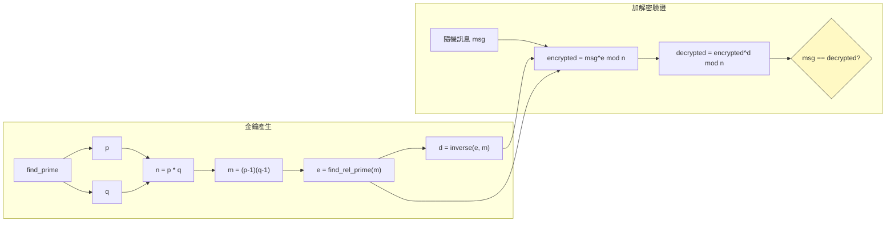

# rsa.cpp -- RSA 公鑰加密實作詳解

> **原始碼**: `ref/systemc/examples/sysc/rsa/rsa.cpp` | **作者**: Ali Dasdan, Synopsys | **參考**: Cormen et al., *Introduction to Algorithms* (CLR)

## 日常生活類比：掛鎖

想像 RSA 就像一個**掛鎖（padlock）**系統：

1. **公鑰 = 打開的掛鎖**：你把一堆打開的掛鎖寄給所有朋友（這是公開的）
2. **私鑰 = 掛鎖的鑰匙**：只有你自己持有
3. **加密 = 鎖上掛鎖**：任何人都可以把訊息放進箱子，然後用你的掛鎖鎖起來
4. **解密 = 用鑰匙開鎖**：只有持有鑰匙的你才能打開箱子讀取訊息

數學上的保障是：**知道掛鎖的形狀（公鑰）無法推導出鑰匙的形狀（私鑰）**，因為這需要對一個極大的數做質因數分解，而這在計算上是不可行的。

## 設計理由：為什麼用 SystemC 實作密碼學？

這個範例的目的**不是**提供一個實用的 RSA 實作。它的目的是展示：

1. **`sc_bigint<NBITS>` 的能力**：SystemC 提供了任意精度整數，可以處理 250-bit 甚至更大的數
2. **演算法建模的可能性**：硬體設計師可以在 SystemC 框架內驗證演算法正確性
3. **型別安全**：`sc_bigint<250>` 在編譯時就確定了位寬，不像 Python 的動態大整數

實務上，如果你要做加密晶片（如 secure element），你會先用這種高階模型驗證數學正確性，然後再逐步轉換成可合成的硬體描述。

## 關鍵型別定義

```cpp
#define NBITS      250
#define HALF_NBITS ( NBITS / 2 )

typedef sc_bigint<NBITS> bigint;  // 250-bit 有號整數
```

`sc_bigint<NBITS>` 是 SystemC 提供的**固定位寬有號整數**。與 C++ 的 `int`（通常 32-bit）不同，它可以精確表示 250-bit 的數值。這相當於能表示大約 75 位十進位數字。

| 概念 | SystemC | Python | C++ |
| --- | --- | --- | --- |
| 型別 | `sc_bigint<250>` | `int`（原生無限精度） | 無內建（需用 library） |
| 位寬 | 編譯時固定 250-bit | 動態增長 | 依 library 而定 |
| 運算 | `+`, `-`, `*`, `/`, `%` | 同左 | 同左（需 operator overloading） |
| 位元存取 | `x[i]` | `(x >> i) & 1` | `(x >> i) & 1` |

## 函式逐一解析

### 輔助函式

#### `abs_val(x)` -- 絕對值

```cpp
bigint abs_val(const sc_signed& x) {
    return (x < 0 ? -x : x);
}
```

直觀明瞭。注意參數型別是 `sc_signed&`（`sc_bigint` 的基底類別），所以它可以接受任何位寬的 `sc_bigint`。

#### `randomize(seed)` -- 初始化亂數產生器

提供可重現的測試：傳入固定 seed 可以得到相同的結果，傳入 -1 則用系統時間。這和你在寫單元測試時固定 random seed 的做法完全一樣。

#### `rand_bitstr(str, nbits)` -- 產生隨機位元字串

產生格式為 `"0b0..."` 的二進位字串。前綴 `0b` 是 SystemC 辨識二進位格式的標記，第三位強制為 `0` 確保正數。

### 核心數論演算法

#### `gcd(a, b)` -- 歐幾里得演算法

```cpp
bigint gcd(const bigint& a, const bigint& b) {
    if (b == 0) return a;
    return gcd(b, a % b);
}
```

這個演算法已有超過 2300 年歷史。遞迴地用 `a % b` 取代 `a`，直到餘數為零。

**軟體類比**：就是 Python 的 `math.gcd()` 或你在演算法課學的那個。

#### `euclid(a, b, d, x, y)` -- 擴展歐幾里得演算法

找到 `d = gcd(a, b)` 同時求出 `x, y` 使得 `ax + by = d`。

這個函式是 RSA 的關鍵：它被 `inverse()` 用來計算模反元素（私鑰的一部分）。

**為什麼需要 x 和 y？** 因為如果 `gcd(e, m) = 1`（即 e 和 m 互質），那麼 `ex + my = 1`，這意味著 `ex = 1 (mod m)`，所以 `x` 就是 `e` 的模反元素。

#### `modular_exp(a, b, n)` -- 模冪運算

```cpp
bigint modular_exp(const bigint& a, const bigint& b, const bigint& n) {
    bigint d = 1;
    for (int i = b.length() - 1; i >= 0; --i) {
        d = (d * d) % n;
        if (b[i])
            d = (d * a) % n;
    }
    return ret_pos(d, n);
}
```

計算 `a^b mod n`，使用**反覆平方法（repeated squaring）**。這是 RSA 加密和解密的核心運算。

**為什麼不直接算 `a^b` 再取餘？** 因為 `a^b` 可能有幾萬位，根本存不下。反覆平方法每一步都取餘，保證中間結果不會爆炸。

**軟體類比**：就是 Python 的 `pow(a, b, n)` 三參數版本，Python 內部也用同樣的演算法。

#### `inverse(a, n)` -- 模反元素

利用擴展歐幾里得演算法求 `a` 在 `mod n` 下的乘法反元素。也就是找 `x` 使得 `a * x = 1 (mod n)`。

在 RSA 中，這用來從公鑰指數 `e` 計算私鑰指數 `d`。

#### `find_rel_prime(n)` -- 找互質數

從 3 開始嘗試每個奇數，直到找到與 `n` 互質的數。實務上通常直接用 65537（一個已知的好選擇），但這裡為了教學目的用了搜尋方式。

#### `witness(a, n)` 和 `miller_rabin(n)` -- Miller-Rabin 質數測試



Miller-Rabin 是一個**機率性質數測試**。它不能 100% 確定一個數是質數，但錯誤機率最多為 `2^(-50)`，大約是 `0.00000000000000088817`。

**軟體類比**：就像你寫 property-based testing 時，用隨機測試跑很多次來增加信心，但永遠不能保證 100% 正確。

#### `find_prime(r)` -- 尋找大質數

隨機產生一個奇數，然後不斷加 2 直到 `miller_rabin()` 判定它是質數。根據質數定理，大約需要 `ln(2^NBITS)` 次迭代。

### RSA 主流程

#### `cipher(msg, e, n)` 和 `decipher(msg, d, n)` -- 加解密

```cpp
bigint cipher(const bigint& msg, const bigint& e, const bigint& n) {
    return modular_exp(msg, e, n);   // msg^e mod n
}

bigint decipher(const bigint& msg, const bigint& d, const bigint& n) {
    return modular_exp(msg, d, n);   // msg^d mod n
}
```

加密和解密的數學形式完全相同，只是使用不同的指數（公鑰 `e` vs 私鑰 `d`）。

#### `rsa(seed)` -- RSA 完整流程



完整步驟：
1. 產生兩個大質數 `p` 和 `q`
2. 計算 `n = p * q`（這是公鑰和私鑰共用的部分）
3. 計算 `m = (p-1) * (q-1)`（歐拉函數）
4. 找到與 `m` 互質的小整數 `e`（公鑰指數）
5. 計算 `e` 的模反元素 `d`（私鑰指數）
6. 公鑰 = `(e, n)`，私鑰 = `(d, n)`
7. 隨機產生訊息，加密後再解密，驗證結果一致

### `sc_main()` -- 程式進入點

```cpp
int sc_main(int argc, char *argv[]) {
    if (argc <= 1)
        rsa(-1);      // 用系統時間做 seed
    else
        rsa(atoi(argv[1]));  // 用指定的 seed
    return 0;
}
```

注意：雖然使用了 `sc_main`（SystemC 的進入點），但本範例**完全沒有用到 SystemC 的模擬引擎**。沒有 `sc_module`、沒有 `sc_start()`、沒有 `SC_THREAD`。它純粹利用了 SystemC 的資料型別。

## 與標準密碼學程式庫的比較

| 面向 | 本範例 | OpenSSL / libsodium |
| --- | --- | --- |
| 目的 | 教學，展示 `sc_bigint` | 生產環境使用 |
| 安全性 | 不安全（NBITS=250 太小） | 安全（2048+ bit） |
| 效能 | 慢 | 高度優化 |
| 質數搜尋 | 線性搜尋 + Miller-Rabin | 多種最佳化策略 |
| 公鑰指數 | 動態搜尋小互質數 | 通常固定為 65537 |

## 核心概念速查

| SystemC 概念 | 軟體對應 | 在本範例中的角色 |
| --- | --- | --- |
| `sc_bigint<NBITS>` | Python native big int | 所有 RSA 運算的核心型別 |
| `sc_signed` | Python `int` 的基底概念 | `abs_val()` 的參數型別，提供多型 |
| `x[i]` 位元存取 | `(x >> i) & 1` | `modular_exp()` 和 `witness()` 中逐位讀取指數 |
| `x.length()` | `x.bit_length()` | 取得數值的位元長度 |
| `x.to_int()` | `int(x)` | `div_test()` 中將小數值轉為 C++ int |
