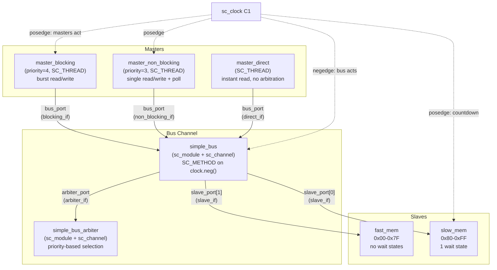
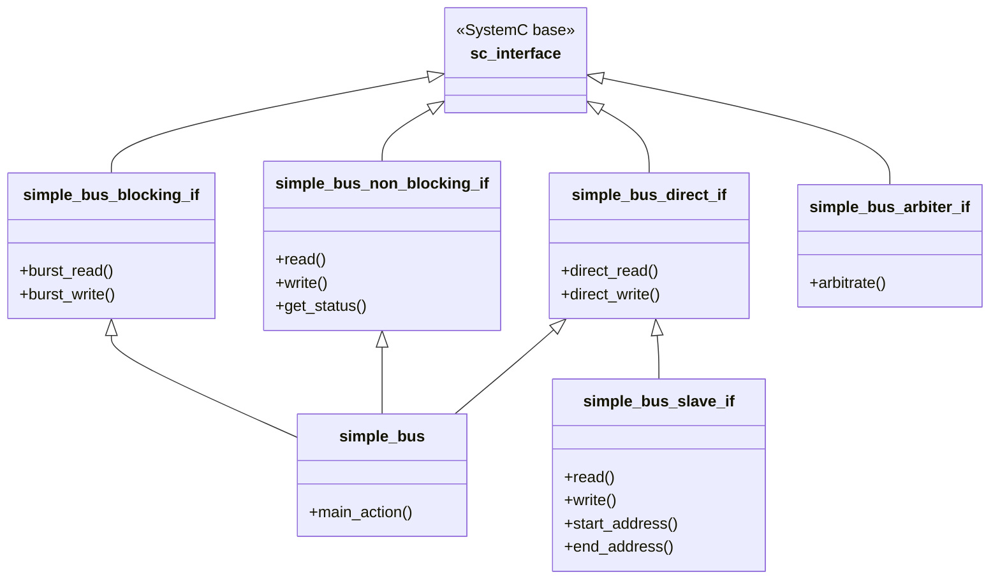
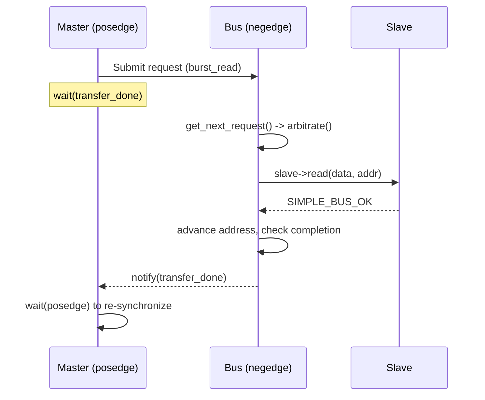

# Simple Bus -- SystemC 匯流排系統總覽

## 軟體類比：共用資料庫與連線池

想像一個服務多個應用程式實例的**共用資料庫伺服器**：

- **Masters** = 需要讀寫資料的應用程式實例
- **Bus** = 仲介所有資料庫存取的連線池管理器
- **Arbiter** = 決定哪個應用程式取得下一個連線的鎖定管理器
- **Slaves** = 不同的儲存後端（快速的 Redis 快取 vs. 緩慢的磁碟資料庫）
- **Blocking access** = 同步 SQL 查詢 -- 執行緒阻塞直到結果回傳
- **Non-blocking access** = 非同步查詢 -- 提交查詢後輪詢結果
- **Direct access** = 記憶體內快取讀取 -- 即時完成，繞過連線池

這正是 `simple_bus` 範例的核心：多個 master 競爭共用匯流排，arbiter 決定優先順序，slave 以不同速度回應。

---

## 架構圖

---

## 介面繼承層次圖

---

## 檔案清單

| 檔案 | 類型 | 說明 |
|------|------|------|
| `simple_bus_types.h` | Header | 狀態列舉、前向宣告、`sb_fprintf` |
| `simple_bus_types.cpp` | Source | 用於除錯輸出的狀態字串陣列 |
| `simple_bus_request.h` | Header | 請求結構（priority、address、data、lock、event）|
| `simple_bus_tools.cpp` | Source | 信號安全的 `sb_fprintf` 工具函式 |
| `simple_bus_blocking_if.h` | Interface | Blocking 匯流排介面：`burst_read`、`burst_write` |
| `simple_bus_non_blocking_if.h` | Interface | Non-blocking 匯流排介面：`read`、`write`、`get_status` |
| `simple_bus_direct_if.h` | Interface | Direct 匯流排介面：`direct_read`、`direct_write` |
| `simple_bus_slave_if.h` | Interface | Slave 介面：繼承 `direct_if` 並加上位址範圍 |
| `simple_bus_arbiter_if.h` | Interface | Arbiter 介面：`arbitrate` |
| `simple_bus.h` | Header | Bus channel：實作 3 個 master 介面 |
| `simple_bus.cpp` | Source | Bus 邏輯：請求處理、slave 分派、lock 管理 |
| `simple_bus_arbiter.h` | Header | Arbiter 模組宣告 |
| `simple_bus_arbiter.cpp` | Source | 含 3 條規則的優先權仲裁 |
| `simple_bus_master_blocking.h` | Header | Blocking master 模組宣告 |
| `simple_bus_master_blocking.cpp` | Source | Burst read -> 計算 -> burst write 迴圈 |
| `simple_bus_master_non_blocking.h` | Header | Non-blocking master 模組宣告 |
| `simple_bus_master_non_blocking.cpp` | Source | 單次 read -> 修改 -> write 並帶輪詢迴圈 |
| `simple_bus_master_direct.h` | Header | Direct master（監視器）模組宣告 |
| `simple_bus_master_direct.cpp` | Source | 週期性 direct-read 監視器 |
| `simple_bus_fast_mem.h` | Header+Source | 快速記憶體 slave（inline，無等待週期）|
| `simple_bus_slow_mem.h` | Header+Source | 慢速記憶體 slave（inline，可設定等待週期）|
| `simple_bus_test.h` | Header | 測試平台：所有模組的實例化與連線 |
| `simple_bus_main.cpp` | Source | `sc_main` 入口點，執行 10000 ns |

---

## 核心概念

### 1. sc_interface 繼承層次 -- 介面隔離原則

匯流排向 master 暴露**三個獨立的介面**。每個 master 只看到它需要的方法。這是 SOLID 設計原則中的**介面隔離原則（ISP）**：blocking master 不需要知道 `get_status()`，direct master 不需要知道 priority。

以軟體的角度來看，就像有 `ReadOnlyRepository`、`AsyncRepository` 和 `SyncRepository` 三個獨立介面，全部由同一個資料庫連線池支撐。

### 2. sc_channel -- 同時是模組也是介面的類別

`simple_bus` 既是 `sc_module`（有 process 和 port），也是 `sc_interface` 的實作（提供 `burst_read`、`read`、`direct_read`）。在 SystemC 中，這種組合稱為**階層式 channel（hierarchical channel）**。這類似於 C++ 中同時繼承多個抽象類別（C++ abstract class / Python ABC），同時也是由依賴注入管理的元件。

### 3. 仲裁（Arbitration）

當多個 master 在同一個時脈週期提出請求時，arbiter 根據以下規則選擇優先者：
1. 正在進行中的 locked burst 不可被中斷
2. 在前一個週期已被 granted 的 locked 請求優先
3. 否則，priority 數字最小者獲勝

這類比於支援 mutex 的**優先權執行緒排程器**。

### 4. Blocking vs. Non-blocking vs. Direct

| 存取模式 | 軟體類比 | Process 類型 | 等待完成？ |
|---|---|---|---|
| Blocking | `await fetch()` | SC_THREAD | 是，透過 `wait(event)` |
| Non-blocking | `fetch().then(poll)` | SC_THREAD | 否，用 `get_status()` 輪詢 |
| Direct | `cache.get()` | SC_THREAD | 即時，不走匯流排協定 |

### 5. 時序慣例

- **Masters** 在**時脈上升沿（posedge）**動作
- **Bus** 在**時脈下降沿（negedge）**動作
- 半個週期的間隔避免競態條件——master 先提交請求，bus 再處理

---

## 建議閱讀順序

1. **[spec.md](spec.md)** -- 給軟體工程師的硬體匯流排概念
2. **[types.md](types.md)** -- 狀態碼、請求結構、工具函式
3. **[interfaces.md](interfaces.md)** -- 5 個介面類別
4. **[simple-bus.md](simple-bus.md)** -- Bus channel 實作
5. **[arbiter.md](arbiter.md)** -- 仲裁邏輯
6. **[slaves.md](slaves.md)** -- 快速與慢速記憶體
7. **[masters.md](masters.md)** -- 三種 master 類型
8. **[main.md](main.md)** -- 測試平台與模擬入口點
