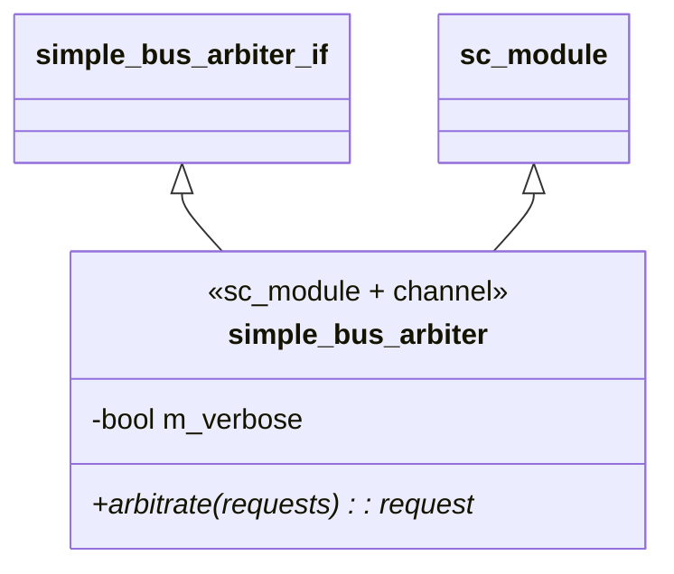
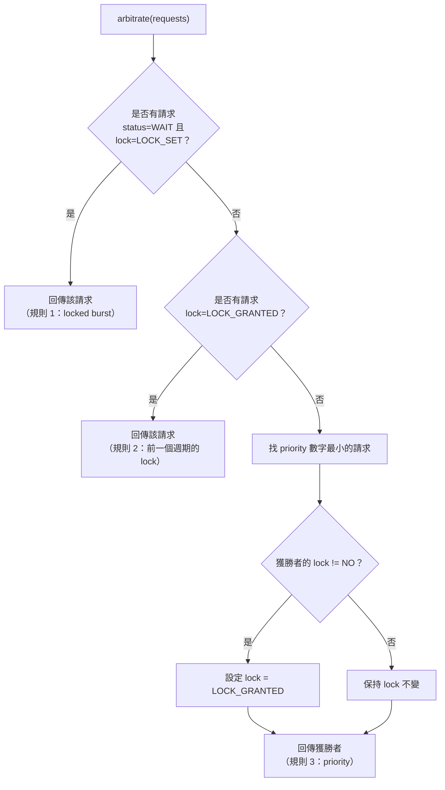
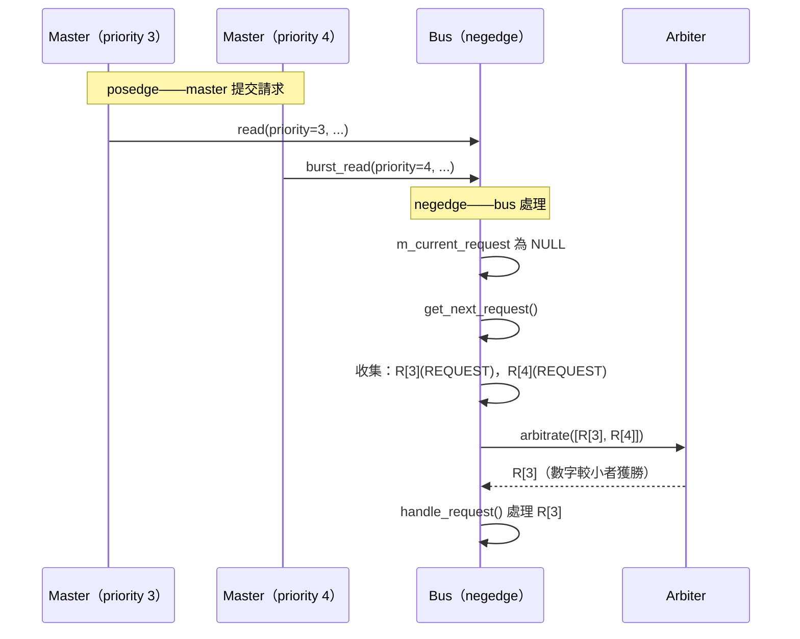

# Simple Bus -- Arbiter

## 概覽

`simple_bus_arbiter` 是一個**階層式 channel**（同時是 `sc_module` 和介面實作），決定每個週期中哪個待處理請求可以存取匯流排。它實作了帶 lock 支援的**優先權仲裁策略**。

**軟體類比：** 想像一個帶有優先權佇列和 mutex 支援的**執行緒排程器**：
- 多個執行緒（master）競爭 CPU 時間（匯流排存取）
- 排程器選取優先權最高的可執行執行緒
- 持有 mutex（lock）的執行緒在其臨界區段內不可被搶佔

**來源檔案：** `simple_bus_arbiter.h`、`simple_bus_arbiter.cpp`

---

## 類別結構



Arbiter 非常簡單——一個方法、一個成員變數。它**沒有 process** 也**沒有 clock port**。它由 bus 的 `get_next_request()` 方法同步呼叫。

---

## 仲裁規則

`arbitrate()` 方法按優先順序套用三條規則：

### 規則 1：正在進行中的 Locked Burst

```cpp
if ((request->status == SIMPLE_BUS_WAIT) &&
    (request->lock == SIMPLE_BUS_LOCK_SET))
    return request;  // 無法中斷 locked burst
```

如果某個請求正在被服務（`WAIT`）且已設定 lock，則無條件獲勝。這防止高優先權的 master 中斷 locked burst 傳輸。

**軟體類比：** 位於 `synchronized` 區塊 / 臨界區段內的執行緒，不可被等待同一個 lock 的其他執行緒搶佔。

### 規則 2：前一個週期已 Granted 的 Lock

```cpp
if (requests[i]->lock == SIMPLE_BUS_LOCK_GRANTED)
    return requests[i];
```

如果某個請求在前一個週期被 granted lock（表示該 master 已保留匯流排，現在正在發出後續請求），則不論優先權如何都優先。

**軟體類比：** 持有 advisory lock 的資料庫連線——同一個用戶端的下一個查詢無需重新競爭就能取得連線。

### 規則 3：最高優先權（最小數字）

```cpp
for (i = 1; i < requests.size(); ++i)
    if (requests[i]->priority < best_request->priority)
        best_request = requests[i];
```

預設退路：**priority 數字最小**的請求獲勝。Arbiter 同時斷言所有 priority 都是唯一的。

**軟體類比：** 數字越小優先權越高的優先權佇列（類似 Unix nice 值）。

---

## 決策流程圖



---

## 仲裁範例

### 情境 1：簡單優先權

```
待處理：R[3](-)，R[4](-)
獲勝：R[3]（規則 3——數字越小優先權越高）
```

### 情境 2：Locked Burst 不可被中斷

```
待處理：R[3](-)，R[4](+, status=WAIT)
獲勝：R[4]（規則 1——locked burst 進行中）
```

即使 R[3] 有更高優先權，R[4] 正在進行 locked burst 傳輸，不可被搶佔。

### 情境 3：Lock 保留

```
第 1 個週期：R[4](+) 被選中（唯一請求）
第 2 個週期：R[3](-)，R[4](+, lock=GRANTED)
獲勝：R[4]（規則 2——lock 在前一個週期已被 granted）
```

R[4] 使用 lock 保留了匯流排。即使 R[3] 有更高優先權，R[4] 因為 lock 已被 granted 而取得匯流排。

### 情境 4：Lock 未被跟進

```
第 1 個週期：R[4](+) 被選中，lock 被 granted
第 2 個週期：只有 R[3](-)（R[4] 未發出新請求）
獲勝：R[3]（規則 3——R[4] 的 lock 透過 clear_locks() 過期）
```

如果持有 lock 的 master 未提交後續請求，lock 會被清除，恢復正常優先權規則。

### 情境 5：重複 Priority（錯誤）

```
待處理：R[3](-)，R[3](-)
結果：sc_assert 失敗——priority 必須唯一
```

---

## 時序：Arbiter 何時被呼叫？



每次 negedge 當 `m_current_request` 為 `NULL` 且有待處理請求時，就會呼叫 arbiter。Bus 收集所有狀態為 `REQUEST` 或 `WAIT` 的請求，傳入 arbiter，並處理獲勝者。

---

## 設計考量

### 為何 Arbiter 是獨立的模組？

仲裁策略是**可插拔的**。透過將 `simple_bus_arbiter_if` 定義為介面並以 `sc_port` 連接，你可以替換成不同的 arbiter 而無需修改 bus：

- **輪詢仲裁器：** 每個 master 輪流取得一次機會，不論優先權
- **公平分配仲裁器：** 追蹤每個 master 使用了多少匯流排時間
- **TDMA 仲裁器：** 為每個 master 分配固定時間槽

這就是**策略模式（Strategy pattern）**——仲裁演算法被封裝在介面背後。

### 為何不直接按 Priority 排序？

三條規則的系統之所以存在，是因為 **lock 機制**。若沒有 lock，一個簡單的 `min_element` by priority 就夠了。但 lock 增加了一種「保留」形式，必須覆蓋正常的優先權，因而形成這個規則層次：
1. 活動中的 locked burst（不可中斷硬體層級的原子操作）
2. 已 granted 的 lock（履行保留）
3. Priority（預設排程）
