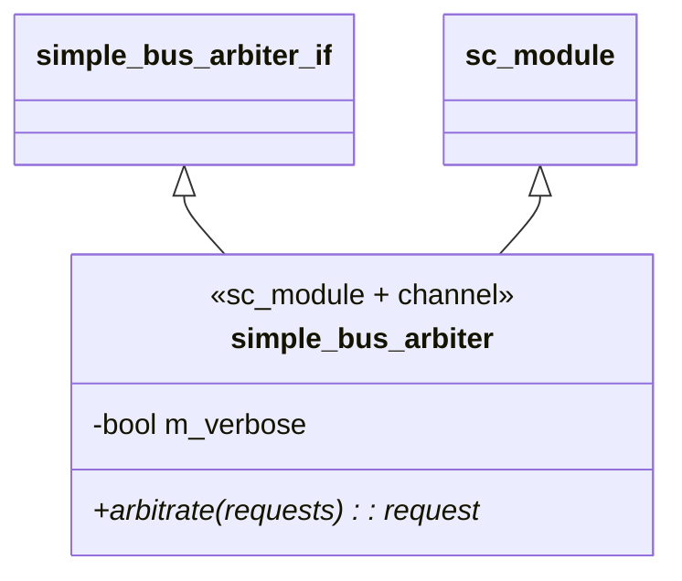
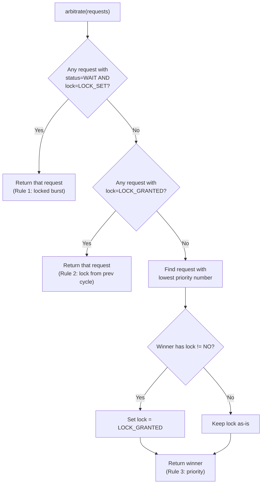
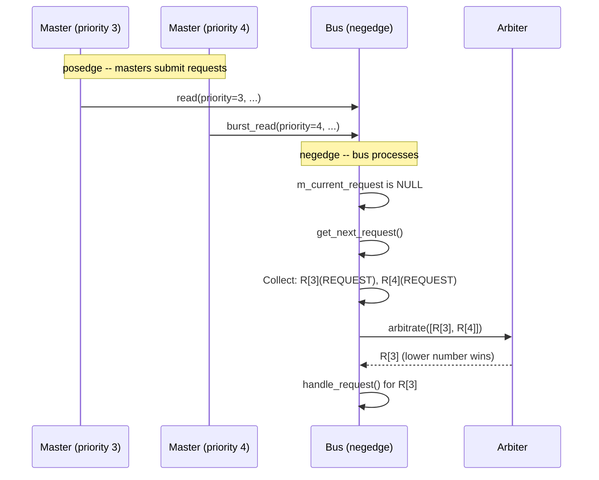

# Simple Bus -- Arbiter

## Overview

The `simple_bus_arbiter` is a **hierarchical channel** (both `sc_module` and interface implementation) that decides which pending request gets access to the bus in each cycle. It implements a **priority-based arbitration policy** with lock support.

**Software analogy:** Think of a **thread scheduler with priority queues and mutex support**:
- Multiple threads (masters) compete for CPU time (bus access)
- The scheduler picks the highest-priority runnable thread
- A thread holding a mutex (lock) cannot be preempted from its critical section

**Source files:** `simple_bus_arbiter.h`, `simple_bus_arbiter.cpp`

---

## Class Structure



The arbiter is remarkably simple -- one method, one member variable. It has **no process** and **no clock port**. It's called synchronously by the bus's `get_next_request()` method.

---

## Arbitration Rules

The `arbitrate()` method applies three rules in order of decreasing priority:

### Rule 1: Locked Burst in Progress

```cpp
if ((request->status == SIMPLE_BUS_WAIT) &&
    (request->lock == SIMPLE_BUS_LOCK_SET))
    return request;  // cannot break into a locked burst
```

If a request is currently being served (`WAIT`) and has its lock set, it wins unconditionally. This prevents higher-priority masters from interrupting a locked burst transfer.

**Software analogy:** A thread inside a `synchronized` block / critical section cannot be preempted by other threads waiting for the same lock.

### Rule 2: Lock Granted from Previous Cycle

```cpp
if (requests[i]->lock == SIMPLE_BUS_LOCK_GRANTED)
    return requests[i];
```

If a request was granted the lock in a previous cycle (meaning the master reserved the bus and is now making a follow-up request), it wins regardless of priority.

**Software analogy:** A database connection with an advisory lock -- the same client's next query gets the connection without re-competing.

### Rule 3: Highest Priority (Lowest Number)

```cpp
for (i = 1; i < requests.size(); ++i)
    if (requests[i]->priority < best_request->priority)
        best_request = requests[i];
```

Default fallback: the request with the **lowest numerical priority** wins. The arbiter also asserts that all priorities are unique.

**Software analogy:** A priority queue where lower numbers mean higher priority (like Unix nice values).

---

## Decision Flowchart



---

## Arbitration Examples

### Scenario 1: Simple Priority

```
Pending: R[3](-), R[4](-)
Winner:  R[3] (Rule 3 -- lower number = higher priority)
```

### Scenario 2: Locked Burst Cannot Be Interrupted

```
Pending: R[3](-), R[4](+, status=WAIT)
Winner:  R[4] (Rule 1 -- locked burst in progress)
```

Even though R[3] has higher priority, R[4] is in the middle of a locked burst transfer and cannot be preempted.

### Scenario 3: Lock Reservation

```
Cycle 1: R[4](+) selected (only request)
Cycle 2: R[3](-), R[4](+, lock=GRANTED)
Winner:  R[4] (Rule 2 -- lock was granted previously)
```

R[4] used the lock to reserve the bus. Even though R[3] has higher priority, R[4] gets the bus because its lock was already granted.

### Scenario 4: Lock Not Followed Up

```
Cycle 1: R[4](+) selected, lock granted
Cycle 2: R[3](-) only (R[4] didn't make a new request)
Winner:  R[3] (Rule 3 -- R[4]'s lock expires via clear_locks())
```

If the locking master doesn't submit a follow-up request, the lock is cleared and normal priority rules apply.

### Scenario 5: Duplicate Priority (Error)

```
Pending: R[3](-), R[3](-)
Result:  sc_assert FAILURE -- priorities must be unique
```

---

## Timing: When Is the Arbiter Called?



The arbiter is called **every negedge** when `m_current_request` is `NULL` and there are pending requests. The bus collects all requests with status `REQUEST` or `WAIT`, passes them to the arbiter, and processes the winner.

---

## Design Considerations

### Why Is the Arbiter a Separate Module?

The arbitration policy is **pluggable**. By defining `simple_bus_arbiter_if` as an interface and connecting it via `sc_port`, you can swap in different arbiters without modifying the bus:

- **Round-robin arbiter:** Each master gets a turn, regardless of priority
- **Fair-share arbiter:** Track how much bus time each master has used
- **TDMA arbiter:** Fixed time slots assigned to each master

This is the **Strategy pattern** -- the arbitration algorithm is encapsulated behind an interface.

### Why Not Just Sort by Priority?

The three-rule system exists because of the **lock mechanism**. Without locks, a simple `min_element` by priority would suffice. But locks add a form of "reservation" that must override normal priority, creating the rule hierarchy:
1. Active locked burst (cannot interrupt hardware-level atomic operation)
2. Previously granted lock (honor the reservation)
3. Priority (default scheduling)
