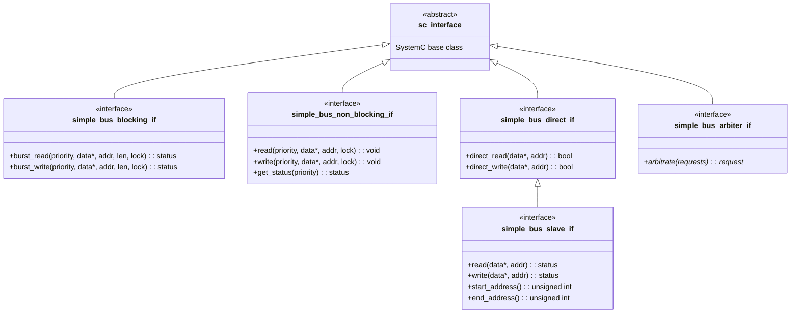
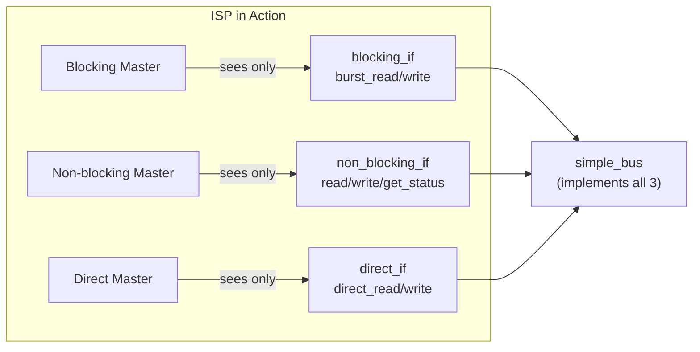

# Simple Bus -- Interfaces

## Overview

This example defines **5 separate interface classes**, all ultimately deriving from SystemC's `sc_interface`. Each interface is a pure abstract class (all methods are `= 0`) that defines a contract between components.

**Software analogy:** Think of these as Java/C# interfaces or Rust traits. The bus "implements" multiple interfaces, and each master only "depends on" the specific interface it needs.

---

## Interface Hierarchy



---

## File: `simple_bus_blocking_if.h`

**Software analogy:** A synchronous HTTP client -- you call `post()` and the function doesn't return until the server responds.

```cpp
class simple_bus_blocking_if : public virtual sc_interface {
public:
    virtual simple_bus_status burst_read(
        unsigned int unique_priority,
        int *data,
        unsigned int start_address,
        unsigned int length = 1,
        bool lock = false) = 0;

    virtual simple_bus_status burst_write(
        unsigned int unique_priority,
        int *data,
        unsigned int start_address,
        unsigned int length = 1,
        bool lock = false) = 0;
};
```

### Key Points

- **`burst_read` / `burst_write`**: Transfer multiple 32-bit words in one call. `length` is the number of words; addresses are byte-aligned (multiples of 4).
- **Returns `simple_bus_status`**: The caller is blocked (via `wait()`) until the transfer completes or fails.
- **`lock` parameter**: If `true`, reserves the bus for the same master's next request. Like acquiring a database advisory lock for a transaction sequence.
- **`unique_priority`**: Lower number = higher priority. Serves both as the master's ID and its importance level.

---

## File: `simple_bus_non_blocking_if.h`

**Software analogy:** An async task queue -- you submit a job and poll a status endpoint to check if it's done.

```cpp
class simple_bus_non_blocking_if : public virtual sc_interface {
public:
    virtual void read(unsigned int unique_priority,
                      int *data, unsigned int address,
                      bool lock = false) = 0;

    virtual void write(unsigned int unique_priority,
                       int *data, unsigned int address,
                       bool lock = false) = 0;

    virtual simple_bus_status get_status(unsigned int unique_priority) = 0;
};
```

### Key Points

- **`read` / `write`** return `void` -- they just submit the request and return immediately.
- **`get_status`** is the polling mechanism. The caller must repeatedly check until status becomes `SIMPLE_BUS_OK` or `SIMPLE_BUS_ERROR`.
- Only transfers **one word at a time** (no `length` parameter), unlike the blocking interface.
- A new request can only be submitted after the previous one completes -- calling `read` while a previous request is still pending triggers `sc_assert` failure.

### Blocking vs. Non-blocking Comparison

| Aspect | Blocking | Non-blocking |
|---|---|---|
| Data granularity | Burst (multi-word) | Single word |
| Return type | `simple_bus_status` | `void` (poll with `get_status`) |
| Caller behavior | Suspended until done | Returns immediately |
| SystemC mechanism | `wait(event)` inside impl | Caller does `wait()` in a loop |

---

## File: `simple_bus_direct_if.h`

**Software analogy:** A local in-process cache read -- no network, no protocol overhead, instant result.

```cpp
class simple_bus_direct_if : public virtual sc_interface {
public:
    virtual bool direct_read(int *data, unsigned int address) = 0;
    virtual bool direct_write(int *data, unsigned int address) = 0;
};
```

### Key Points

- **No priority, no lock** -- bypasses the bus protocol entirely.
- Returns `bool`: `true` for success, `false` if the address doesn't map to any slave.
- Executes **instantaneously** in simulation time (zero delta cycles for the bus portion).
- Both the bus AND the slaves implement this interface. The bus simply forwards the call to the matching slave.

---

## File: `simple_bus_slave_if.h`

**Software analogy:** A storage backend interface -- like the interface a database driver must implement.

```cpp
class simple_bus_slave_if : public simple_bus_direct_if {
public:
    virtual simple_bus_status read(int *data, unsigned int address) = 0;
    virtual simple_bus_status write(int *data, unsigned int address) = 0;
    virtual unsigned int start_address() const = 0;
    virtual unsigned int end_address() const = 0;
};
```

### Key Points

- **Extends `simple_bus_direct_if`** -- every slave must support both normal and direct access.
- `read`/`write` return `simple_bus_status` instead of `bool`. This allows slaves to return `SIMPLE_BUS_WAIT` (I need more time) in addition to `SIMPLE_BUS_OK` or `SIMPLE_BUS_ERROR`.
- `start_address()` / `end_address()` define the slave's address range. The bus uses these to route requests to the correct slave -- like URL routing in a web framework.

---

## File: `simple_bus_arbiter_if.h`

**Software analogy:** A thread scheduler's `pick_next_thread()` function.

```cpp
class simple_bus_arbiter_if : public virtual sc_interface {
public:
    virtual simple_bus_request *
        arbitrate(const simple_bus_request_vec &requests) = 0;
};
```

### Key Points

- Takes a vector of pending requests, returns a pointer to the "winner."
- The bus calls this when it has no current request and there are pending ones.
- Decoupled from the bus -- you could swap in a round-robin arbiter, a fair-share arbiter, etc. without changing any other code.

---

## Why So Many Interfaces? (Interface Segregation Principle)

In software design, the **Interface Segregation Principle (ISP)** states: *No client should be forced to depend on methods it does not use.*

Consider what would happen with a single `simple_bus_if` containing ALL methods:

```cpp
// BAD: fat interface
class simple_bus_if : public virtual sc_interface {
    virtual status burst_read(...) = 0;
    virtual status burst_write(...) = 0;
    virtual void read(...) = 0;
    virtual void write(...) = 0;
    virtual status get_status(...) = 0;
    virtual bool direct_read(...) = 0;
    virtual bool direct_write(...) = 0;
};
```

Problems:
1. The direct master would "see" burst_read/write, which it should never call.
2. Changing the blocking interface signature would force recompilation of non-blocking masters.
3. No type safety -- nothing prevents a direct master from accidentally calling `burst_read`.

With separate interfaces, `sc_port<simple_bus_direct_if>` **only exposes** `direct_read` and `direct_write`. The compiler enforces the contract.



This is exactly the same pattern as having `Readable`, `Writable`, and `ReadWritable` interfaces for streams in many languages.
