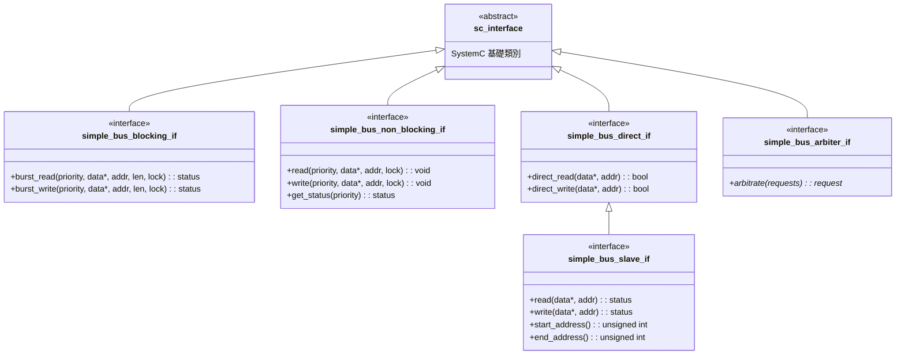
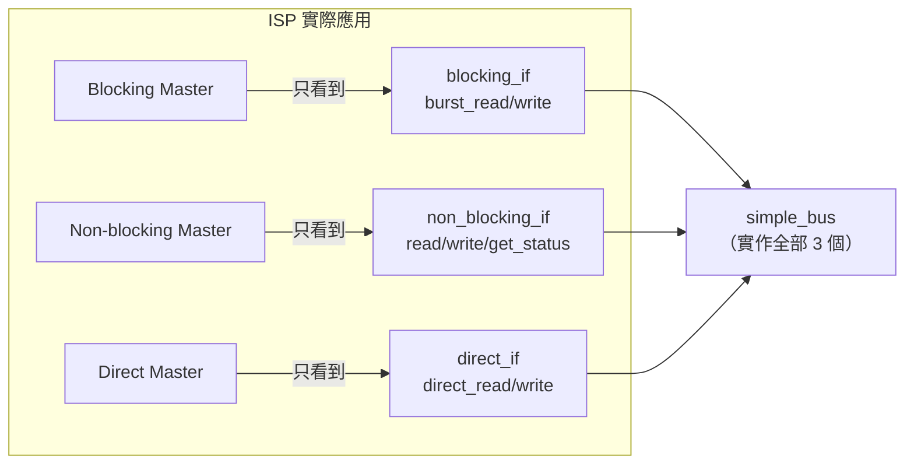

# Simple Bus -- 介面（Interfaces）

## 概覽

本範例定義了 **5 個獨立的介面類別**，全部最終繼承自 SystemC 的 `sc_interface`。每個介面都是純抽象類別（所有方法皆為 `= 0`），定義元件之間的契約。

**軟體類比：** 可以把它們想成 C++ 的純虛擬介面或 Python 的 ABC（Abstract Base Class）。匯流排「實作」多個介面，每個 master 只「依賴」它所需的特定介面。

---

## 介面繼承層次



---

## 檔案：`simple_bus_blocking_if.h`

**軟體類比：** 同步 HTTP 用戶端——你呼叫 `post()`，函式直到伺服器回應才返回。

```cpp
class simple_bus_blocking_if : public virtual sc_interface {
public:
    virtual simple_bus_status burst_read(
        unsigned int unique_priority,
        int *data,
        unsigned int start_address,
        unsigned int length = 1,
        bool lock = false) = 0;

    virtual simple_bus_status burst_write(
        unsigned int unique_priority,
        int *data,
        unsigned int start_address,
        unsigned int length = 1,
        bool lock = false) = 0;
};
```

### 重點說明

- **`burst_read` / `burst_write`**：一次呼叫傳輸多個 32 位元字。`length` 是字的數量；位址以位元組對齊（4 的倍數）。
- **回傳 `simple_bus_status`**：呼叫者透過 `wait()` 阻塞，直到傳輸完成或失敗。
- **`lock` 參數**：若為 `true`，為同一個 master 的下一個請求保留匯流排。類似於為一系列交易獲取資料庫 advisory lock。
- **`unique_priority`**：數字越小優先權越高。同時作為 master 的唯一 ID 和重要性級別。

---

## 檔案：`simple_bus_non_blocking_if.h`

**軟體類比：** 非同步工作佇列——你提交一個任務，然後輪詢狀態端點查看是否完成。

```cpp
class simple_bus_non_blocking_if : public virtual sc_interface {
public:
    virtual void read(unsigned int unique_priority,
                      int *data, unsigned int address,
                      bool lock = false) = 0;

    virtual void write(unsigned int unique_priority,
                       int *data, unsigned int address,
                       bool lock = false) = 0;

    virtual simple_bus_status get_status(unsigned int unique_priority) = 0;
};
```

### 重點說明

- **`read` / `write`** 回傳 `void`——只是提交請求後立即返回。
- **`get_status`** 是輪詢機制。呼叫者必須反覆查詢，直到狀態變成 `SIMPLE_BUS_OK` 或 `SIMPLE_BUS_ERROR`。
- 每次只傳輸**一個字**（無 `length` 參數），不像 blocking 介面可以 burst。
- 新請求只能在前一個請求完成後才能提交——若前一個請求仍在執行中就呼叫 `read`，會觸發 `sc_assert` 失敗。

### Blocking vs. Non-blocking 比較

| 面向 | Blocking | Non-blocking |
|---|---|---|
| 資料粒度 | Burst（多字）| 單字 |
| 回傳型別 | `simple_bus_status` | `void`（用 `get_status` 輪詢）|
| 呼叫者行為 | 暫停直到完成 | 立即返回 |
| SystemC 機制 | 實作內部 `wait(event)` | 呼叫者在迴圈中 `wait()` |

---

## 檔案：`simple_bus_direct_if.h`

**軟體類比：** 本地程序內快取讀取——無網路、無協定開銷、即時結果。

```cpp
class simple_bus_direct_if : public virtual sc_interface {
public:
    virtual bool direct_read(int *data, unsigned int address) = 0;
    virtual bool direct_write(int *data, unsigned int address) = 0;
};
```

### 重點說明

- **無 priority、無 lock**——完全繞過匯流排協定。
- 回傳 `bool`：成功為 `true`，位址找不到對應 slave 時為 `false`。
- 在模擬時間中**即時執行**（bus 部分零 delta cycles）。
- Bus 和 slave 都實作此介面。Bus 只是將呼叫轉發給符合的 slave。

---

## 檔案：`simple_bus_slave_if.h`

**軟體類比：** 儲存後端介面——就像資料庫驅動程式必須實作的介面。

```cpp
class simple_bus_slave_if : public simple_bus_direct_if {
public:
    virtual simple_bus_status read(int *data, unsigned int address) = 0;
    virtual simple_bus_status write(int *data, unsigned int address) = 0;
    virtual unsigned int start_address() const = 0;
    virtual unsigned int end_address() const = 0;
};
```

### 重點說明

- **繼承 `simple_bus_direct_if`**——每個 slave 必須同時支援一般存取和 direct 存取。
- `read`/`write` 回傳 `simple_bus_status` 而非 `bool`。這讓 slave 除了 `SIMPLE_BUS_OK` 或 `SIMPLE_BUS_ERROR` 之外，還能回傳 `SIMPLE_BUS_WAIT`（我需要更多時間）。
- `start_address()` / `end_address()` 定義 slave 的位址範圍。Bus 用這些來將請求路由到正確的 slave——類似 web framework 中的 URL 路由。

---

## 檔案：`simple_bus_arbiter_if.h`

**軟體類比：** 執行緒排程器的 `pick_next_thread()` 函式。

```cpp
class simple_bus_arbiter_if : public virtual sc_interface {
public:
    virtual simple_bus_request *
        arbitrate(const simple_bus_request_vec &requests) = 0;
};
```

### 重點說明

- 接收一個待處理請求的 vector，回傳指向「獲勝者」的指標。
- Bus 在沒有當前請求且有待處理請求時呼叫此方法。
- 與 bus 解耦——你可以替換成輪詢仲裁器、公平分配仲裁器等，而無需修改任何其他程式碼。

---

## 為何需要這麼多介面？（介面隔離原則）

在軟體設計中，**介面隔離原則（ISP）**指出：*不應強迫客戶端依賴它不使用的方法。*

考慮如果用單一 `simple_bus_if` 包含所有方法會發生什麼：

```cpp
// 不好的做法：臃腫的介面
class simple_bus_if : public virtual sc_interface {
    virtual status burst_read(...) = 0;
    virtual status burst_write(...) = 0;
    virtual void read(...) = 0;
    virtual void write(...) = 0;
    virtual status get_status(...) = 0;
    virtual bool direct_read(...) = 0;
    virtual bool direct_write(...) = 0;
};
```

問題：
1. Direct master 會「看到」burst_read/write，而它永遠不應該呼叫這些。
2. 修改 blocking 介面的簽名，會強迫 non-blocking master 重新編譯。
3. 沒有型別安全——沒有任何東西能防止 direct master 意外呼叫 `burst_read`。

有了獨立的介面，`sc_port<simple_bus_direct_if>` **只暴露** `direct_read` 和 `direct_write`。編譯器強制執行此契約。



這與許多語言中為串流（stream）設計 `Readable`、`Writable` 和 `ReadWritable` 介面的模式完全相同。
