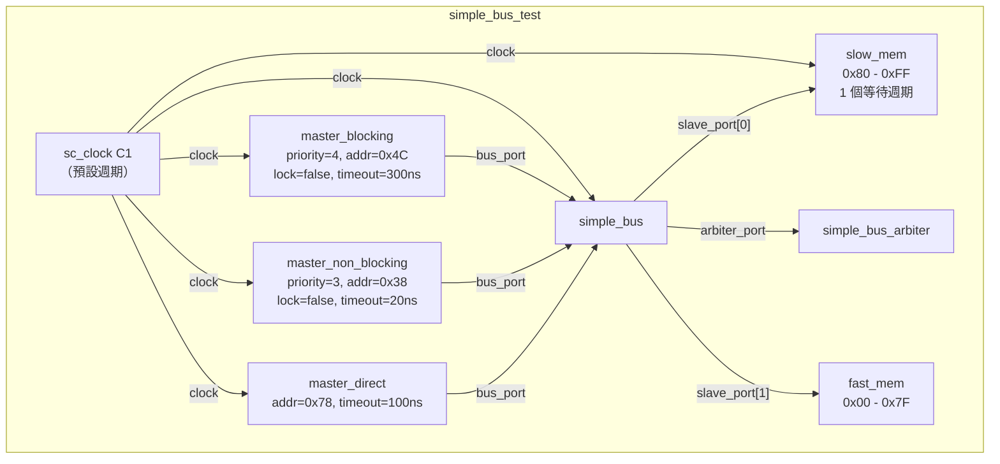

# Simple Bus -- 測試平台與主程式入口點

## 概覽

這些檔案將所有元件組裝成一個可運行的系統並執行模擬。

**來源檔案：** `simple_bus_test.h`、`simple_bus_main.cpp`

---

## 檔案：`simple_bus_main.cpp`

模擬入口點非常精簡：

```cpp
int sc_main(int, char **) {
    simple_bus_test top("top");
    sc_start(10000, SC_NS);
    return 0;
}
```

這在 `simple_bus_test` 內建立整個測試平台階層，並執行模擬 10,000 奈秒（10 微秒）。

---

## 檔案：`simple_bus_test.h`

`simple_bus_test` 是一個階層式模組，負責實例化並連線所有元件。它的角色等同於軟體中的**依賴注入容器**或**主程式設定**。

### 系統拓撲



### 建構細節

| 元件 | 建構子參數 | 備注 |
|---|---|---|
| `master_b` | `"master_b", priority=4, addr=0x4C, lock=false, timeout=300` | Burst 讀/寫從 0x4C 開始的 16 個字。優先權較低。 |
| `master_nb` | `"master_nb", priority=3, addr=0x38, lock=false, timeout=20` | 單字讀-改-寫，掃描 0x38-0xB8。優先權較高。 |
| `master_d` | `"master_d", addr=0x78, timeout=100` | 監視 0x78-0x84 的 4 個字。不需要 priority。 |
| `mem_fast` | `"mem_fast", start=0x00, end=0x7F` | 128 位元組 = 32 個字的即時存取記憶體。 |
| `mem_slow` | `"mem_slow", start=0x80, end=0xFF` | 128 位元組 = 32 個字，1 個等待週期。 |
| `bus` | `"bus"` | Verbose 模式已被註解掉。 |
| `arbiter` | `"arbiter"` | Verbose 模式已被註解掉。 |

### 記憶體映射

```
位址：  0x00                    0x38    0x4C         0x78 0x80          0xB8    0xFF
        |---- fast_mem (0x00-0x7F) ----||---- slow_mem (0x80-0xFF) ----|

        |                        ^      ^             ^  ^              ^       |
        |                        |      |             |  |              |       |
        |                   nb_start  b_start     d_start|          nb_end     |
        |                                                |                     |
        |                                            b_end (0x8C)              |
```

**重要觀察：** Blocking master 的 burst（`0x4C` 到 `0x4C + 16*4 = 0x8C`）**跨越了**快速記憶體和慢速記憶體的邊界。前 13 個字（`0x4C-0x7C`）命中快速記憶體；最後 3 個字（`0x80-0x88`）命中慢速記憶體並有等待週期。這使得這些最後幾個字的 burst 傳輸花費更長時間。

### 連線程式碼

```cpp
// Master port -> Bus
master_d->bus_port(*bus);    // direct_if 視角
master_b->bus_port(*bus);    // blocking_if 視角
master_nb->bus_port(*bus);   // non_blocking_if 視角

// Bus -> Arbiter
bus->arbiter_port(*arbiter);

// Bus -> Slaves（multi-port）
bus->slave_port(*mem_slow);  // slave_port[0]
bus->slave_port(*mem_fast);  // slave_port[1]
```

每個 `bus_port(*bus)` 綁定可行，是因為 `simple_bus` 實作了三個 master 端介面。C++ 隱式轉換解析出正確的介面。`slave_port` 是 multi-port（`sc_port<..., 0>`），因此多次 `slave_port(...)` 綁定會加入 port 的連線清單。

---

## 模擬時間線

```mermaid
gantt
    title 模擬期間大約活動（10000 ns）
    dateFormat X
    axisFormat %s

    section Direct Master
    讀取 4 個字並印出     :d1, 0, 1
    等待 100ns            :d2, 1, 100
    讀取 4 個字並印出     :d3, 100, 101
    等待 100ns            :d4, 101, 200

    section Non-blocking Master
    讀取 0x38 的字        :nb1, 0, 2
    寫入 0x38 的字        :nb2, 2, 4
    等待 20ns             :nb3, 4, 24
    讀取 0x3C 的字        :nb4, 24, 26

    section Blocking Master
    Burst 讀取 16 個字    :b1, 0, 20
    計算 16 個週期        :b2, 20, 36
    Burst 寫入 16 個字    :b3, 36, 56
    等待 300ns            :b4, 56, 356
```



### 執行期互動

1. **早期階段（0-50 ns）：** 三個 master 都在活動。當兩者都有待處理請求時，non-blocking master（priority 3）搶佔 blocking master（priority 4）。

2. **穩定狀態：** Blocking master 有長時間閒置期（300 ns timeout），而 non-blocking master 約每 20 ns 就循環一次。Direct master 每 100 ns 獨立運作一次，不產生匯流排競爭。

3. **位址衝突：** 當 non-blocking master 的位址掃描到達 blocking master burst 所在的相同區域時，它們競爭匯流排存取。Non-blocking master 因優先權較高而獲勝。

4. **慢速記憶體開銷：** 當 blocking 或 non-blocking master 存取位址 >= 0x80 時，由於慢速記憶體的等待週期，每個字的傳輸需要多一個週期。

---

## 啟用 Verbose 輸出

測試平台有被註解掉的 verbose 選項：

```cpp
// bus = new simple_bus("bus", true);       // verbose bus 輸出
// arbiter = new simple_bus_arbiter("arbiter", true);  // verbose arbiter 輸出
```

啟用這些選項後，會顯示詳細的每個週期資訊：
- **Bus verbose：** 哪些請求在待處理、正在存取哪個 slave
- **Arbiter verbose：** 完整的請求佇列以及哪條規則選出了獲勝者

這對於理解系統逐週期的行為非常有價值。
