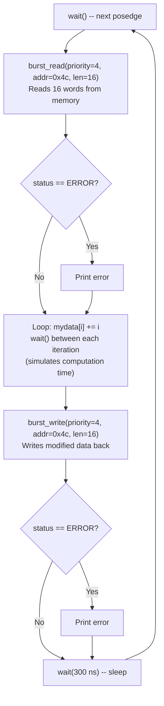
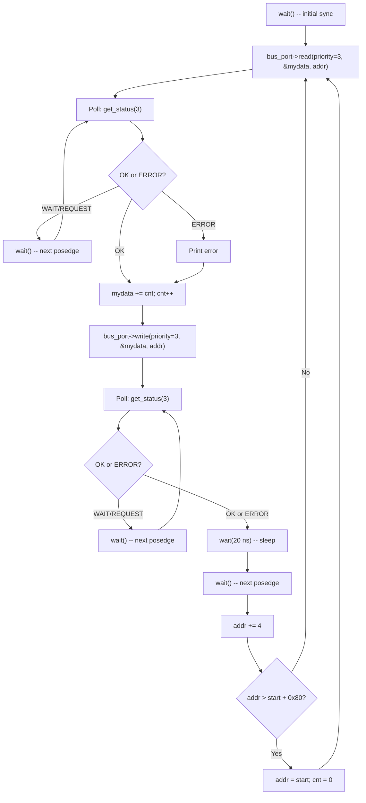
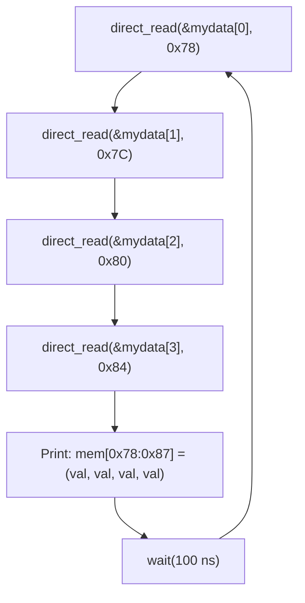

# Simple Bus -- Master Modules

## Overview

The example includes three master modules, each demonstrating a different bus access pattern. All three are `SC_MODULE` instances using `SC_THREAD` processes (they can call `wait()`).

**Software analogy:**

| Master | Software Equivalent |
|---|---|
| Blocking | Synchronous API call: `response = httpClient.post(data)` |
| Non-blocking | Async with polling: `jobId = queue.submit(task); while (!queue.isDone(jobId)) sleep()` |
| Direct | In-process function call: `value = cache.get(key)` |

---

## Comparison Table

| Aspect | `master_blocking` | `master_non_blocking` | `master_direct` |
|---|---|---|---|
| Bus interface | `simple_bus_blocking_if` | `simple_bus_non_blocking_if` | `simple_bus_direct_if` |
| Priority | 4 (lower priority) | 3 (higher priority) | N/A (no arbitration) |
| Data granularity | 16-word burst | Single word | Single word |
| Target address | `0x4c` (fast mem) | `0x38..0xB8` (wraps) | `0x78` (fast mem, read-only) |
| Timeout | 300 ns | 20 ns | 100 ns |
| Lock | false | false | N/A |
| Role | Bulk data processor | Incremental writer | Monitor/debugger |

---

## File: `simple_bus_master_blocking.h` / `.cpp`

### Software Analogy

This master is like a **batch ETL job**: it reads a large block of data, processes it, writes it back, then sleeps.

### Structure

```cpp
SC_MODULE(simple_bus_master_blocking) {
    sc_in_clk clock;
    sc_port<simple_bus_blocking_if> bus_port;
    // configured via constructor: priority, address, lock, timeout
};
```

### Behavior: `main_action()` (SC_THREAD)



### Key Details

- **Burst length:** 16 words (0x10), so it reads addresses `0x4C` through `0x8C`. Note this **crosses the boundary** between fast memory (`0x00-0x7F`) and slow memory (`0x80-0xFF`).
- **Computation simulation:** The `for` loop with `wait()` between each iteration simulates a CPU spending 16 clock cycles processing data.
- **Priority = 4:** This is lower than the non-blocking master (priority 3), meaning the non-blocking master can **interrupt** this master's burst transfer.
- **Block during transfer:** `burst_read()` and `burst_write()` don't return until all 16 words are transferred -- the SC_THREAD is suspended internally via `wait(transfer_done)`.

---

## File: `simple_bus_master_non_blocking.h` / `.cpp`

### Software Analogy

This master is like an **async microservice client**: it submits a request, then busy-polls until the result is ready.

### Structure

```cpp
SC_MODULE(simple_bus_master_non_blocking) {
    sc_in_clk clock;
    sc_port<simple_bus_non_blocking_if> bus_port;
    // configured via constructor: priority, start_address, lock, timeout
};
```

### Behavior: `main_action()` (SC_THREAD)



### Key Details

- **Priority = 3:** Higher than the blocking master, so it can preempt burst transfers.
- **Polling pattern:** After `read()` returns (immediately), the master enters a `while` loop checking `get_status()` each clock cycle. This is the non-blocking pattern -- the master is responsible for detecting completion.
- **Address sweep:** Starts at `0x38`, increments by 4 each iteration, wraps back after reaching `0x38 + 0x80 = 0xB8`. This covers both fast and slow memory regions.
- **Read-modify-write:** Each iteration reads one word, adds a counter value, writes it back.

### Blocking vs. Non-Blocking: What's the Real Difference?

Both masters use `SC_THREAD` and both call `wait()`. The difference is **where the waiting logic lives**:

- **Blocking:** The `wait()` is hidden inside `burst_read()` -- the master just calls the function and gets a result.
- **Non-blocking:** The master explicitly polls with a `while` loop. It has **full control** over what to do between checks (though in this example, it just waits).

In software, this is the difference between:
```python
# Blocking
result = requests.get(url)  # blocks until response

# Non-blocking
future = session.get(url)   # returns immediately
while not future.done():
    time.sleep(0.01)         # explicit polling
result = future.result()
```

---

## File: `simple_bus_master_direct.h` / `.cpp`

### Software Analogy

This master is a **read-only monitoring dashboard** -- it periodically samples memory values and prints them, without going through the bus protocol.

### Structure

```cpp
SC_MODULE(simple_bus_master_direct) {
    sc_in_clk clock;
    sc_port<simple_bus_direct_if> bus_port;
    // configured via constructor: address, timeout, verbose
};
```

### Behavior: `main_action()` (SC_THREAD)



### Key Details

- **No priority:** Direct access bypasses the arbiter entirely.
- **Reads 4 words:** At addresses `0x78, 0x7C, 0x80, 0x84`. Note that `0x78-0x7C` are in fast memory and `0x80-0x84` are in slow memory -- but direct access ignores wait states.
- **Instant execution:** All 4 reads happen in the same simulation time step (no `wait()` between them).
- **Monitor role:** This master never writes -- it's purely observational. Useful for debugging what the other masters are doing to memory.
- **No clock sensitivity in constructor:** Unlike the other masters, `SC_THREAD(main_action)` has no `sensitive << clock.pos()`. The thread runs freely, using `wait(timeout)` for its own timing.

---

## How Masters Connect to the Same Bus

All three masters connect to the **same `simple_bus` instance**, but through different interface views:


The binding `master_b->bus_port(*bus)` works because `simple_bus` inherits from `simple_bus_blocking_if`. C++ resolves the correct interface view at compile time. Each master only sees the methods defined in its specific interface -- the compiler prevents a direct master from accidentally calling `burst_read()`.
