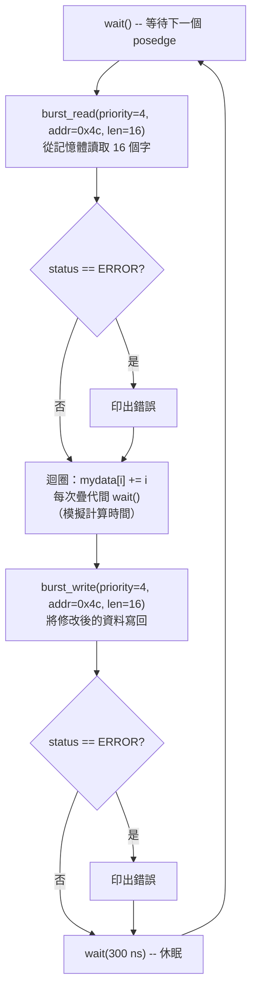
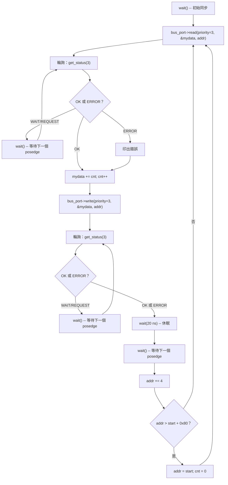
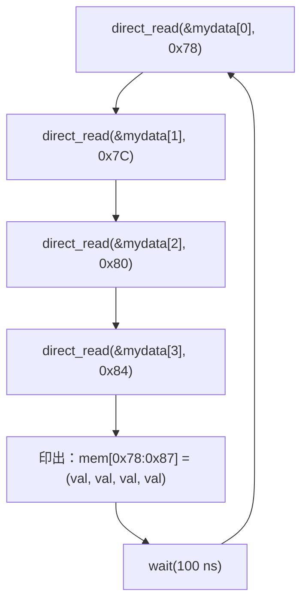
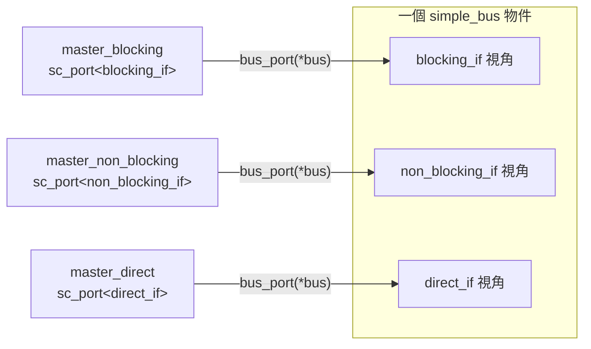

# Simple Bus -- Master 模組

## 概覽

本範例包含三個 master 模組，各自展示不同的匯流排存取模式。三個模組都是使用 `SC_THREAD` process 的 `SC_MODULE` 實例（可以呼叫 `wait()`）。

**軟體類比：**

| Master | 軟體對應 |
|---|---|
| Blocking | 同步 API 呼叫：`response = httpClient.post(data)` |
| Non-blocking | 非同步輪詢：`jobId = queue.submit(task); while (!queue.isDone(jobId)) sleep()` |
| Direct | 程序內函式呼叫：`value = cache.get(key)` |

---

## 比較表

| 面向 | `master_blocking` | `master_non_blocking` | `master_direct` |
|---|---|---|---|
| 匯流排介面 | `simple_bus_blocking_if` | `simple_bus_non_blocking_if` | `simple_bus_direct_if` |
| Priority | 4（較低優先權）| 3（較高優先權）| N/A（無仲裁）|
| 資料粒度 | 16 字 burst | 單字 | 單字 |
| 目標位址 | `0x4c`（fast mem）| `0x38..0xB8`（循環）| `0x78`（fast mem，唯讀）|
| Timeout | 300 ns | 20 ns | 100 ns |
| Lock | false | false | N/A |
| 角色 | 批次資料處理器 | 增量寫入器 | 監視器/除錯器 |

---

## 檔案：`simple_bus_master_blocking.h` / `.cpp`

### 軟體類比

此 master 就像一個**批次 ETL 任務**：讀取一大塊資料、處理它、寫回，然後休眠。

### 結構

```cpp
SC_MODULE(simple_bus_master_blocking) {
    sc_in_clk clock;
    sc_port<simple_bus_blocking_if> bus_port;
    // 透過建構子設定：priority, address, lock, timeout
};
```

### 行為：`main_action()` (SC_THREAD)



### 重點說明

- **Burst 長度：** 16 個字（0x10），因此讀取位址 `0x4C` 到 `0x8C`。注意這**跨越了**快速記憶體（`0x00-0x7F`）和慢速記憶體（`0x80-0xFF`）的邊界。
- **計算模擬：** 帶有 `wait()` 的 `for` 迴圈模擬 CPU 花費 16 個時脈週期處理資料。
- **Priority = 4：** 低於 non-blocking master（priority 3），表示 non-blocking master 可以**中斷**此 master 的 burst 傳輸。
- **傳輸期間阻塞：** `burst_read()` 和 `burst_write()` 在所有 16 個字傳輸完成前不會返回——SC_THREAD 透過 `wait(transfer_done)` 在內部暫停。

---

## 檔案：`simple_bus_master_non_blocking.h` / `.cpp`

### 軟體類比

此 master 就像一個**非同步微服務用戶端**：提交請求後忙輪詢直到結果就緒。

### 結構

```cpp
SC_MODULE(simple_bus_master_non_blocking) {
    sc_in_clk clock;
    sc_port<simple_bus_non_blocking_if> bus_port;
    // 透過建構子設定：priority, start_address, lock, timeout
};
```

### 行為：`main_action()` (SC_THREAD)



### 重點說明

- **Priority = 3：** 高於 blocking master，因此可以搶佔 burst 傳輸。
- **輪詢模式：** `read()` 返回後（立即），master 進入 `while` 迴圈每個時脈週期檢查 `get_status()`。這是 non-blocking 模式——master 負責偵測完成。
- **位址掃描：** 從 `0x38` 開始，每次疊代增加 4，到達 `0x38 + 0x80 = 0xB8` 後循環回去。涵蓋快速和慢速記憶體兩個區域。
- **讀-改-寫：** 每次疊代讀取一個字，加上計數器值，再寫回。

### Blocking vs. Non-blocking：真正的差異是什麼？

兩個 master 都使用 `SC_THREAD`，都會呼叫 `wait()`。差異在於**等待邏輯位於何處**：

- **Blocking：** `wait()` 隱藏在 `burst_read()` 內部——master 只是呼叫函式並取得結果。
- **Non-blocking：** Master 明確地用 `while` 迴圈輪詢。它**完全掌控**每次查詢之間要做什麼（雖然在本範例中只是等待）。

以軟體來說，這就是以下兩者的差異：
```python
# Blocking
result = requests.get(url)  # 阻塞直到收到回應

# Non-blocking
future = session.get(url)   # 立即返回
while not future.done():
    time.sleep(0.01)         # 明確輪詢
result = future.result()
```

---

## 檔案：`simple_bus_master_direct.h` / `.cpp`

### 軟體類比

此 master 是一個**唯讀監控儀表板**——週期性地取樣記憶體值並印出，而不通過匯流排協定。

### 結構

```cpp
SC_MODULE(simple_bus_master_direct) {
    sc_in_clk clock;
    sc_port<simple_bus_direct_if> bus_port;
    // 透過建構子設定：address, timeout, verbose
};
```

### 行為：`main_action()` (SC_THREAD)



### 重點說明

- **無 priority：** Direct 存取完全繞過 arbiter。
- **讀取 4 個字：** 位址 `0x78, 0x7C, 0x80, 0x84`。注意 `0x78-0x7C` 在快速記憶體，`0x80-0x84` 在慢速記憶體——但 direct 存取忽略等待週期。
- **即時執行：** 全部 4 次讀取在同一個模擬時間步驟內完成（之間沒有 `wait()`）。
- **監視器角色：** 此 master 從不寫入——純粹用於觀測。適合用來除錯其他 master 對記憶體的操作。
- **建構子中無時脈敏感性：** 與其他 master 不同，`SC_THREAD(main_action)` 沒有 `sensitive << clock.pos()`。執行緒自由運行，使用 `wait(timeout)` 控制自己的時序。

---

## 三個 Master 如何連接到同一個 Bus

三個 master 都連接到**同一個 `simple_bus` 實例**，但透過不同的介面視角：



綁定 `master_b->bus_port(*bus)` 可行，是因為 `simple_bus` 繼承自 `simple_bus_blocking_if`。C++ 在編譯期解析正確的介面視角。每個 master 只看到其特定介面中定義的方法——編譯器防止 direct master 意外呼叫 `burst_read()`。
