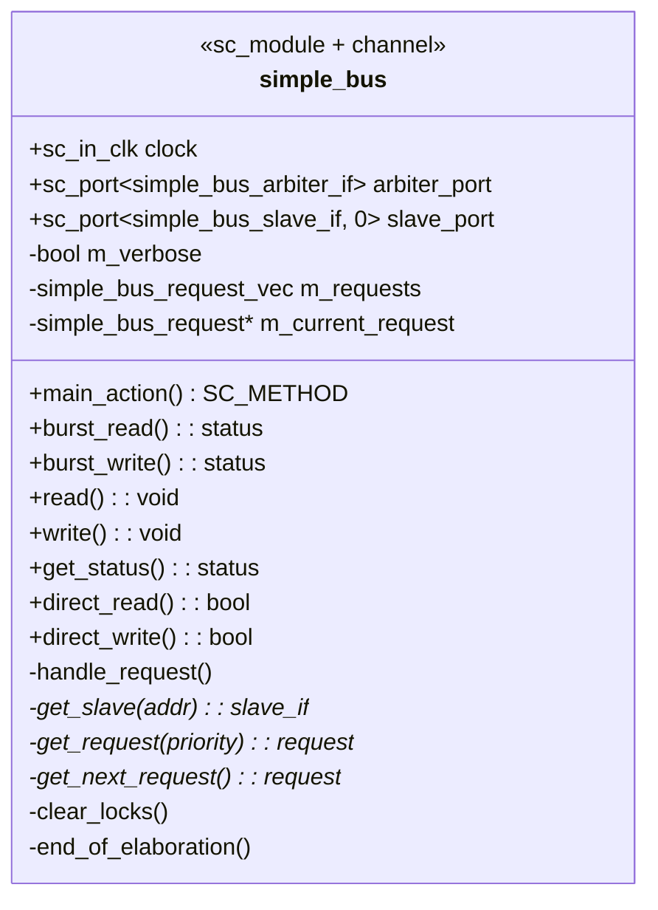
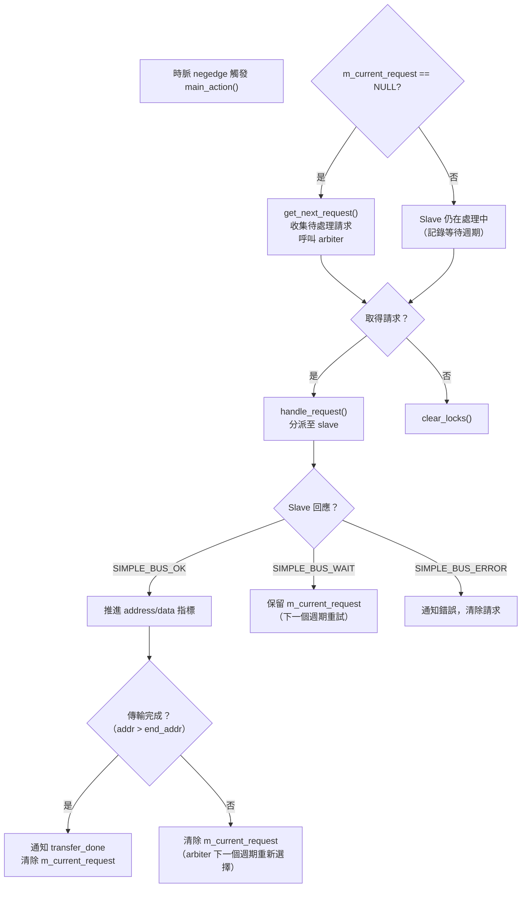
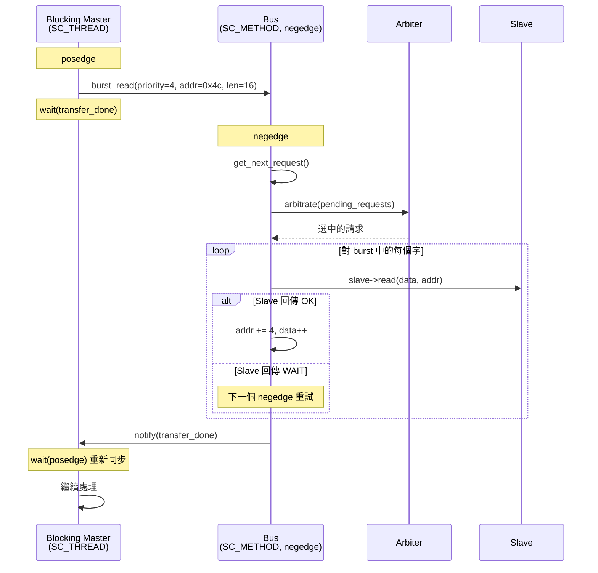
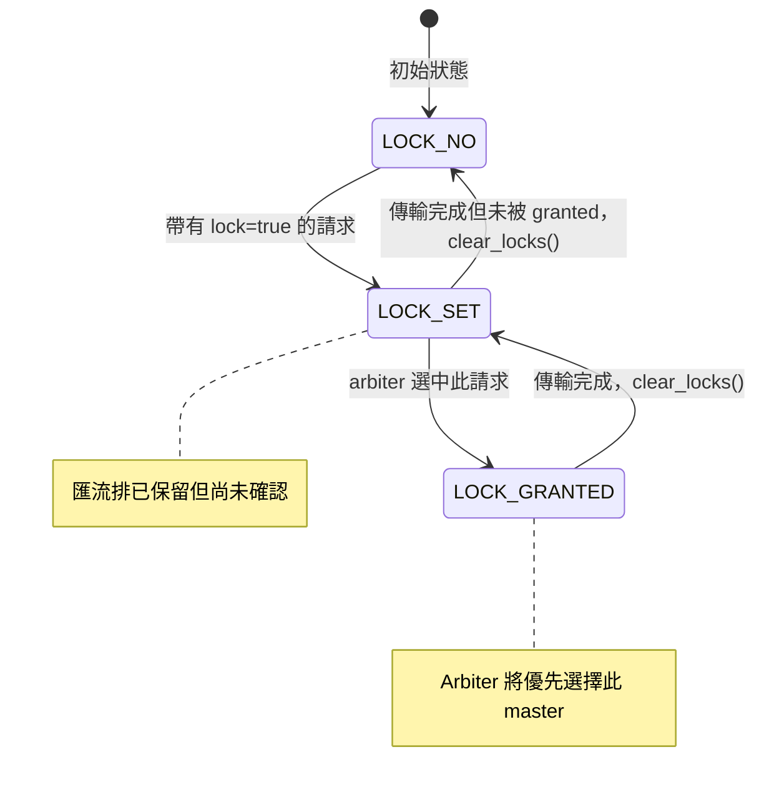

# Simple Bus -- Bus Channel 實作

## 概覽

`simple_bus` 是本範例的核心**階層式 channel（hierarchical channel）**。它既是 `sc_module`（有 process 和 port），也實作了三個 `sc_interface` 子類別（blocking、non-blocking、direct）。以軟體的角度來看，它是**連線池 + 請求分派器**——接收來自 master 的請求、委託 arbiter 進行排程，並將操作轉發到對應的 slave。

**來源檔案：** `simple_bus.h`、`simple_bus.cpp`

---

## 類別結構

### Port 說明

| Port | 型別 | 說明 |
|------|------|------|
| `clock` | `sc_in_clk` | 系統時脈。Bus 在**negedge（下降沿）**動作。 |
| `arbiter_port` | `sc_port<simple_bus_arbiter_if>` | 單一 arbiter 連線。 |
| `slave_port` | `sc_port<simple_bus_slave_if, 0>` | **Multi-port**（`0` 表示無限制綁定數量）。多個 slave 連接至此。 |

`slave_port` 的 `0` 模板參數值得注意——以軟體角度來說，這就像把依賴宣告為 `List<SlaveInterface>` 而非 `SlaveInterface`。Bus 遍歷所有綁定的 slave，以位址找到正確的那一個。

---

## Process：`main_action()`

Bus 有一個在 `clock.neg()`（下降沿）觸發的 `SC_METHOD`：

### 為何在 Burst 字與字之間清除 `m_current_request`？

每次 burst 傳輸中一個字完成後（`SIMPLE_BUS_OK` 但還有更多資料），bus 將 `m_current_request = NULL`。這強制 arbiter 在下一個週期重新評估所有待處理請求。

**軟體類比：** 就像協作式排程器——每個量子（一個字的傳輸）後，執行中的任務讓出控制權，排程器決定是否應該執行優先權更高的任務。這讓高優先權的 non-blocking master 可以**搶佔**進行中的低優先權 burst 傳輸（除非有 lock）。

---

## 介面實作

### Direct 介面（`direct_read` / `direct_write`）

最簡單的路徑——無仲裁、無請求佇列：

1. 檢查位址對齊（必須是字對齊，4 的倍數）
2. 呼叫 `get_slave(address)` 找到對應的 slave
3. 直接轉發至 `slave->direct_read()` 或 `slave->direct_write()`

這在**零模擬時間**內執行——是一條沒有 `wait()` 的函式呼叫鏈。

### Non-blocking 介面（`read` / `write` / `get_status`）

1. `get_request(priority)` 取得（或建立）此 master 的請求物件
2. 填入請求欄位（位址、資料指標、讀/寫旗標）
3. 設定 `request->status = SIMPLE_BUS_REQUEST`
4. 立即返回——實際傳輸在下一個 negedge 的 `main_action()` 中執行

呼叫者用 `get_status(priority)` 輪詢，此方法只是回傳 `get_request(priority)->status`。

### Blocking 介面（`burst_read` / `burst_write`）

1. 與 non-blocking 相同的設定：填入請求物件
2. 但 `end_address = start_address + (length-1)*4` 用於多字 burst
3. **關鍵差異：** 呼叫 `wait(request->transfer_done)` ——這會暫停呼叫端的 SC_THREAD
4. Bus 完成（或發生錯誤）後，`main_action` 通知 `transfer_done`
5. Master 接著執行 `wait(clock->posedge_event())` 以重新同步至上升沿

---

## 關鍵內部方法

### `get_slave(address)`

遍歷所有綁定的 slave，回傳位址範圍 `[start_address, end_address]` 包含給定位址的那一個。找不到時回傳 `NULL`。

**軟體類比：** URL 路由比對——`/api/users/123` 比對到路由 `/api/users/:id`。

### `get_request(priority)`

在 `m_requests` 中搜尋具有對應 priority 的請求。找不到時建立新的。Priority 同時作為 master 的唯一 ID 和重要性級別。

**軟體類比：** 以用戶端 ID 為鍵的 session 儲存。

### `get_next_request()`

收集所有狀態為 `SIMPLE_BUS_REQUEST` 或 `SIMPLE_BUS_WAIT` 的請求，傳入 `arbiter_port->arbitrate()`，並回傳獲勝者。

### `clear_locks()`

在沒有活動請求時呼叫。降級 lock 狀態：
- `SIMPLE_BUS_LOCK_GRANTED` -> `SIMPLE_BUS_LOCK_SET`（保留至下一輪）
- 其他 -> `SIMPLE_BUS_LOCK_NO`（釋放）

### `end_of_elaboration()`

SystemC 在所有模組連接後、模擬開始前自動呼叫。檢查 slave 之間是否有**重疊的位址空間**——如果兩個 slave 宣告了相同的位址範圍，則以錯誤退出。

**軟體類比：** 應用程式啟動驗證——就像檢查 web framework 中是否有重複的路由定義。

---

## Lock 機制狀態機

Lock 機制讓 master 可以**串聯多筆匯流排交易**而不被搶佔。它的運作方式類似資料庫 advisory lock——第一筆交易設定 lock，若被 granted，同一個 master 的後續交易就保證能取得匯流排存取權。
