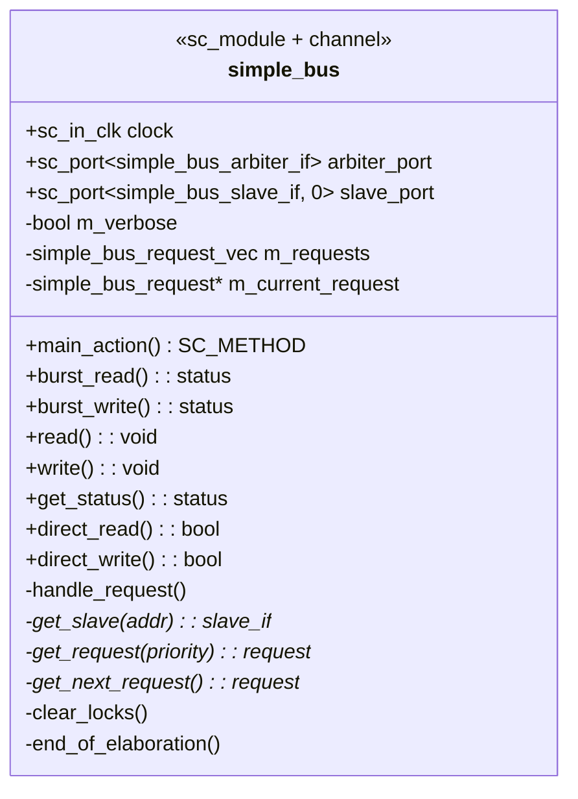
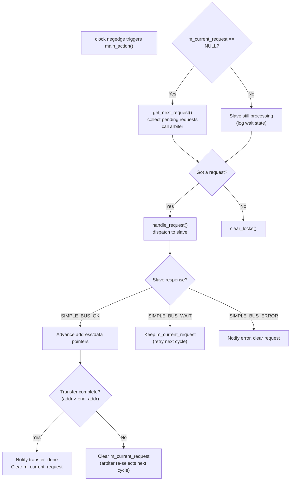
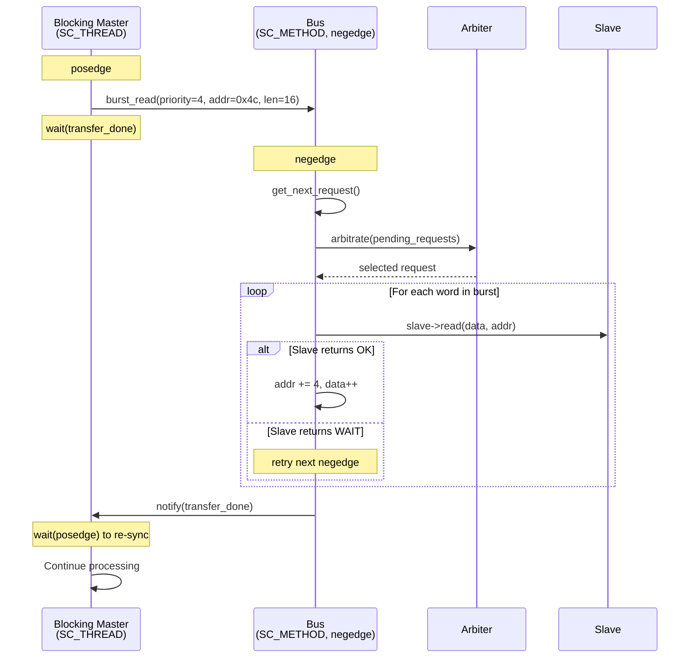
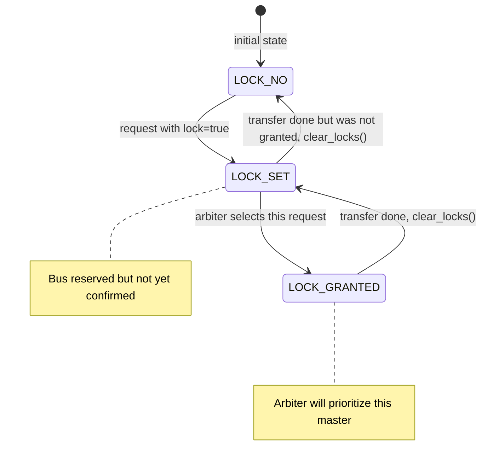

# Simple Bus -- Bus Channel Implementation

## Overview

`simple_bus` is the central **hierarchical channel** of this example. It is both an `sc_module` (has processes, ports) and implements three `sc_interface` subclasses (blocking, non-blocking, direct). In software terms, it is the **connection pool + request dispatcher** -- it receives requests from masters, delegates to the arbiter for scheduling, and forwards operations to the appropriate slave.

**Source files:** `simple_bus.h`, `simple_bus.cpp`

---

## Class Structure

### Ports

| Port | Type | Description |
|------|------|-------------|
| `clock` | `sc_in_clk` | System clock. Bus acts on **negedge** (falling edge). |
| `arbiter_port` | `sc_port<simple_bus_arbiter_if>` | Single arbiter connection. |
| `slave_port` | `sc_port<simple_bus_slave_if, 0>` | **Multi-port** (the `0` means unlimited bindings). Multiple slaves connect here. |

The `0` template parameter on `slave_port` is noteworthy -- in software terms, it's like declaring a dependency as `List<SlaveInterface>` instead of `SlaveInterface`. The bus iterates over all bound slaves to find the right one by address.

---

## Process: `main_action()`

The bus has a single `SC_METHOD` triggered on `clock.neg()` (falling clock edge):

### Why Clear `m_current_request` Between Burst Words?

After each word of a burst transfer completes (`SIMPLE_BUS_OK` but more data remains), the bus sets `m_current_request = NULL`. This forces the arbiter to re-evaluate all pending requests next cycle.

**Software analogy:** It's like a cooperative scheduler -- after each quantum (one word transfer), the running task yields and the scheduler decides if a higher-priority task should run. This allows a high-priority non-blocking master to **preempt** a lower-priority burst in progress (unless locked).

---

## Interface Implementations

### Direct Interface (`direct_read` / `direct_write`)

The simplest path -- no arbitration, no request queue:

1. Check address alignment (must be word-aligned, multiple of 4)
2. Call `get_slave(address)` to find the matching slave
3. Forward directly to `slave->direct_read()` or `slave->direct_write()`

This executes in **zero simulation time** -- it's a function call chain with no `wait()`.

### Non-Blocking Interface (`read` / `write` / `get_status`)

1. `get_request(priority)` retrieves (or creates) a request form for this master
2. Fills in the request fields (address, data pointer, read/write flag)
3. Sets `request->status = SIMPLE_BUS_REQUEST`
4. Returns immediately -- the actual transfer happens in `main_action()` on the next negedge

The caller polls with `get_status(priority)` which simply returns `get_request(priority)->status`.

### Blocking Interface (`burst_read` / `burst_write`)

1. Same setup as non-blocking: fill in request form
2. But `end_address = start_address + (length-1)*4` for multi-word burst
3. **Key difference:** calls `wait(request->transfer_done)` -- this suspends the calling SC_THREAD
4. After the bus completes (or errors), `main_action` notifies `transfer_done`
5. The master then does `wait(clock->posedge_event())` to re-synchronize to the rising edge

---

## Key Internal Methods

### `get_slave(address)`

Iterates over all bound slaves and returns the one whose address range `[start_address, end_address]` contains the given address. Returns `NULL` if no match.

**Software analogy:** URL router matching -- `/api/users/123` matches the route `/api/users/:id`.

### `get_request(priority)`

Searches `m_requests` for a request with matching priority. If not found, creates a new one. The priority serves as both the master's unique ID and its importance level.

**Software analogy:** A session store keyed by client ID.

### `get_next_request()`

Collects all requests with status `SIMPLE_BUS_REQUEST` or `SIMPLE_BUS_WAIT`, passes them to `arbiter_port->arbitrate()`, and returns the winner.

### `clear_locks()`

Called when no request is active. Downgrades lock states:
- `SIMPLE_BUS_LOCK_GRANTED` -> `SIMPLE_BUS_LOCK_SET` (preserve for next round)
- Others -> `SIMPLE_BUS_LOCK_NO` (release)

### `end_of_elaboration()`

Called automatically by SystemC after all modules are connected but before simulation starts. Checks for **overlapping address spaces** between slaves -- if two slaves claim the same address range, it exits with an error.

**Software analogy:** Application startup validation -- like checking for duplicate route definitions in a web framework.

---

## Lock Mechanism State Machine

The lock mechanism allows a master to **chain multiple bus transactions** without being preempted. It works like a database advisory lock -- the first transaction sets the lock, and if granted, subsequent transactions from the same master are guaranteed bus access.
