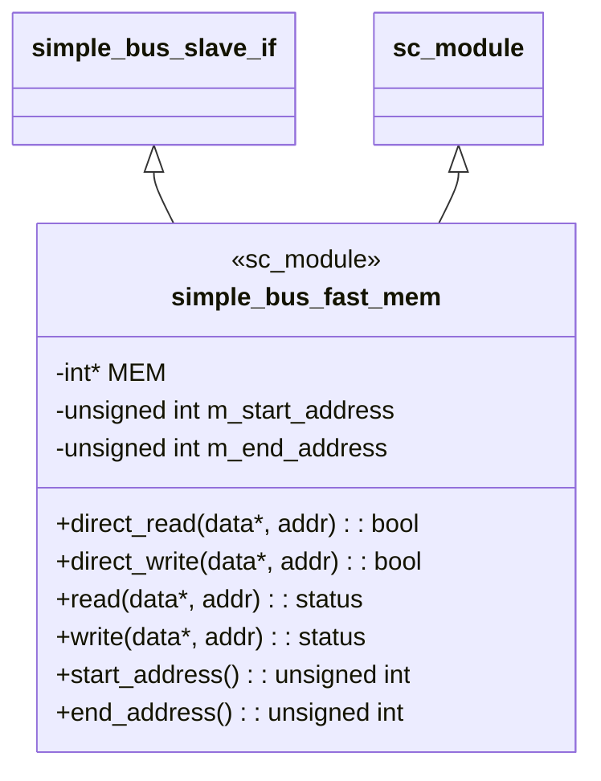
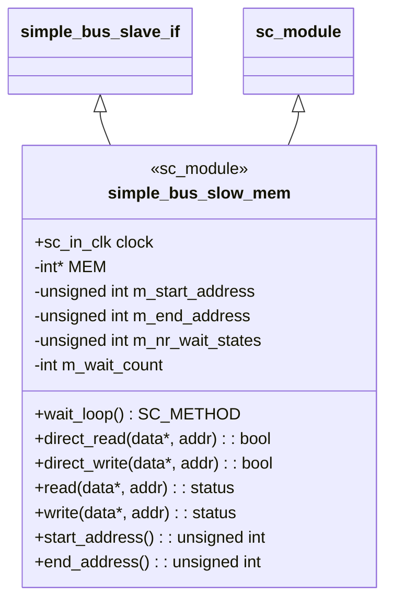
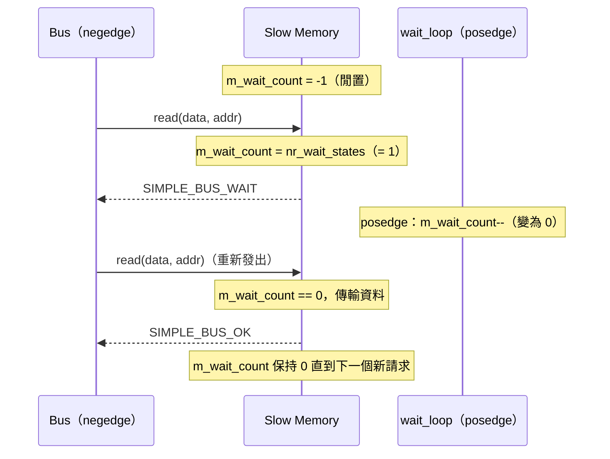
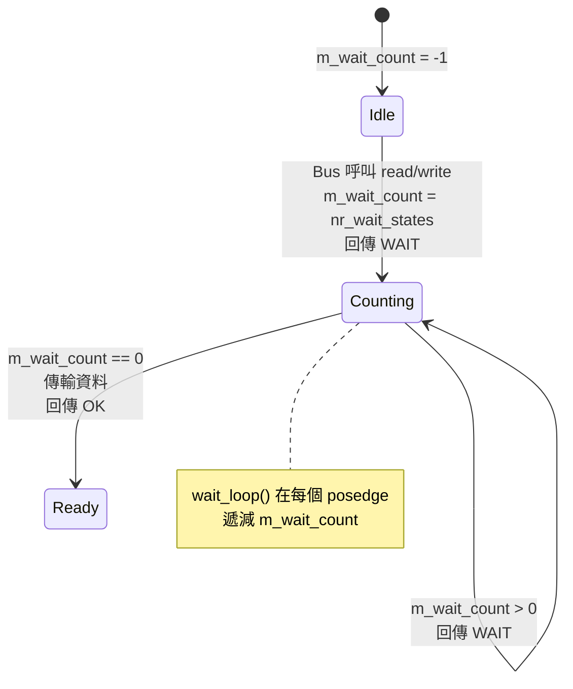

# Simple Bus -- Slave 模組（記憶體）

## 概覽

本範例包含兩個實作 `simple_bus_slave_if` 的記憶體 slave 模組。兩者都模擬一段連續的 RAM，但回應延遲不同：

| Slave | 位址範圍 | 等待週期 | 軟體類比 |
|---|---|---|---|
| `simple_bus_fast_mem` | `0x00 - 0x7F` | 0（即時）| 記憶體內 HashMap / Redis 快取 |
| `simple_bus_slow_mem` | `0x80 - 0xFF` | 1（可設定）| 磁碟支撐的資料庫 / 網路儲存 |

**為何需要兩種不同速度？** 在真實硬體中，不同的記憶體類型存取時間差異極大——L1 快取在 1 個週期內回應，DRAM 需要 50-100 個週期，快閃儲存需要數千個週期。本範例以最簡單的方式模擬這個現實。

---

## 檔案：`simple_bus_fast_mem.h`

### 軟體類比

快速記憶體 slave 就像一次 **HashMap 查詢**——你要求資料，同一個時脈週期就立即取得，無需等待。

### 類別結構



### 關鍵實作細節

**建構子：**
- 配置大小為 `(end_address - start_address + 1) / 4` 個字的 `int[]` 陣列
- 將所有記憶體初始化為零
- 斷言位址範圍是字對齊的（可被 4 整除）

**`read()` / `write()`：**
```cpp
inline simple_bus_status simple_bus_fast_mem::read(int *data, unsigned int address) {
    *data = MEM[(address - m_start_address) / 4];
    return SIMPLE_BUS_OK;  // 永遠 OK，無等待週期
}
```

位址轉換 `(address - m_start_address) / 4` 將位元組位址轉換成字索引。例如，當 `m_start_address = 0x00` 時，位址 `0x08` 對應到 `MEM[2]`。

**`direct_read()` / `direct_write()`：**
直接委託給 `read()` / `write()` 並將狀態轉換成 `bool`。

**無 process，無 clock port：** 快速記憶體沒有內部狀態機——它在被呼叫的同一個 delta cycle 內回應。

---

## 檔案：`simple_bus_slow_mem.h`

### 軟體類比

慢速記憶體 slave 就像一個**帶延遲的資料庫查詢**：你提交查詢，N 個週期內收到「處理中...」，之後才得到資料。這就像呼叫一個先回傳 HTTP 202（Accepted）、處理後再回傳 200（OK）的 API。

### 類別結構



### 等待週期機制



**`read()` / `write()` 狀態機：**



### 關鍵實作細節

**兩部分設計：**

1. **`read()` / `write()` 方法**（由 bus 在 negedge 呼叫）：
   - 若 `m_wait_count < 0`：這是新請求。將計數器設為 `m_nr_wait_states`，回傳 `SIMPLE_BUS_WAIT`。
   - 若 `m_wait_count == 0`：計數器已倒數完畢。執行實際的資料傳輸，回傳 `SIMPLE_BUS_OK`。
   - 否則：仍在倒數中，回傳 `SIMPLE_BUS_WAIT`。

2. **`wait_loop()` SC_METHOD**（在 posedge 觸發）：
   - 若 `m_wait_count >= 0` 則單純遞減。

**為何計數器在 posedge 遞減？** Bus 在 negedge 呼叫 `read()`/`write()`。計數器在 posedge（半個週期後）遞減。在下一個 negedge，bus 重新發出請求並檢查計數器是否已達到零。這建立了等待週期的時序：

```
posedge  negedge  posedge  negedge
   |        |        |        |
   |   Bus 呼叫  計數器     Bus 重新呼叫
   |   read()    遞減        read()
   |   (WAIT)   (1->0)      (OK，傳輸)
```

**`direct_read()` / `direct_write()`：**
與一般的 `read`/`write` 不同，direct 存取**完全繞過等待週期**——直接讀/寫 `MEM[]` 並回傳 `true`。這就是為什麼 direct master 可以即時讀取慢速記憶體。

---

## 快速 vs. 慢速：並列比較

| 面向 | `simple_bus_fast_mem` | `simple_bus_slow_mem` |
|---|---|---|
| Clock port | 無 | `sc_in_clk clock` |
| Process | 無 | `SC_METHOD(wait_loop)` 在 posedge |
| `read()`/`write()` 回傳 | 永遠 `SIMPLE_BUS_OK` | 先 `SIMPLE_BUS_WAIT` 再 `SIMPLE_BUS_OK` |
| `direct_read()`/`direct_write()` | 委託給 `read()`/`write()` | 直接讀取 `MEM[]`（繞過等待）|
| 等待週期 | 0 | 可設定（`m_nr_wait_states`）|
| 每字傳輸週期數 | 1 | 1 + `nr_wait_states` |
| 現實世界模型 | SRAM / L1 快取 | DRAM / Flash |

---

## 位址轉換示意圖

```
位元組位址：  0x00  0x04  0x08  ...  0x7C  0x80  0x84  ...  0xFC
              |---- fast_mem (0x00-0x7F) ----||---- slow_mem (0x80-0xFF) ----|
字索引：      [0]   [1]   [2]  ...  [31]   [0]   [1]  ...  [31]
MEM 陣列：    MEM[0] MEM[1] ...      MEM[0] MEM[1] ...

公式：MEM[(address - start_address) / 4]
```

每個 slave 獨立地將位元組位址轉換為自己內部的陣列索引。Bus 根據位址範圍決定路由到哪個 slave；slave 再將絕對位址轉換為本地偏移量。
