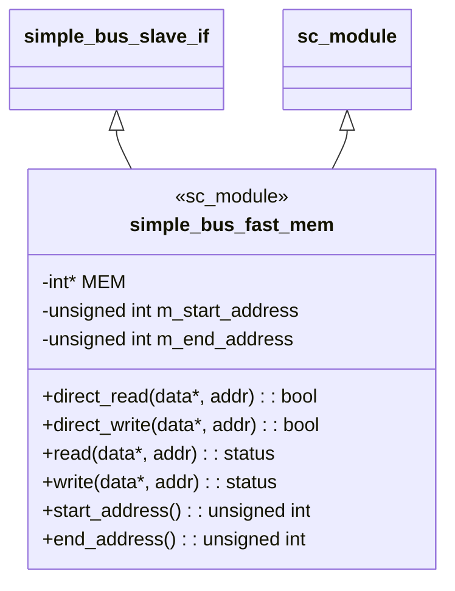
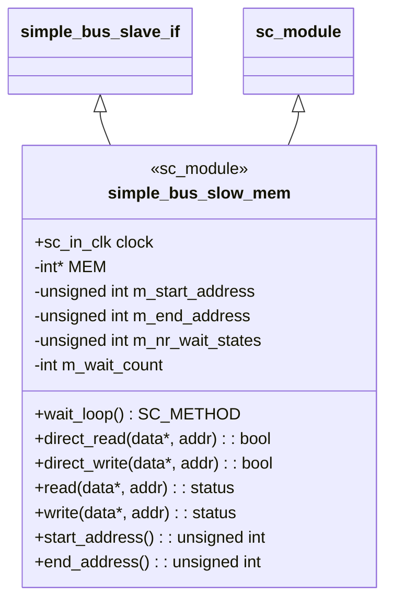
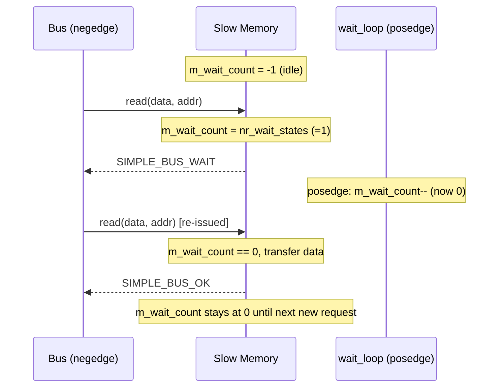
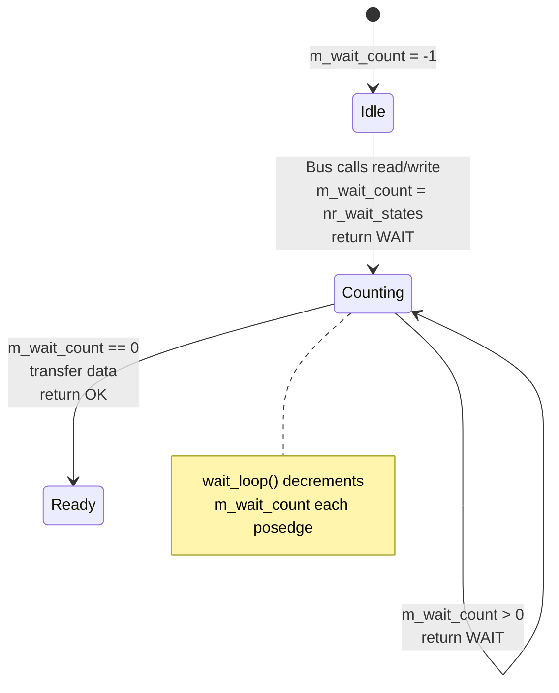

# Simple Bus -- Slave Modules (Memory)

## Overview

The example includes two memory slave modules that implement `simple_bus_slave_if`. Both model a contiguous block of RAM, but differ in response latency:

| Slave | Address Range | Wait States | Software Analogy |
|---|---|---|---|
| `simple_bus_fast_mem` | `0x00 - 0x7F` | 0 (instant) | In-memory HashMap / Redis cache |
| `simple_bus_slow_mem` | `0x80 - 0xFF` | 1 (configurable) | Disk-backed database / network storage |

**Why two different speeds?** In real hardware, different memory types have vastly different access times -- L1 cache responds in 1 cycle, DRAM takes 50-100 cycles, and flash storage takes thousands. This example models that reality in the simplest way possible.

---

## File: `simple_bus_fast_mem.h`

### Software Analogy

A fast memory slave is like a **HashMap lookup** -- you ask for data and get it immediately, same clock cycle, no waiting.

### Class Structure



### Key Implementation Details

**Constructor:**
- Allocates `int[]` array sized to `(end_address - start_address + 1) / 4` words
- Initializes all memory to zero
- Asserts that the address range is word-aligned (divisible by 4)

**`read()` / `write()`:**
```cpp
inline simple_bus_status simple_bus_fast_mem::read(int *data, unsigned int address) {
    *data = MEM[(address - m_start_address) / 4];
    return SIMPLE_BUS_OK;  // always OK, no wait states
}
```

The address translation `(address - m_start_address) / 4` converts a byte address to a word index. For example, with `m_start_address = 0x00`, address `0x08` maps to `MEM[2]`.

**`direct_read()` / `direct_write()`:**
Simply delegate to `read()` / `write()` and convert the status to `bool`.

**No process, no clock port:** Fast memory has no internal state machine -- it responds in the same delta cycle it's called.

---

## File: `simple_bus_slow_mem.h`

### Software Analogy

A slow memory slave is like a **database query with latency**: you submit the query, get back "processing..." for N cycles, and only then get your data. It's like calling an API that returns HTTP 202 (Accepted) first, then 200 (OK) after processing.

### Class Structure



### Wait State Mechanism



**The `read()` / `write()` state machine:**



### Key Implementation Details

**Two-part design:**

1. **`read()` / `write()` methods** (called by the bus on negedge):
   - If `m_wait_count < 0`: This is a new request. Set counter to `m_nr_wait_states`, return `SIMPLE_BUS_WAIT`.
   - If `m_wait_count == 0`: Counter has expired. Perform the actual data transfer, return `SIMPLE_BUS_OK`.
   - Otherwise: Still counting down, return `SIMPLE_BUS_WAIT`.

2. **`wait_loop()` SC_METHOD** (triggered on posedge):
   - Simply decrements `m_wait_count` if >= 0.

**Why posedge for the counter?** The bus calls `read()`/`write()` on negedge. The counter decrements on posedge (half a cycle later). On the next negedge, the bus re-issues the request and checks if the counter has reached zero. This creates the wait state timing:

```
posedge  negedge  posedge  negedge
   |        |        |        |
   |   Bus calls  Counter   Bus re-calls
   |   read()     decrements read()
   |   (WAIT)     (1->0)    (OK, transfer)
```

**`direct_read()` / `direct_write()`:**
Unlike the normal `read`/`write`, direct access **bypasses wait states entirely** -- it reads/writes `MEM[]` directly and returns `true`. This is why the direct master can read slow memory instantly.

---

## Fast vs. Slow: Side-by-Side

| Aspect | `simple_bus_fast_mem` | `simple_bus_slow_mem` |
|---|---|---|
| Clock port | None | `sc_in_clk clock` |
| Process | None | `SC_METHOD(wait_loop)` on posedge |
| `read()`/`write()` return | Always `SIMPLE_BUS_OK` | `SIMPLE_BUS_WAIT` then `SIMPLE_BUS_OK` |
| `direct_read()`/`direct_write()` | Delegates to `read()`/`write()` | Reads `MEM[]` directly (bypasses wait) |
| Wait states | 0 | Configurable (`m_nr_wait_states`) |
| Cycles per word transfer | 1 | 1 + `nr_wait_states` |
| Real-world model | SRAM / L1 cache | DRAM / Flash |

---

## Address Translation Diagram

```
Byte Address:    0x00  0x04  0x08  ...  0x7C  0x80  0x84  ...  0xFC
                 |---- fast_mem ----|    |---- slow_mem ----|
Word Index:      [0]   [1]   [2]  ...  [31]   [0]   [1]  ...  [31]
MEM array:       MEM[0] MEM[1] ...      MEM[0] MEM[1] ...

Formula: MEM[(address - start_address) / 4]
```

Each slave independently translates the byte address to its own internal array index. The bus determines which slave to route to based on address range; the slave then translates the absolute address to a local offset.
