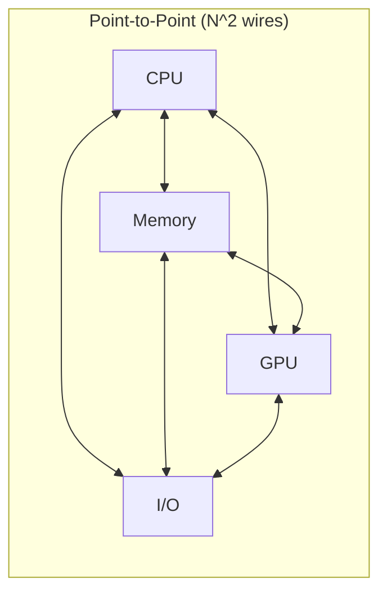
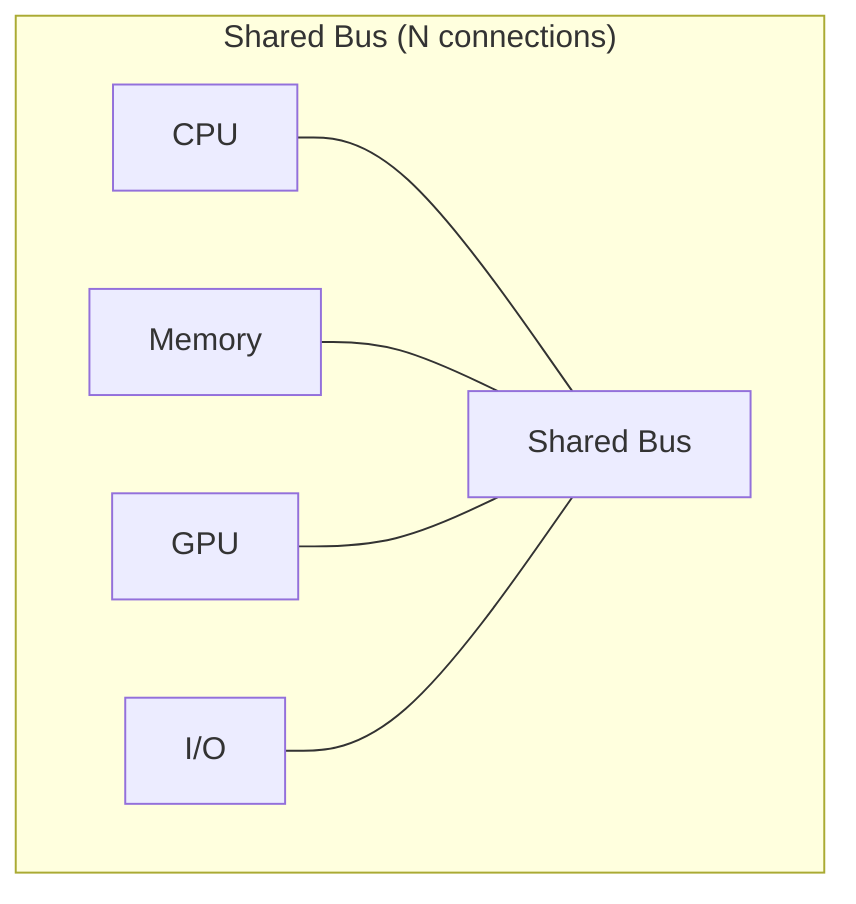
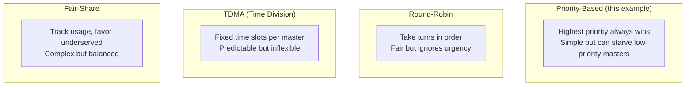
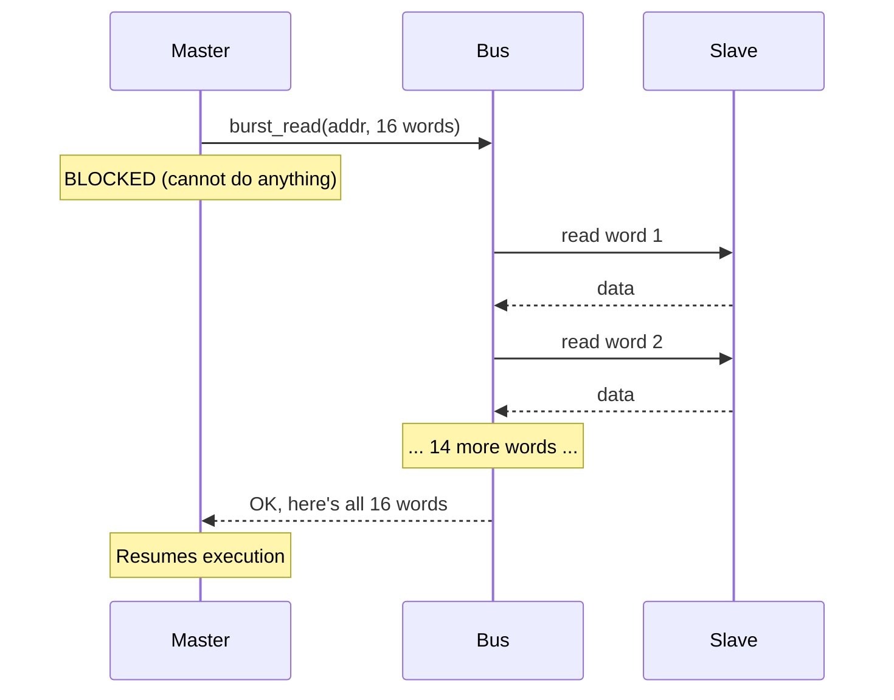
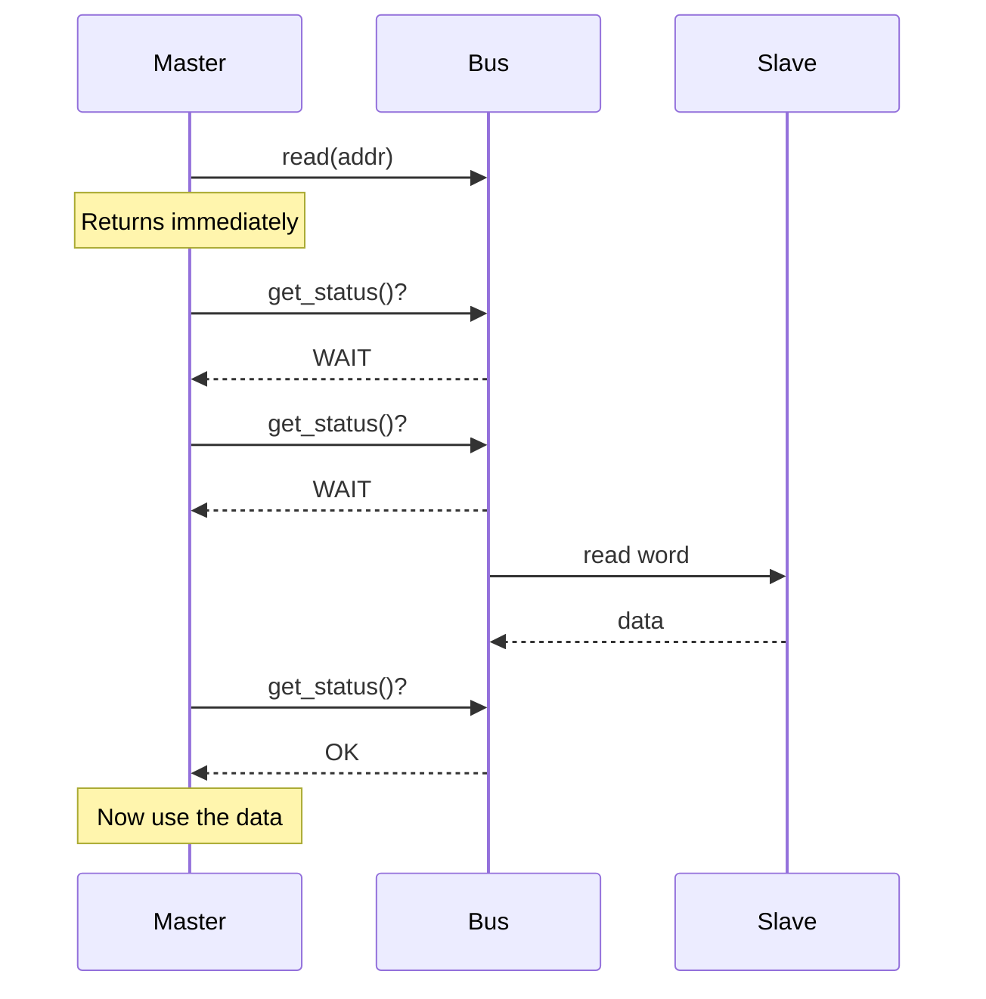
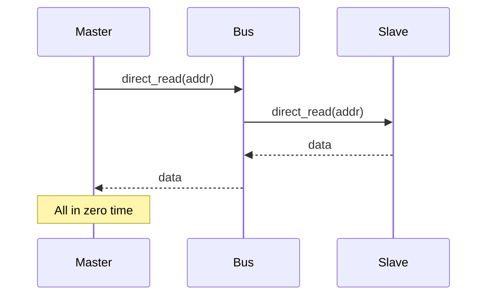
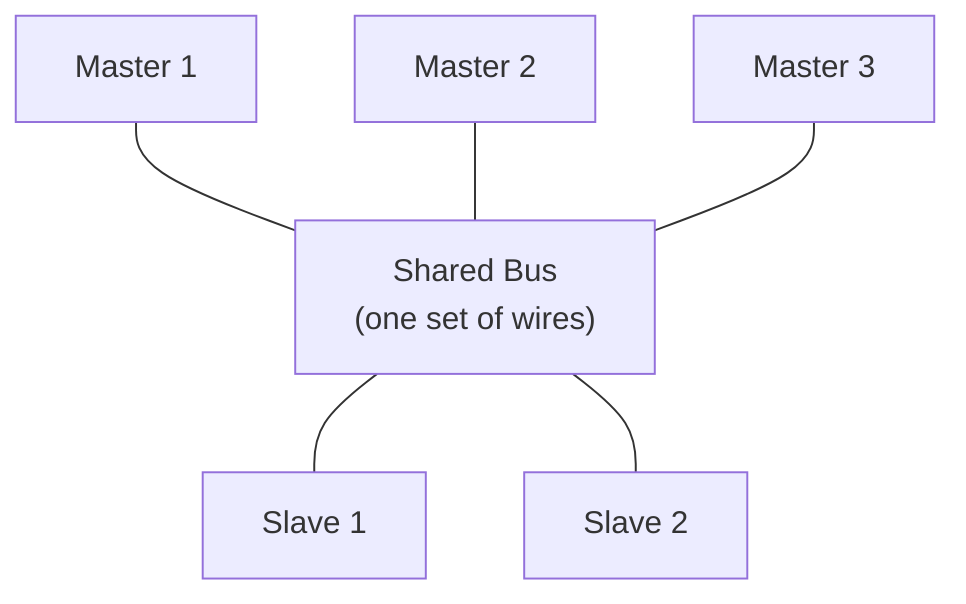
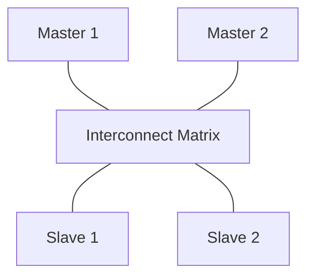

# Simple Bus -- Hardware Spec for Software Engineers

## What Is a System Bus?

A **system bus** is a shared communication highway that connects chips (CPU, memory, peripherals) on a circuit board. Instead of running dedicated wires between every pair of chips, all chips connect to one shared set of wires.

### Software Analogy

Think of a **message broker** (like RabbitMQ or Kafka):

| Hardware Concept | Software Equivalent |
|---|---|
| System bus | Message broker / shared event bus |
| Bus wires | Network connection / shared memory segment |
| Master (CPU) | Producer / API client |
| Slave (Memory) | Consumer / Database |
| Bus arbiter | Load balancer / Connection pool manager |
| Bus protocol | Message format / API contract |

Or think of a **shared database** -- all application servers connect to one database server. The database handles concurrent access, queuing, and locking. That's essentially what a bus does for hardware.

---

## Why Buses? Why Not Point-to-Point?

### The Wiring Problem

If you have 4 chips that all need to talk to each other, point-to-point wiring requires 6 connections (N*(N-1)/2). With 10 chips, that's 45 connections. Each "connection" is actually 32+ parallel wires (for 32-bit data), plus address wires, plus control signals. The circuit board quickly becomes impossibly complex.

A bus solves this: **one shared set of wires, everyone connects to it.**

### Trade-offs

| Aspect | Point-to-Point | Shared Bus |
|---|---|---|
| Wiring complexity | O(N^2) | O(N) |
| Concurrent transfers | All pairs simultaneously | One at a time |
| Bandwidth | Dedicated per pair | Shared among all |
| Cost | Expensive for many devices | Cheap |
| Software analogy | Dedicated database per service | Shared database |

---

## Bus Arbitration: Who Talks When?

Since only one master can use the bus at a time (the wires are shared), there must be a mechanism to decide who gets to talk. This is **arbitration**.

### Software Analogy: Meeting Moderator

Imagine a conference call with 5 people and one rule: only one person can speak at a time. The moderator decides who speaks next.

| Meeting Concept | Bus Equivalent |
|---|---|
| Participant raises hand | Master submits bus request |
| Moderator picks next speaker | Arbiter selects winning request |
| Speaker talks | Master performs data transfer |
| "I'm done" | Transfer completes, bus released |
| "Hold on, I'm not finished" | Locked burst -- cannot be interrupted |

### Common Arbitration Policies

This example uses **priority-based arbitration** with lock support (see [arbiter.md](arbiter.md)).

---

## Blocking vs. Non-Blocking vs. Direct Access

These three access patterns represent different levels of coupling between the master and the bus:

### Blocking (Synchronous)

**Software:** `result = requests.get(url)` -- your thread is stuck until the response arrives.

**When to use:** When you need all the data before you can proceed. Like loading a configuration file at startup.

### Non-Blocking (Asynchronous with Polling)

**Software:** `future = executor.submit(task); while (!future.isDone()) { ... }` -- you submit work and check back periodically.

**When to use:** When you want to do other work while waiting, or when you need fine-grained control over the waiting behavior.

### Direct (Instant, Protocol-Free)

**Software:** `value = hashMap.get(key)` -- instant, in-process, no network overhead.

**When to use:** Debugging, monitoring, or when you need to peek at memory without affecting the bus protocol (no arbitration, no wait states).

---

## Real-World Bus Standards

### ARM AMBA Family (Most Common Today)

ARM's **Advanced Microcontroller Bus Architecture (AMBA)** is the dominant bus standard in mobile and embedded devices.

| Bus | Speed | Complexity | Used For | Analogy |
|---|---|---|---|---|
| **AHB** (Advanced High-perf) | High | Medium | CPU-memory, DMA | Express highway |
| **APB** (Advanced Peripheral) | Low | Simple | UART, SPI, GPIO | Local road |
| **AXI** (Advanced eXtensible) | Very High | Complex | High-bandwidth IP, GPUs | Multi-lane motorway |

**AXI** supports multiple outstanding transactions, out-of-order completion, and separate read/write channels. It's far more complex than this simple_bus example but shares the same fundamental concepts.

### Other Standards

| Standard | Origin | Notable Feature |
|---|---|---|
| **Wishbone** | OpenCores | Open-source, simple |
| **Avalon** | Intel/Altera | FPGA-optimized |
| **OCP** (Open Core Protocol) | OCP-IP | Standardized socket interface |
| **PCIe** | PCI-SIG | Point-to-point serial, used in PCs |

### How This Example Maps to Real Buses

| simple_bus Feature | AHB Equivalent | AXI Equivalent |
|---|---|---|
| `burst_read/write` | HBURST (burst type) | ARLEN/AWLEN (burst length) |
| `priority` | Bus master priority | QoS signals |
| `lock` | HMASTLOCK | ARLOCK/AWLOCK |
| `SIMPLE_BUS_WAIT` | HREADY = 0 (wait state) | RVALID/WREADY handshake |
| `slave_if::start/end_address` | Address decoder | Address decoder |
| `arbiter` | Built-in arbiter | Interconnect fabric |

---

## Bus Topology: How Chips Connect

### Single Shared Bus (This Example)

**Limitation:** Only one transfer at a time. If Master 1 is talking to Slave 1, Master 2 must wait even though Slave 2 is idle.

### Multi-Layer Bus (AHB/AXI)

The interconnect matrix allows **simultaneous transfers** to different slaves: Master 1 talks to Slave 1 while Master 2 talks to Slave 2. Contention only occurs when two masters want the same slave.

**Software analogy:** A shared bus is a single-threaded event loop (Python asyncio event loop). A multi-layer bus is a thread pool where parallel requests can hit different backends simultaneously.

---

## Key Takeaways for Software Engineers

1. **A bus is just a shared communication channel** with protocol rules. It's not fundamentally different from a message broker or shared database.

2. **Arbitration = scheduling.** The same algorithms used for CPU scheduling (priority, round-robin, fair-share) apply to bus arbitration.

3. **Blocking vs. non-blocking** in hardware has the exact same semantics as in software: does the caller wait for the result, or does it check back later?

4. **Wait states** are the hardware equivalent of network latency -- different "backends" (memory types) respond at different speeds.

5. **The real complexity** in modern buses (AXI) comes from supporting concurrent outstanding transactions, out-of-order completion, and bandwidth optimization -- the same challenges as building high-performance web servers.
