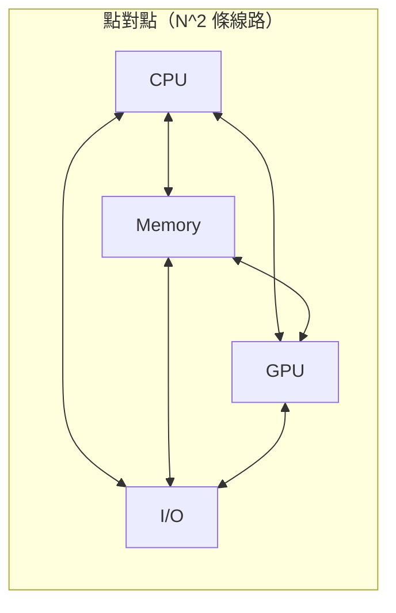
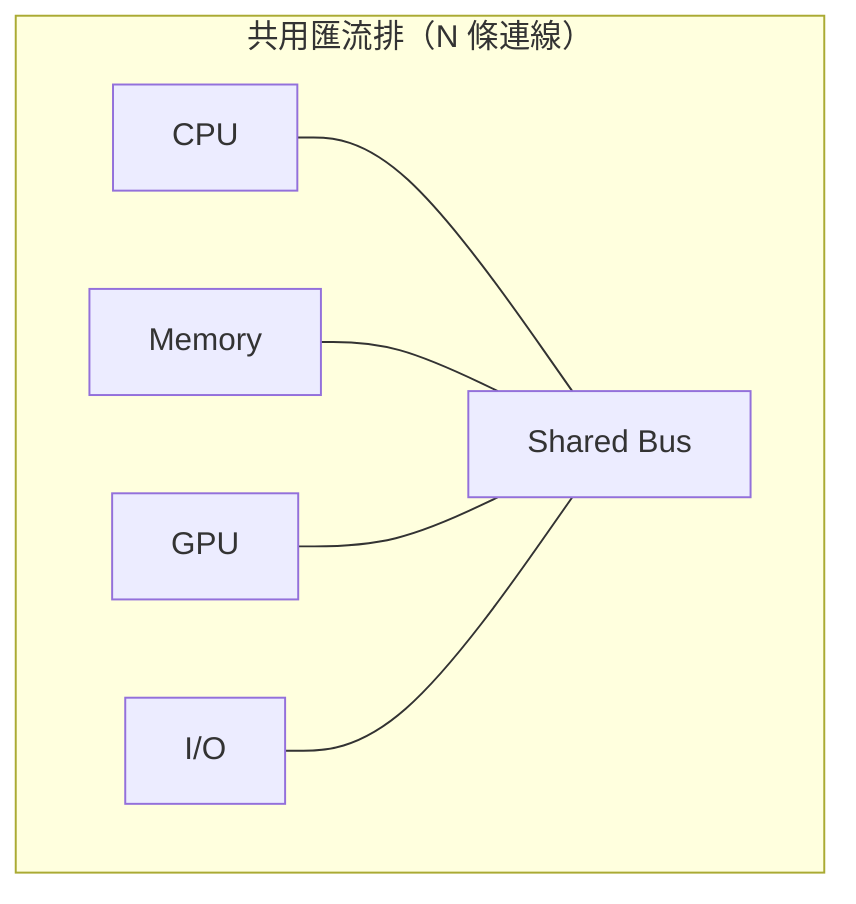
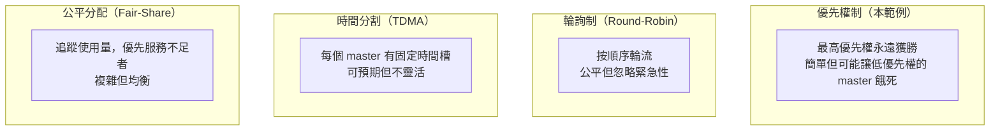
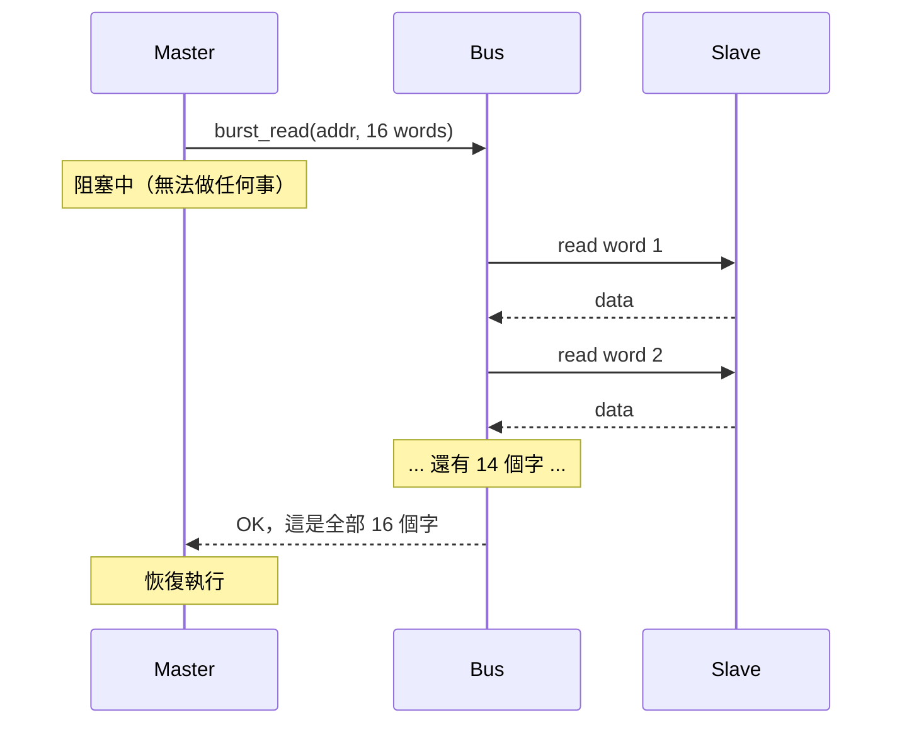
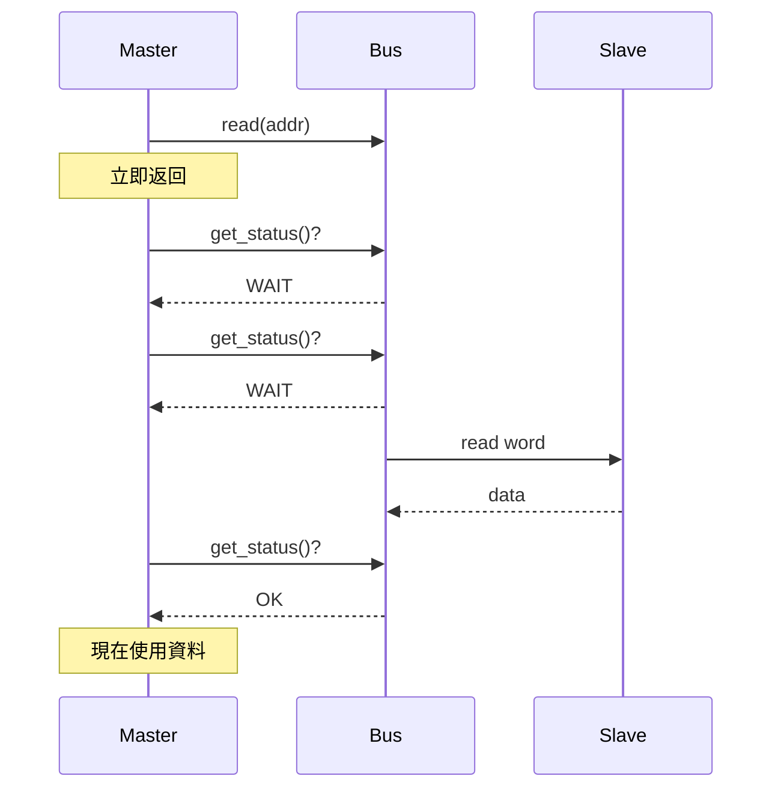
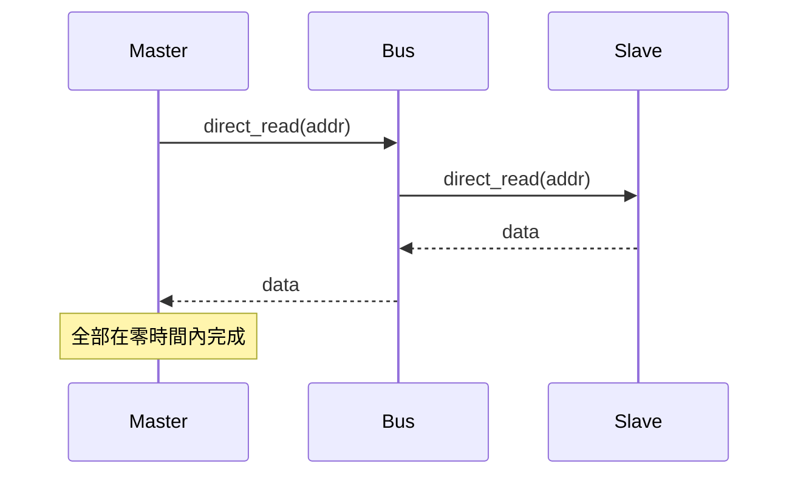
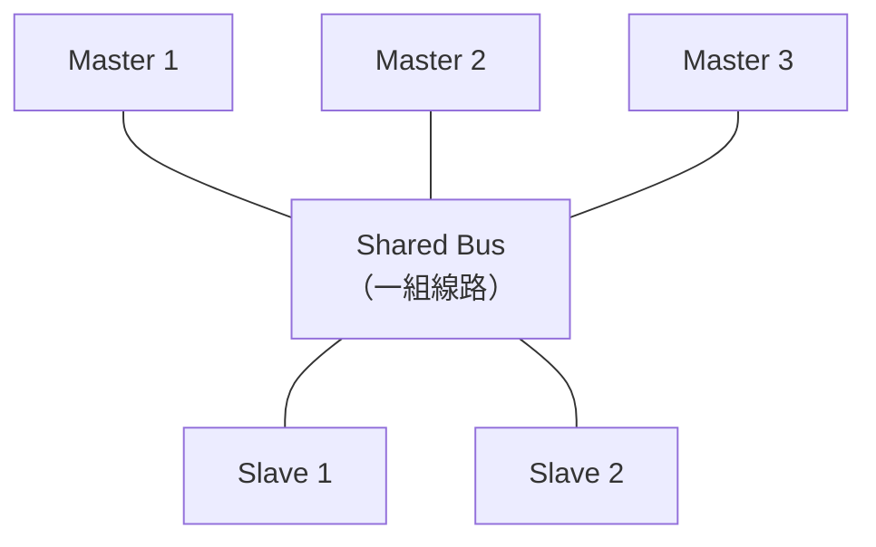
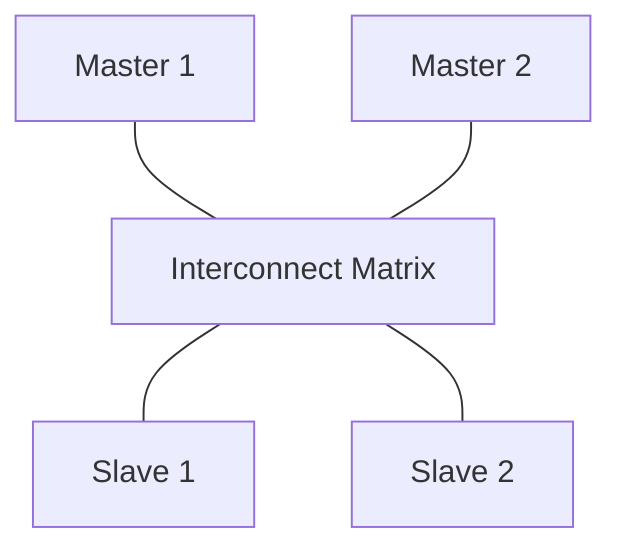

# Simple Bus -- 給軟體工程師的硬體規格說明

## 什麼是系統匯流排（System Bus）？

**系統匯流排**是連接電路板上各晶片（CPU、記憶體、周邊裝置）的共用通訊幹道。不需要在每一對晶片之間拉獨立的線路，所有晶片都連接到同一組共用線路上。

### 軟體類比

把它想成一個**訊息代理（message broker）**（如 RabbitMQ 或 Kafka）：

| 硬體概念 | 軟體對應 |
|---|---|
| 系統匯流排 | 訊息代理 / 共用事件匯流排 |
| 匯流排線路 | 網路連線 / 共用記憶體區段 |
| Master（CPU）| 生產者 / API 用戶端 |
| Slave（記憶體）| 消費者 / 資料庫 |
| Bus arbiter | 負載均衡器 / 連線池管理器 |
| 匯流排協定 | 訊息格式 / API 契約 |

或者想成一個**共用資料庫**——所有應用程式伺服器連接到同一個資料庫伺服器。資料庫負責處理並發存取、排隊與鎖定。這基本上就是匯流排對硬體所做的事。

---

## 為什麼需要匯流排？為什麼不用點對點連線？

### 線路數量問題

如果有 4 個晶片需要彼此通訊，點對點連線需要 6 條連線（N*(N-1)/2）。有 10 個晶片就需要 45 條連線。每條「連線」實際上是 32 條以上的並行線路（32 位元資料），加上位址線和控制信號。電路板很快就會複雜到無法實現。

匯流排解決了這個問題：**一組共用線路，所有人連上去。**

### 取捨比較

| 面向 | 點對點 | 共用匯流排 |
|---|---|---|
| 線路複雜度 | O(N^2) | O(N) |
| 並發傳輸 | 所有配對同時進行 | 每次只能一個 |
| 頻寬 | 每對配對獨享 | 所有人共享 |
| 成本 | 裝置多時昂貴 | 便宜 |
| 軟體類比 | 每個服務獨享資料庫 | 共用資料庫 |

---

## 匯流排仲裁（Bus Arbitration）：誰在何時傳輸？

由於一次只能有一個 master 使用匯流排（線路是共用的），必須有一個機制來決定誰可以傳輸。這就是**仲裁（arbitration）**。

### 軟體類比：會議主持人

想像一個有 5 個人的電話會議，規則是：每次只能有一個人發言。主持人決定下一個發言者。

| 會議概念 | 匯流排對應 |
|---|---|
| 與會者舉手 | Master 提交匯流排請求 |
| 主持人選下一位發言者 | Arbiter 選出獲勝的請求 |
| 發言者講話 | Master 執行資料傳輸 |
| 「我說完了」 | 傳輸完成，釋放匯流排 |
| 「等一下，我還沒講完」 | Locked burst——不可被中斷 |

### 常見仲裁策略

本範例使用帶 lock 支援的**優先權仲裁**（參見 [arbiter.md](arbiter.md)）。

---

## Blocking vs. Non-blocking vs. Direct 存取

這三種存取模式代表 master 與匯流排之間不同程度的耦合：

### Blocking（同步）

**軟體對應：** `result = requests.get(url)` -- 執行緒卡住直到收到回應。

**使用時機：** 當你需要取得全部資料才能繼續時。例如啟動時載入設定檔。

### Non-blocking（非同步輪詢）

**軟體對應：** `future = executor.submit(task); while (!future.isDone()) { ... }` -- 提交工作後定期查詢。

**使用時機：** 當你想在等待期間做其他工作，或需要精細控制等待行為時。

### Direct（即時，無協定）

**軟體對應：** `value = hashMap.get(key)` -- 即時、在同一程序內，無網路開銷。

**使用時機：** 除錯、監控，或需要在不影響匯流排協定的情況下查看記憶體（無仲裁、無等待週期）。

---

## 現實世界的匯流排標準

### ARM AMBA 系列（現今最普遍）

ARM 的 **Advanced Microcontroller Bus Architecture（AMBA）** 是行動裝置與嵌入式裝置中的主流匯流排標準。

| 匯流排 | 速度 | 複雜度 | 用途 | 類比 |
|---|---|---|---|---|
| **AHB**（Advanced High-perf）| 高 | 中等 | CPU-記憶體、DMA | 高速公路 |
| **APB**（Advanced Peripheral）| 低 | 簡單 | UART、SPI、GPIO | 市區道路 |
| **AXI**（Advanced eXtensible）| 極高 | 複雜 | 高頻寬 IP、GPU | 多線道快速道路 |

**AXI** 支援多個未完成的傳輸、亂序完成以及獨立的讀寫通道。比本範例的 simple_bus 複雜許多，但共享相同的基本概念。

### 其他標準

| 標準 | 來源 | 特色 |
|---|---|---|
| **Wishbone** | OpenCores | 開源、簡單 |
| **Avalon** | Intel/Altera | FPGA 優化 |
| **OCP**（Open Core Protocol）| OCP-IP | 標準化 socket 介面 |
| **PCIe** | PCI-SIG | 點對點序列，PC 常用 |

### 本範例與現實匯流排的對應

| simple_bus 特性 | AHB 對應 | AXI 對應 |
|---|---|---|
| `burst_read/write` | HBURST（burst 類型）| ARLEN/AWLEN（burst 長度）|
| `priority` | Bus master priority | QoS 信號 |
| `lock` | HMASTLOCK | ARLOCK/AWLOCK |
| `SIMPLE_BUS_WAIT` | HREADY = 0（等待週期）| RVALID/WREADY 交握 |
| `slave_if::start/end_address` | Address decoder | Address decoder |
| `arbiter` | 內建 arbiter | Interconnect fabric |

---

## 匯流排拓撲：晶片如何連接

### 單一共用匯流排（本範例）

**限制：** 每次只能進行一個傳輸。如果 Master 1 正在與 Slave 1 通訊，Master 2 即使 Slave 2 閒置也必須等待。

### 多層匯流排（AHB/AXI）

interconnect matrix 允許**同時傳輸**至不同 slave：Master 1 與 Slave 1 通訊的同時，Master 2 可以與 Slave 2 通訊。只有當兩個 master 想存取同一個 slave 時才會產生競爭。

**軟體類比：** 共用匯流排就像單執行緒事件迴圈（Python asyncio event loop）。多層匯流排就像執行緒池，平行請求可以同時打到不同的後端。

---

## 給軟體工程師的重點整理

1. **匯流排只是一條帶有協定規則的共用通訊通道**，和訊息代理或共用資料庫本質上沒有不同。

2. **仲裁 = 排程。** CPU 排程用的相同演算法（優先權、輪詢、公平分配）同樣適用於匯流排仲裁。

3. **硬體中的 blocking vs. non-blocking** 與軟體中的語意完全相同：呼叫者等待結果，還是稍後再查詢？

4. **等待週期（wait states）** 是硬體版的網路延遲——不同的「後端」（記憶體類型）以不同速度回應。

5. **現代匯流排（AXI）的真正複雜之處**在於支援並發未完成的傳輸、亂序完成和頻寬優化——這與建立高效能網頁伺服器面臨的挑戰相同。
