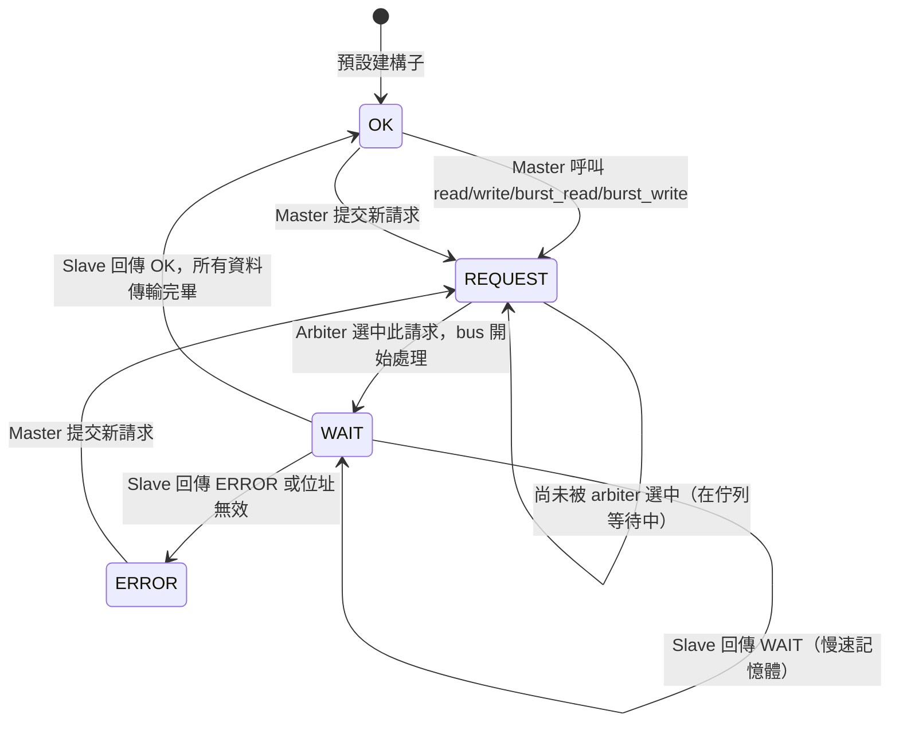
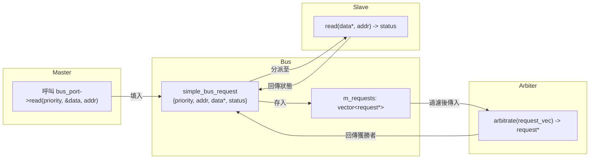

# Simple Bus -- 型別、請求結構與工具函式

## 概覽

這些檔案定義了整個 simple bus 系統共用的資料型別：狀態碼、lock 狀態、流經匯流排的請求結構，以及工具函式。

**來源檔案：** `simple_bus_types.h`、`simple_bus_types.cpp`、`simple_bus_request.h`、`simple_bus_tools.cpp`

---

## 檔案：`simple_bus_types.h` / `.cpp`

### 狀態列舉（Status Enum）

```cpp
enum simple_bus_status {
    SIMPLE_BUS_OK = 0,
    SIMPLE_BUS_REQUEST,
    SIMPLE_BUS_WAIT,
    SIMPLE_BUS_ERROR
};
```

**軟體類比：** HTTP 狀態碼：

| 匯流排狀態 | 值 | HTTP 對應 | 意義 |
|---|---|---|---|
| `SIMPLE_BUS_OK` | 0 | 200 OK | 傳輸成功完成 |
| `SIMPLE_BUS_REQUEST` | 1 | 202 Accepted | 請求已提交，等待處理 |
| `SIMPLE_BUS_WAIT` | 2 | 102 Processing | 正在處理，尚未完成 |
| `SIMPLE_BUS_ERROR` | 3 | 500 Error | 傳輸失敗 |

### 狀態字串陣列

```cpp
char simple_bus_status_str[4][20] = {
    "SIMPLE_BUS_OK",
    "SIMPLE_BUS_REQUEST",
    "SIMPLE_BUS_WAIT",
    "SIMPLE_BUS_ERROR"
};
```

用於除錯輸出——將列舉整數轉換成人類可讀的字串。

### 前向宣告

```cpp
struct simple_bus_request;
typedef std::vector<simple_bus_request *> simple_bus_request_vec;
```

`simple_bus_request_vec` 是 arbiter 使用的容器型別——它接收一個待處理請求指標的 vector。

### `sb_fprintf` 宣告

```cpp
extern int sb_fprintf(FILE *, const char *, ...);
```

信號安全版本的 `fprintf`（詳見下方 `simple_bus_tools.cpp`）。

---

## 檔案：`simple_bus_request.h`

### Lock 狀態列舉

```cpp
enum simple_bus_lock_status {
    SIMPLE_BUS_LOCK_NO = 0,      // 無鎖定
    SIMPLE_BUS_LOCK_SET,          // 已請求鎖定
    SIMPLE_BUS_LOCK_GRANTED       // 已由 arbiter 確認鎖定
};
```

這三個狀態組成一個小型狀態機，管理匯流排保留（詳見 [arbiter.md](arbiter.md)）。

### 請求結構

```cpp
struct simple_bus_request {
    // 身份識別
    unsigned int priority;

    // 請求參數
    bool do_write;
    unsigned int address;
    unsigned int end_address;
    int *data;
    simple_bus_lock_status lock;

    // 完成通知
    sc_event transfer_done;
    simple_bus_status status;
};
```

**軟體類比：** 這是工作佇列系統中的一張**任務票據**：

| 欄位 | 類比 | 說明 |
|---|---|---|
| `priority` | 工作優先權 / 用戶端 ID | 數字越小越重要。同時作為 master 的唯一識別碼。 |
| `do_write` | HTTP 方法（GET vs PUT）| `false` = 讀取，`true` = 寫入 |
| `address` | 當前 URL/偏移量 | 當前正在處理的位元組位址 |
| `end_address` | 範圍結束 | burst 傳輸的最後一個位元組位址。單次傳輸時等於 `address`。 |
| `data` | Payload 指標 | 指向 master 的資料緩衝區，每次傳輸一個字後遞增。 |
| `lock` | Advisory lock 狀態 | 控制連續請求之間的匯流排保留。 |
| `transfer_done` | 完成回調 / Promise | blocking 介面 `wait()` 等待的 `sc_event`，bus 完成傳輸後通知。 |
| `status` | 工作狀態 | 當前狀態：`OK`、`REQUEST`、`WAIT` 或 `ERROR`。 |

### 預設建構子

```cpp
simple_bus_request::simple_bus_request()
    : priority(0), do_write(false), address(0), end_address(0),
      data((int *)0), lock(SIMPLE_BUS_LOCK_NO), status(SIMPLE_BUS_OK)
{}
```

新請求以 `OK` 狀態且無鎖定開始。當 master 呼叫匯流排介面函式時，bus 會填入實際欄位。

### 請求生命週期



---

## 檔案：`simple_bus_tools.cpp`

### `sb_fprintf` -- 信號安全的 Printf

```cpp
int sb_fprintf(FILE *fp, const char *fmt, ...) {
    va_list ap;
    va_start(ap, fmt);
    int ret = 0;
    do {
        errno = 0;
        ret = vfprintf(fp, fmt, ap);
    } while (errno == EINTR);
    return ret;
}
```

這是 `vfprintf` 的包裝函式，在 `EINTR`（被信號中斷）時重試。在標準 C 中，如果 Unix 信號在寫入過程中到達，`fprintf` 可能會無聲失敗。這個包裝函式確保輸出確實被寫出。

**軟體類比：** 具備暫時性網路錯誤自動重試功能的 HTTP 用戶端。

系統中所有的除錯輸出都使用 `sb_fprintf`，而非直接使用 `printf` 或 `fprintf`。

---

## 型別在系統中的流動方式



`simple_bus_request` 結構是串聯整個系統的核心資料結構。每個 master（以 priority 識別）只建立一個請求物件並在多次交易中重複使用。Bus 在 master 呼叫介面函式時填入它，arbiter 從集合中選取，bus 再用它分派到 slave。
