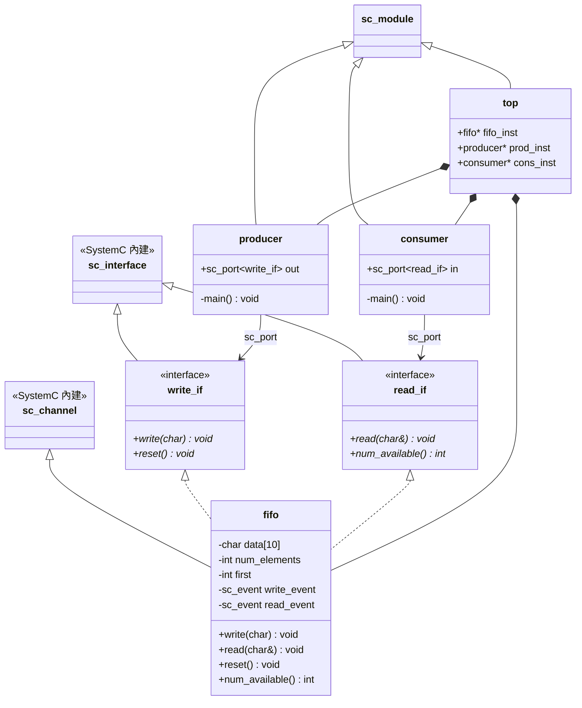
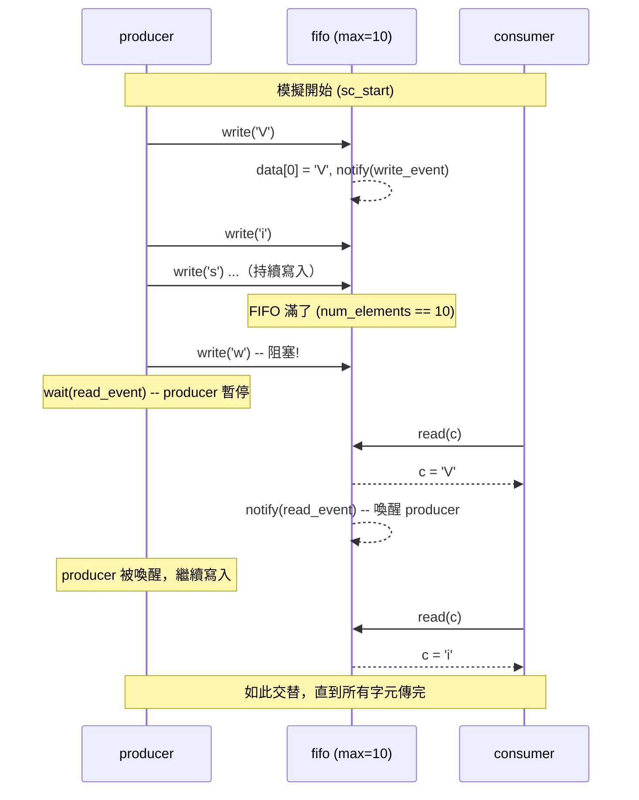

# simple_fifo -- 生產者-消費者範例

> **難度**: 入門 | **軟體類比**: Python queue.Queue | **原始碼**: `ref/systemc/examples/sysc/simple_fifo/simple_fifo.cpp`

## 概述

`simple_fifo` 是 SystemC 官方最經典的入門範例。它展示了一個**生產者（producer）**透過一個自訂的 **FIFO channel** 將資料傳遞給**消費者（consumer）**的完整流程。

如果你寫過 Python，這就是一個 **bounded queue**：

```python
import queue
q = queue.Queue(maxsize=10)  # 容量 10 的 queue
# coroutine 寫入
# coroutine 讀取
```

這就是 Python `queue.Queue(maxsize=10)`：
- 佇列滿了 -> `put()` 會阻塞（blocking），直到有人取走資料
- 佇列空了 -> `get()` 會阻塞，直到有人放入資料

SystemC 的 FIFO channel 做的事情完全一樣，只是它是用 **event（事件）** 來實現阻塞與喚醒，而不是 OS 的 mutex/condition variable。

## 架構圖

### 類別關係圖



### 執行時序圖



## 檔案列表

| 檔案 | 說明 | 文件連結 |
| --- | --- | --- |
| `simple_fifo.cpp` | 單一檔案包含所有類別定義與 `sc_main` | [simple_fifo.md](simple_fifo.md) |

## 硬體規格參考

想了解 FIFO 在真實硬體中扮演什麼角色？請參閱 [spec.md](spec.md)。

## 核心概念速查

| SystemC 概念 | 軟體對應 | 在本範例中的角色 |
| --- | --- | --- |
| `sc_interface` | C++ abstract class / Python ABC | `write_if` 和 `read_if` 定義了 FIFO 的讀寫契約 |
| `sc_channel` | 實作 interface 的具體類別（如 Python queue.Queue 的底層實作） | `fifo` 同時實作 `write_if` 和 `read_if` |
| `sc_port<T>` | 依賴注入的接口指標（類似 Python inject library 的 `@inject`） | producer 透過 `sc_port<write_if>` 存取 FIFO |
| `SC_THREAD` | `asyncio.create_task()` / `threading.Thread()` | producer 和 consumer 各自在獨立的 thread 中執行 |
| `sc_event` | `threading.Condition` / `asyncio.Event` | `write_event` 和 `read_event` 用來協調阻塞與喚醒 |
| `wait(event)` | `condition.wait()` / `queue.get() blocking` | FIFO 滿時 producer 等待；FIFO 空時 consumer 等待 |

## 學習路徑建議

1. 先讀 [spec.md](spec.md) 了解 FIFO 在硬體世界的意義
2. 再讀 [simple_fifo.md](simple_fifo.md) 逐行理解程式碼
3. 接著可以挑戰 [pipe](../pipe/_index.md) 範例（多級管線）
