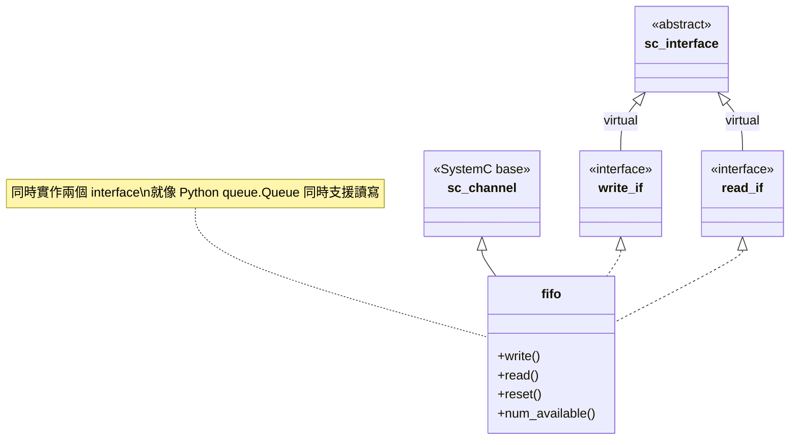
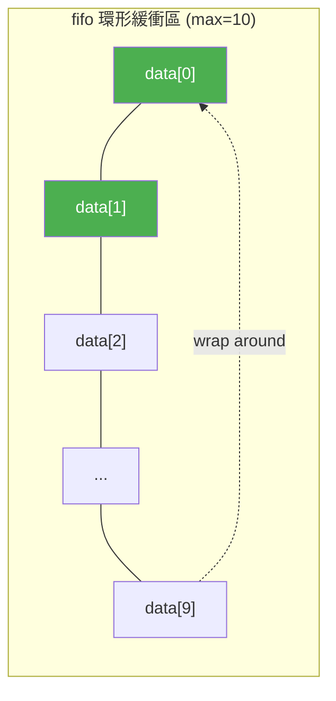
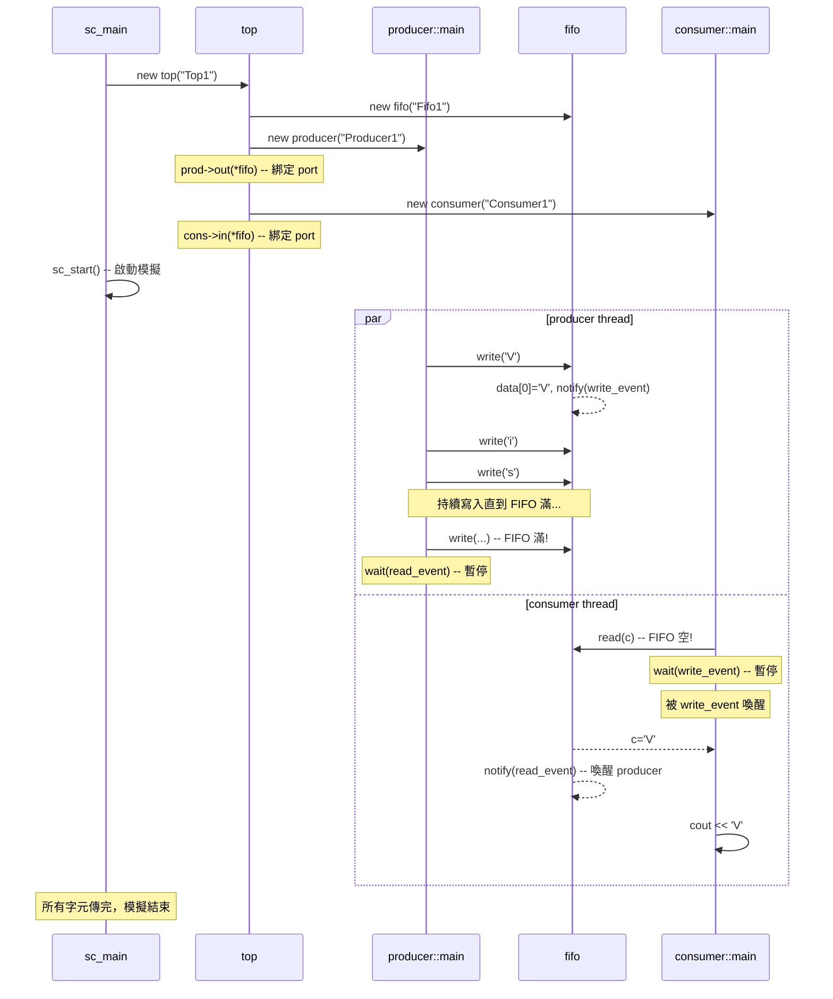

# simple_fifo.cpp -- 逐行解析

> **原始碼**: `ref/systemc/examples/sysc/simple_fifo/simple_fifo.cpp`
> **行數**: 165 行 | **類別數**: 6 個（含 2 個 interface）

## 概述

這是一個**單一檔案**的範例，在 165 行程式碼中展示了 SystemC 最核心的設計模式：
- 定義**介面（interface）** -- 規範通訊契約
- 實作**通道（channel）** -- 提供具體的通訊機制
- 透過**埠（port）** -- 將模組與通道連接起來

## 日常生活類比

想像一家餐廳的**廚房**和**外場**之間有一條**輸送帶**：

| 餐廳元素 | 程式碼對應 | 說明 |
| --- | --- | --- |
| 廚師 | `producer` | 持續做出菜品（產生資料） |
| 輸送帶 | `fifo` | 固定長度（最多 10 盤），滿了廚師就要等 |
| 服務生 | `consumer` | 從輸送帶取菜送給客人 |
| 「可以放菜」的燈號 | `read_event` | 服務生取走一盤後亮燈，通知廚師可以繼續放 |
| 「有新菜了」的燈號 | `write_event` | 廚師放了一盤後亮燈，通知服務生可以來取 |
| 放菜的規則 | `write_if` | 「放菜」和「清空輸送帶」兩個動作的規範 |
| 取菜的規則 | `read_if` | 「取菜」和「查看剩幾盤」兩個動作的規範 |

## 類別逐一解析

### 1. `write_if` -- 寫入介面（第 45-50 行）

```cpp
class write_if : virtual public sc_interface
{
   public:
     virtual void write(char) = 0;
     virtual void reset() = 0;
};
```

**用途**: 定義「寫入端」能做什麼事。這就是一個純虛擬介面（pure virtual interface），等同於：

- **Python**: `class WriteIF(ABC): @abstractmethod write(c); @abstractmethod reset()`
- **C++**: `class WriteIF { virtual void write(char c) = 0; virtual void reset() = 0; };`

**為什麼用 `virtual` 繼承 `sc_interface`?**

SystemC 的 channel 會同時繼承多個 interface。使用 `virtual` 繼承可以避免**菱形繼承（diamond inheritance）**問題 -- `fifo` 同時繼承 `write_if` 和 `read_if`，它們都繼承自 `sc_interface`，加了 `virtual` 就只會有一份 `sc_interface` 的實例。

### 2. `read_if` -- 讀取介面（第 52-57 行）

```cpp
class read_if : virtual public sc_interface
{
   public:
     virtual void read(char &) = 0;
     virtual int num_available() = 0;
};
```

**用途**: 定義「讀取端」能做什麼事。注意 `read` 的參數是**引用（reference）**，這是 C++ 中回傳值的常見手法。

`num_available()` 讓消費者可以查詢目前 FIFO 中有多少資料可讀，相當於 Python `queue.Queue.qsize()`。

### 3. `fifo` -- FIFO 通道（第 59-92 行）

這是本範例的核心。`fifo` 同時實作了 `write_if` 和 `read_if`，就像一個 Python queue.Queue 同時支援 `get()`（讀）和 `put()`（寫）。

```cpp
class fifo : public sc_channel, public write_if, public read_if
```

#### 繼承關係圖



#### 內部資料結構

```cpp
enum e { max = 10 };       // FIFO 容量 = 10
char data[max];            // 環形緩衝區
int num_elements, first;   // 元素數量、讀取位置
sc_event write_event;      // 「有新資料寫入」事件
sc_event read_event;       // 「有資料被讀走」事件
```

這是一個經典的**環形緩衝區（circular buffer / ring buffer）**：



#### `write()` -- 寫入與阻塞

```cpp
void write(char c) {
    if (num_elements == max)    // FIFO 滿了？
        wait(read_event);       // 等到有人讀走資料

    data[(first + num_elements) % max] = c;  // 寫入環形緩衝區
    ++ num_elements;
    write_event.notify();       // 通知：有新資料了
}
```

**與 Python queue.Queue 的對比**:

| 操作 | Python queue.Queue | SystemC fifo |
| --- | --- | --- |
| 寫入 | `q.put(data)` | `fifo.write(data)` |
| 滿時行為 | 呼叫端被阻塞 | `wait(read_event)` 暫停 SC_THREAD |
| 喚醒機制 | Python 內部 Condition 自動處理 | `write_event.notify()` 手動通知 |

**重要細節**: `wait()` 在 SystemC 中會**讓出執行權**給模擬器核心（simulator kernel），讓其他 thread 有機會執行。這跟 Python asyncio 的 event loop scheduler 概念一致 -- 你不是在忙等（busy wait），而是真正地暫停。

#### `read()` -- 讀取與阻塞

```cpp
void read(char &c) {
    if (num_elements == 0)      // FIFO 空了？
        wait(write_event);      // 等到有人寫入資料

    c = data[first];            // 讀取最前面的資料
    -- num_elements;
    first = (first + 1) % max;  // 移動讀指標（環形）
    read_event.notify();        // 通知：有空位了
}
```

讀取是寫入的鏡像操作。空了就等、有資料就讀、讀完就通知寫入端。

### 4. `producer` -- 生產者模組（第 94-113 行）

```cpp
class producer : public sc_module
{
   public:
     sc_port<write_if> out;    // 透過 write_if 介面連接到 FIFO

     producer(sc_module_name name) : sc_module(name)
     {
       SC_THREAD(main);        // 註冊 main() 為一個獨立執行的 thread
     }

     void main()
     {
       const char *str =
         "Visit www.accellera.org and see what SystemC can do for you today!\n";
       while (*str)
         out->write(*str++);   // 逐字元寫入 FIFO
     }
};
```

**關鍵設計**:

- **`sc_port<write_if>`**: 這是一個「型別安全的插座」。producer 只知道自己連接到一個實作了 `write_if` 的東西，完全不知道具體實作是 `fifo`。這就是**依賴反轉（Dependency Inversion）**。
  - 軟體類比：dependency injection (like Python's inject library) 的 `@inject`
  - Python 類比：只依賴 ABC interface，不依賴 concrete type

- **`SC_THREAD(main)`**: 將 `main()` 函式註冊為一個 SystemC thread。這類似於 `asyncio.create_task(main())` -- 一個獨立的執行單元，可以被暫停和恢復。

- **`out->write(*str++)`**: 透過 port 呼叫 interface 方法。`->` 是 `sc_port` 重載的運算子，實際上呼叫的是 FIFO 的 `write()`。

### 5. `consumer` -- 消費者模組（第 115-140 行）

```cpp
class consumer : public sc_module
{
   public:
     sc_port<read_if> in;

     consumer(sc_module_name name) : sc_module(name)
     {
       SC_THREAD(main);
     }

     void main()
     {
       char c;
       while (true) {
         in->read(c);           // 從 FIFO 讀一個字元（可能阻塞）
         cout << c << flush;

         if (in->num_available() == 1)
           cout << "<1>" << flush;  // FIFO 中只剩 1 個元素時標記
         if (in->num_available() == 9)
           cout << "<9>" << flush;  // FIFO 中有 9 個元素時標記
       }
     }
};
```

**注意**: consumer 的 `while(true)` 永遠不會主動結束。模擬會在 producer 傳完所有字元且所有 thread 都在 `wait()` 時自動停止（因為沒有任何事件可以觸發了）。

`<1>` 和 `<9>` 的標記是為了觀察 FIFO 的填充程度 -- 當你看到 `<1>` 表示 FIFO 幾乎空了（消費速度跟上了），看到 `<9>` 表示 FIFO 幾乎滿了（生產速度太快）。

### 6. `top` -- 頂層模組（第 142-159 行）

```cpp
class top : public sc_module
{
   public:
     fifo *fifo_inst;
     producer *prod_inst;
     consumer *cons_inst;

     top(sc_module_name name) : sc_module(name)
     {
       fifo_inst = new fifo("Fifo1");

       prod_inst = new producer("Producer1");
       prod_inst->out(*fifo_inst);     // 將 producer 的 out port 綁定到 fifo

       cons_inst = new consumer("Consumer1");
       cons_inst->in(*fifo_inst);      // 將 consumer 的 in port 綁定到 fifo
     }
};
```

`top` 是**組裝者**，負責建立所有子模組並把它們連接起來。這就像 Python 的 `main()` 中做依賴注入：

```python
# Python 類比
fifo = Fifo(maxsize=10)
producer = Producer(fifo)  # 注入 WriteIF
consumer = Consumer(fifo)  # 注入 ReadIF
```

**為什麼 `prod_inst->out(*fifo_inst)` 可以運作？**

`sc_port<write_if>` 重載了 `operator()`，接受任何實作了 `write_if` 的物件。`fifo` 實作了 `write_if`，所以可以直接綁定。這就是**介面多型（interface polymorphism）**的威力。

### 7. `sc_main` -- 程式進入點（第 161-165 行）

```cpp
int sc_main(int, char *[]) {
    top top1("Top1");
    sc_start();
    return 0;
}
```

`sc_main` 是 SystemC 程式的進入點（取代一般的 `main()`）。SystemC library 會提供真正的 `main()`，呼叫你定義的 `sc_main()`。

`sc_start()` 啟動模擬器核心，開始排程所有已註冊的 `SC_THREAD`。模擬會持續到所有 thread 都結束或永久等待為止。

## 完整執行流程



## 設計理念

### 為什麼要用 interface？

直接讓 producer 持有 `fifo*` 不是更簡單嗎？答案是**關注點分離（Separation of Concerns）**：

1. **producer 只需要寫入能力** -- 它不該知道 `read()` 和 `num_available()` 的存在
2. **consumer 只需要讀取能力** -- 它不該知道 `write()` 和 `reset()` 的存在
3. **可替換性** -- 你可以把 `fifo` 換成任何實作了 `write_if` 的東西（例如一個帶有流量控制的高級 FIFO），producer 完全不需要改動

這就是 SOLID 原則中的**介面隔離原則（Interface Segregation Principle）**。

### 為什麼用 `sc_channel` 而不是普通的類別？

`sc_channel` 繼承自 `sc_module`，它擁有 SystemC 模擬器核心的支援：
- 可以使用 `wait()` 暫停和恢復
- 參與模擬器的排程（scheduling）
- 有名稱（`sc_module_name`），方便除錯和追蹤

如果用普通的 C++ class 實作 FIFO，你將無法使用 `wait()` 來暫停 thread，只能用 busy wait 或自己實作 condition variable -- 而那就失去了 SystemC 模擬引擎的意義。

### `SC_THREAD` vs `SC_METHOD`

本範例使用 `SC_THREAD`，因為 producer 和 consumer 需要**阻塞等待**（`wait()`）。SystemC 還有另一種執行模型 `SC_METHOD`，它不能呼叫 `wait()`，更像是一個 callback function。

| 特性 | SC_THREAD | SC_METHOD |
| --- | --- | --- |
| 軟體類比 | Python coroutine (asyncio) / Thread | callback / event handler |
| 可以 `wait()` | 可以 | 不行 |
| 執行方式 | 可以暫停/恢復 | 每次從頭執行到尾 |
| 適用場景 | 需要等待事件的複雜邏輯 | 簡單的組合邏輯 |
