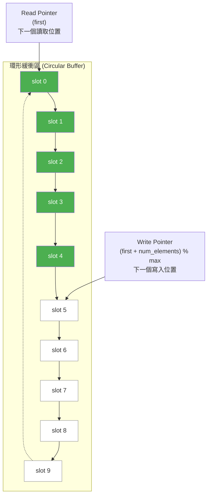

# FIFO 硬體規格 -- 給軟體工程師的解釋

> 本文件解釋 FIFO 在真實硬體中的角色與設計考量。不需要硬體背景即可閱讀。

## FIFO 是什麼？

FIFO 是 **First In, First Out** 的縮寫，在硬體世界中，它是一個**固定大小的佇列**，焊在晶片上，用來在兩個獨立運作的電路之間傳遞資料。

**日常類比**: 想像一條壽司迴轉台：
- 廚師把壽司放上去（寫入端）
- 客人從另一端取走壽司（讀取端）
- 迴轉台有固定長度（不能無限放）
- 廚師和客人各自按自己的節奏運作

在軟體世界中，你已經很熟悉這個概念：

| 軟體技術 | 等效概念 | 特點 |
| --- | --- | --- |
| Python `queue.Queue(maxsize)` (bounded) | 有容量限制的 queue | 滿時 put 阻塞，空時 get 阻塞 |
| C++ `std::queue` + condition_variable | 固定大小的阻塞佇列 | 基於 std::mutex + std::condition_variable |
| Unix pipe | `cmd1 \| cmd2` | 核心中有 64KB 的緩衝區 |
| Python `queue.Queue(maxsize)` | 執行緒安全的有界佇列 | 底層用 Lock + Condition |
| Kafka partition | 持久化的 FIFO | 生產者/消費者解耦 |

差別在於：硬體的 FIFO 是**實體電路**，沒有作業系統、沒有 garbage collector、沒有 context switch。它必須在每個時脈週期（clock cycle）內完成讀或寫操作。

## 為什麼硬體需要 FIFO？

### 1. 時脈域跨越（Clock Domain Crossing）

硬體系統中，不同模組可能用**不同的時脈頻率**運作。例如：
- CPU 跑在 3 GHz
- 記憶體控制器跑在 1.6 GHz
- PCIe 介面跑在 2.5 GHz

它們之間不能直接傳資料（就像兩個不同 timezone 的人不能直接同步通話），需要一個 FIFO 當「緩衝翻譯」。

**軟體類比**: 想像兩個微服務跑在不同的 event loop 頻率上，中間放一個 message queue 來解耦。

### 2. 速率匹配（Rate Matching）

生產者和消費者的處理速度不同。例如：
- 網路介面每秒收到 10Gbps 的封包
- CPU 的處理速度可能跟不上

FIFO 吸收這些速度差異，避免資料遺失。

**軟體類比**: Web server 前面放 Nginx 當 buffer，應對突發流量（burst traffic）。

### 3. 時序解耦（Temporal Decoupling）

生產者不需要等消費者準備好才能送出資料（反之亦然），FIFO 讓兩者獨立運作。

**軟體類比**: 非同步訊息佇列 -- producer 丟進 queue 就返回，不用等 consumer 處理完。

## FIFO 的典型參數

在硬體設計中，FIFO 有幾個關鍵參數：

| 參數 | 英文名稱 | 說明 | 軟體對應 |
| --- | --- | --- | --- |
| 深度 | Depth | 可以儲存多少筆資料（本範例 = 10） | `make(chan T, 10)` 中的 `10` |
| 寬度 | Width | 每筆資料的位元數（本範例 = 8 bit = 1 char） | 資料型別的大小 |
| 幾乎滿 | Almost Full | 接近滿時發出警告（例如 8/10） | 水位告警、背壓（backpressure） |
| 幾乎空 | Almost Empty | 接近空時發出警告（例如 2/10） | 消費者快要餓死的警告 |
| 滿 | Full | 完全滿，無法再寫入 | channel 阻塞 |
| 空 | Empty | 完全空，無法再讀取 | channel 阻塞 |
| 溢位 | Overflow | 滿了還硬寫，資料遺失 | buffer overflow -- 嚴重 bug |
| 底流 | Underflow | 空了還硬讀，讀到垃圾資料 | 讀取空 queue -- 嚴重 bug |

### 本範例中的對應

```
simple_fifo 的 fifo class:
  Depth     = 10  (enum e { max = 10 })
  Width     = 8 bit (char)
  Full 行為  = wait(read_event)  -- 阻塞直到被讀走
  Empty 行為 = wait(write_event) -- 阻塞直到被寫入
  Almost Full/Empty = 不支援（簡化版本）
```

consumer 中的 `num_available() == 1` 和 `num_available() == 9` 檢查，其實就是在觀察「幾乎空」和「幾乎滿」的狀態。

## FIFO 的內部結構 -- 環形緩衝區

大多數 FIFO（包含本範例）使用**環形緩衝區（circular buffer）**實作：



- 綠色 = 有資料（5 個元素，`num_elements = 5`）
- 白色 = 空的
- Read Pointer (`first`) 指向最早寫入的資料
- Write Pointer (`first + num_elements`) 指向下一個可寫入的位置
- 當指標到達陣列尾端，自動繞回（`% max`）-- 這就是「環形」的意思

### 硬體中的環形緩衝區

在硬體中，環形緩衝區通常用 **dual-port SRAM** 實作：
- 一個 port 負責寫入（連接到寫入端電路）
- 一個 port 負責讀取（連接到讀取端電路）
- 讀寫可以在**同一個時脈週期內同時進行**

這比軟體快得多 -- 不需要加鎖，因為硬體天生就是平行的。

## 真實世界的 FIFO 應用

### 1. UART 收發緩衝區

你的電腦透過 serial port（或 USB-to-serial）跟嵌入式裝置通訊時，UART 晶片內部有 16-byte 的 FIFO：
- 收到的位元組先進 RX FIFO，等 CPU 來讀
- CPU 要發送的位元組先進 TX FIFO，UART 慢慢送出

**軟體類比**: `BufferedReader` / `BufferedWriter` 包裝底層的 stream。

### 2. 網路封包緩衝區

網路交換器（switch）的每個 port 都有 FIFO：
- 封包到達時放入 ingress FIFO
- 交換矩陣（switching fabric）從中讀取並轉發
- 轉發前放入 egress FIFO

FIFO 深度決定了能承受多大的突發流量。深度不夠就會丟包。

**軟體類比**: Nginx 的 proxy buffer / TCP 的 receive buffer。

### 3. DMA 傳輸佇列

DMA（Direct Memory Access）控制器讓周邊設備直接讀寫記憶體，不經過 CPU：
- CPU 把「搬移指令」放入 command FIFO
- DMA 引擎逐一取出並執行
- 完成後放結果到 completion FIFO

**軟體類比**: 工作佇列（job queue）-- producer 丟任務進去，worker thread 慢慢消化。

### 4. 顯示管線緩衝區

GPU 把算好的像素資料放入 frame buffer FIFO，顯示控制器按固定速率（60Hz / 144Hz）從中讀取送到螢幕。FIFO 太淺會造成畫面撕裂（screen tearing）。

**軟體類比**: 影片播放器的預載緩衝區 -- 先載入幾秒的影片資料，避免卡頓。

## FIFO 設計的取捨

| 考量 | 淺 FIFO（小深度） | 深 FIFO（大深度） |
| --- | --- | --- |
| 面積（晶片成本） | 小 | 大 |
| 延遲 | 低 | 高（資料在佇列中等更久） |
| 突發流量容忍度 | 差（容易滿） | 好（能吸收大量突發） |
| 功耗 | 低 | 高 |

**軟體類比**: 這就像選擇 message queue 的 buffer size -- 太小會頻繁阻塞降低吞吐量，太大會占用記憶體且增加延遲。

## 從這個範例學到什麼

`simple_fifo` 這個範例雖然簡單，但完整展示了硬體設計中最基本的通訊模式：

1. **介面分離** -- 讀寫端各自定義契約（`write_if` / `read_if`），如同硬體中 FIFO 的寫入 port 和讀取 port 是物理上分開的
2. **阻塞語意** -- 滿了等、空了也等，這是硬體中 `full` 和 `empty` 信號的行為模型
3. **事件驅動** -- 用 `sc_event` 模擬硬體中的信號通知，而不是輪詢（polling）
4. **環形緩衝區** -- 硬體中最常見的 FIFO 實作方式

理解了這些概念，你就掌握了硬體系統中**模組間通訊**的基本原理。這與軟體中的 producer-consumer pattern 本質相同，只是實現層面不同。
