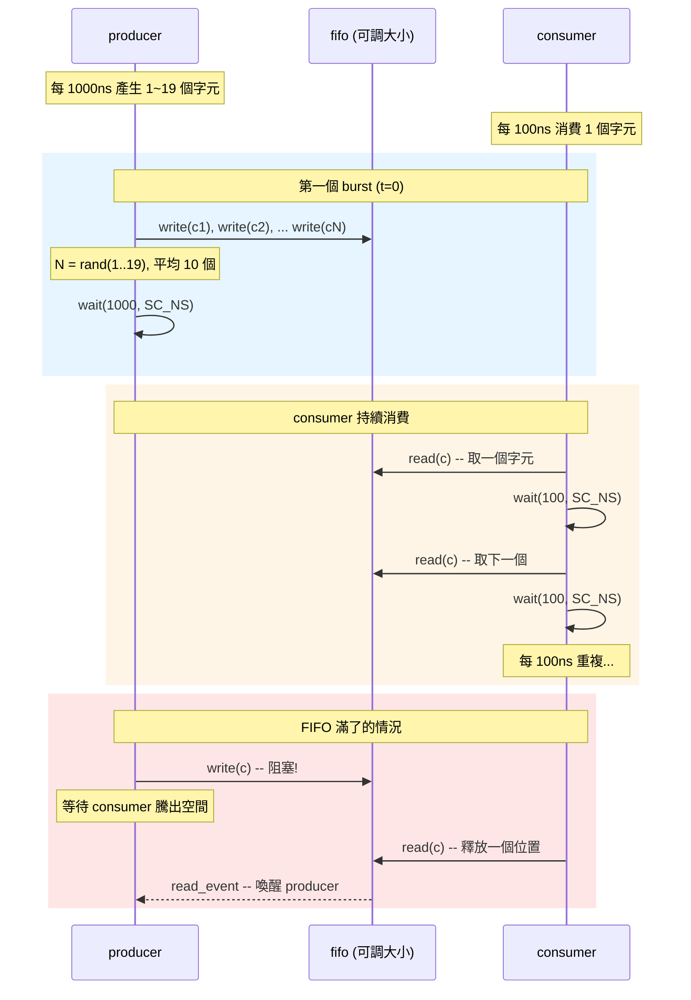
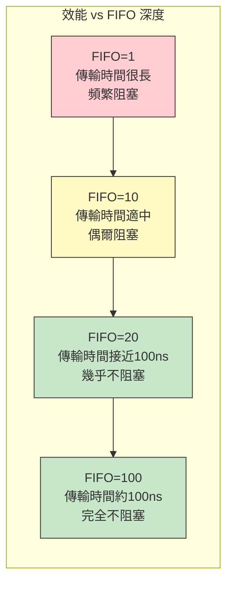

# simple_perf -- 效能建模範例

> **難度**: 中級 | **軟體類比**: 壓測 Kafka/RabbitMQ 在不同 buffer size 下的吞吐量 | **原始碼**: `ref/systemc/examples/sysc/simple_perf/simple_perf.cpp`

## 概述

`simple_perf` 是 [simple_fifo](../simple_fifo/_index.md) 的「效能分析版」。它保留了相同的生產者-消費者架構，但加入了**時間模型**和**統計收集**，讓你可以探索一個關鍵問題：

> **FIFO 的深度（buffer 大小）如何影響整體吞吐量？**

這個問題在軟體世界也很常見。想像你在調整 Kafka 的 consumer buffer size，或是 RabbitMQ 的 prefetch count：
- Buffer 太小：生產者經常被阻塞，整體吞吐量下降
- Buffer 太大：浪費記憶體（在硬體世界是浪費晶片面積）
- 剛剛好：生產者和消費者都能順暢運作

### 與 simple_fifo 的關係

| 面向 | simple_fifo | simple_perf |
| --- | --- | --- |
| 目的 | 教學 -- 展示 channel 機制 | 分析 -- 探索設計空間 |
| 時間模型 | 無 | producer: 1000ns/burst, consumer: 100ns/char |
| FIFO 大小 | 固定 10 | 可從命令列調整 |
| 統計資料 | 無 | 平均/最大填充深度、平均傳輸時間 |
| 傳輸量 | 一個字串 | 100,000 個字元 |

## 時序關係圖



## 核心洞察

平均來看，producer 的產出速率和 consumer 的消費速率是匹配的（都是約 100ns/字元）。但 producer 是**突發性（bursty）**的 -- 它一次寫入 1~19 個字元然後休息。

這就像一個 API server 收到突發流量：

```
producer:  |====burst====|--------idle--------|====burst====|
consumer:  |-c-|-c-|-c-|-c-|-c-|-c-|-c-|-c-|-c-|-c-|-c-|-c-|
```

FIFO 的作用就是**吸收突發流量**。如果 FIFO 夠大，producer 的 burst 可以全部寫入而不阻塞；如果太小，producer 就必須等待，導致整體傳輸時間增加。

## 效能曲線概念



原始碼中的提示：
- FIFO = 10~20 之間可以達到平均 110ns/字元的傳輸時間
- 超過某個閾值後，增加 FIFO 大小的邊際效益遞減

## 檔案列表

| 檔案 | 說明 | 文件連結 |
| --- | --- | --- |
| `simple_perf.cpp` | 單一檔案包含所有類別定義與 `sc_main` | [simple_perf.md](simple_perf.md) |

## 硬體規格參考

想了解效能建模在硬體設計中為什麼重要？請參閱 [spec.md](spec.md)。

## 核心概念速查

| SystemC 概念 | 軟體對應 | 在本範例中的角色 |
| --- | --- | --- |
| `sc_time` | `Duration` / `time.Duration` | 表示模擬時間（如 100 ns） |
| `wait(time)` | `time.sleep()` / `Thread.sleep()` | 模擬經過指定時間 |
| `sc_time_stamp()` | `System.currentTimeMillis()` | 取得目前模擬時間 |
| `sc_channel` | `queue.Queue` 的底層實作 | FIFO 同時實作讀寫介面 |
| `sc_event` | `Condition.notify()` | 協調 producer 和 consumer 的阻塞/喚醒 |

## 學習路徑建議

1. 先讀 [spec.md](spec.md) 了解效能建模的動機
2. 如果還沒看過 [simple_fifo](../simple_fifo/_index.md)，建議先讀它（本範例是其進階版）
3. 再讀 [simple_perf.md](simple_perf.md) 逐行理解程式碼
4. 嘗試用不同的 FIFO 大小執行程式，觀察統計數據如何變化
