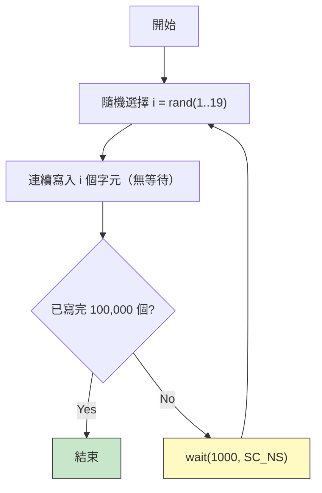
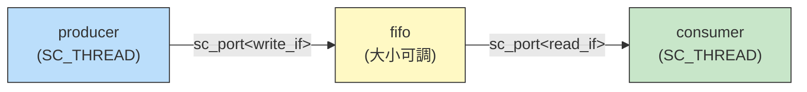

# simple_perf.cpp -- 效能建模實作詳解

> **原始碼**: `ref/systemc/examples/sysc/simple_perf/simple_perf.cpp` | **作者**: Stuart Swan, Cadence Design Systems

## 與 simple_fifo 的差異總覽

如果你已經讀過 simple_fifo，這個範例的結構幾乎相同。關鍵差異在於：

1. **加入時間模型**：producer 每 1000ns burst 一次，consumer 每 100ns 讀一個
2. **加入統計收集**：FIFO 在解構時印出效能報告
3. **可調整 FIFO 大小**：透過命令列參數
4. **大量傳輸**：100,000 個字元（足夠產生有意義的統計數據）

## 介面定義

```cpp
class write_if : virtual public sc_interface {
    virtual void write(char) = 0;
    virtual void reset() = 0;
};

class read_if : virtual public sc_interface {
    virtual void read(char &) = 0;
    virtual int num_available() = 0;
};
```

和 simple_fifo 完全相同。`write_if` 和 `read_if` 定義了 FIFO 的讀寫契約，就像 C++ 的 abstract class 或 Python 的 ABC。

## FIFO 實作 -- 效能版

### 建構函式

```cpp
fifo(sc_module_name name, int size_) : sc_channel(name), size(size_) {
    data = new char[size];
    num_elements = first = 0;
    num_read = max_used = average = 0;
    last_time = SC_ZERO_TIME;
}
```

相比 simple_fifo，多了統計變數：
- `num_read`：已讀取的字元總數
- `max_used`：歷史最高填充深度
- `average`：累計填充深度（用於計算平均）
- `last_time`：最後一次讀取的模擬時間

### 解構函式 -- 統計報告

```cpp
~fifo() {
    delete[] data;
    cout << "Fifo size is: " << size << endl;
    cout << "Average fifo fill depth: " << double(average) / num_read << endl;
    cout << "Maximum fifo fill depth: " << max_used << endl;
    cout << "Average transfer time per character: " << last_time / num_read << endl;
    cout << "Total characters transferred: " << num_read << endl;
    cout << "Total time: " << last_time << endl;
}
```

這是整個範例最有價值的部分。模擬結束時（物件被銷毀），FIFO 會自動印出效能報告。

**軟體類比**：就像你在 load test 結束後看 Grafana dashboard -- 平均延遲、最大延遲、吞吐量。

### 統計指標解讀

| 指標 | 意義 | 軟體對應 |
| --- | --- | --- |
| Average fifo fill depth | FIFO 平均裝了幾個元素 | message queue 的平均積壓量 |
| Maximum fifo fill depth | FIFO 最多同時裝了幾個 | queue 的峰值積壓量 |
| Average transfer time | 每個字元從寫入到系統結束的平均時間 | end-to-end latency |
| Total characters transferred | 總傳輸量 | total requests served |
| Total time | 模擬總耗時 | test duration |

### write() -- 寫入操作

```cpp
void write(char c) {
    if (num_elements == size)
        wait(read_event);        // FIFO 滿了，等 consumer 騰出空間

    data[(first + num_elements) % size] = c;
    ++ num_elements;
    write_event.notify();        // 通知 consumer 有新資料
}
```

環形緩衝區（circular buffer）實作。`(first + num_elements) % size` 是經典的環形索引計算。

### read() -- 讀取操作（含統計）

```cpp
void read(char &c) {
    last_time = sc_time_stamp();   // 記錄目前模擬時間
    if (num_elements == 0)
        wait(write_event);         // FIFO 空了，等 producer 寫入

    compute_stats();               // 更新統計數據

    c = data[first];
    -- num_elements;
    first = (first + 1) % size;
    read_event.notify();           // 通知 producer 有空位
}
```

與 simple_fifo 的差異：多了 `sc_time_stamp()` 記錄時間和 `compute_stats()` 收集統計。

### compute_stats() -- 統計收集

```cpp
void compute_stats() {
    average += num_elements;         // 累加當前填充深度
    if (num_elements > max_used)
        max_used = num_elements;     // 更新最大值
    ++num_read;                      // 計數器 +1
}
```

每次讀取時都會被呼叫。`average` 累加了每次讀取時的填充深度，最後除以 `num_read` 就得到平均填充深度。

## Producer -- 突發性生產者

```cpp
void main() {
    const char *str = "Visit www.accellera.org and see what SystemC can do for you today!\n";
    const char *p = str;
    int total = 100000;

    while (true) {
        int i = 1 + int(19.0 * rand() / RAND_MAX);  // 1 <= i <= 19
        while (--i >= 0) {
            out->write(*p++);
            if (!*p) p = str;
            -- total;
        }
        if (total <= 0) break;
        wait(1000, SC_NS);   // 每次 burst 後等待 1000ns
    }
}
```

### 時間模型分析



**平均產出速率計算**：
- 每次 burst 平均產出 `(1+19)/2 = 10` 個字元
- 每次 burst 間隔 1000ns
- 平均速率 = 10 字元 / 1000ns = **1 字元 / 100ns**

這恰好與 consumer 的消費速率（100ns/字元）匹配。所以理論上，如果 FIFO 無限大，平均傳輸時間就是 100ns。但因為 producer 是突發性的，有限的 FIFO 會導致阻塞。

## Consumer -- 穩定消費者

```cpp
void main() {
    char c;
    while (true) {
        in->read(c);
        wait(100, SC_NS);   // 每 100ns 讀一個字元
    }
}
```

Consumer 非常簡單：每 100ns 穩定地讀取一個字元。它是整個系統的「時鐘」。

## Top-level 模組

```cpp
class top : public sc_module {
    fifo fifo_inst;
    producer prod_inst;
    consumer cons_inst;

    top(sc_module_name name, int size) :
        sc_module(name),
        fifo_inst("Fifo1", size),
        prod_inst("Producer1"),
        cons_inst("Consumer1")
    {
        prod_inst.out(fifo_inst);
        cons_inst.in(fifo_inst);
    }
};
```



## sc_main -- 程式進入點

```cpp
int sc_main(int argc, char *argv[]) {
    int size = 10;                    // 預設 FIFO 大小
    if (argc > 1)
        size = atoi(argv[1]);         // 從命令列讀取
    if (size < 1) size = 1;
    if (size > 100000) size = 100000;

    top top1("Top1", size);
    sc_start();                       // 開始模擬
    return 0;
}
```

可以這樣執行：
```bash
./simple_perf 15    # FIFO 大小 = 15
./simple_perf 50    # FIFO 大小 = 50
```

## 設計空間探索

這個範例的真正價值在於**設計空間探索（Design Space Exploration）**。透過改變 FIFO 大小，你可以觀察：

| FIFO 大小 | 預期行為 |
| --- | --- |
| 1 | 幾乎每次 burst 都會阻塞，傳輸時間遠大於 100ns |
| 5 | 經常阻塞，但比 size=1 好很多 |
| 10 (預設) | 偶爾阻塞，傳輸時間略高於 100ns |
| 15-20 | 很少阻塞，接近理想的 100ns |
| 50+ | 幾乎從不阻塞，但浪費空間 |

**軟體類比**：這就像你在做 capacity planning -- 你的 Kafka partition 需要多大的 buffer？你的 Redis queue 需要設多大的 maxlen？答案取決於你的 producer 有多突發、你能容忍多少延遲。

## 為什麼要做效能建模？

在硬體設計中，FIFO 的每一個 entry 都佔用實際的晶片面積和功耗。不像軟體中可以隨時加記憶體，硬體一旦做出來就不能改了。所以硬體設計師需要在設計階段就精確決定 buffer 大小。

這個範例展示了 SystemC 效能建模的核心能力：**在寫任何一行 RTL 之前，先用高階模型找到最佳設計參數**。

## 核心概念速查

| SystemC 概念 | 軟體對應 | 在本範例中的角色 |
| --- | --- | --- |
| `wait(1000, SC_NS)` | `time.sleep(1ms)` | producer 的 burst 間隔 |
| `wait(100, SC_NS)` | `time.sleep(0.1ms)` | consumer 的消費間隔 |
| `sc_time_stamp()` | `clock.now()` | 記錄每次讀取的模擬時間 |
| `SC_ZERO_TIME` | `Duration::ZERO` | 時間的零值常數 |
| `last_time / num_read` | 平均延遲計算 | FIFO 析構時計算平均傳輸時間 |
| `sc_start()` | 啟動事件迴圈 | 開始模擬直到所有 thread 結束 |
