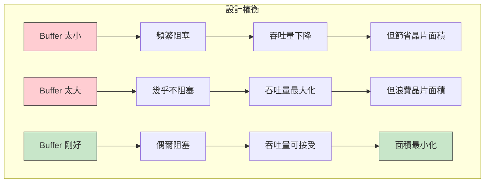
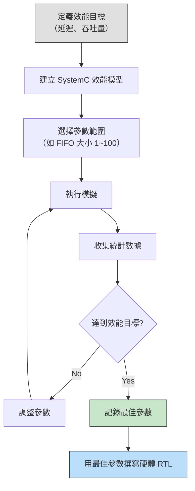

# 效能建模 -- 硬體設計中的容量規劃

> **閱讀前提**: 無需硬體背景 | **軟體類比**: 壓力測試與容量規劃

## 什麼是效能建模？

效能建模（Performance Modeling）就是在**實際建造之前**，用軟體模擬來預測系統的效能表現。

**軟體類比**：假設你要設計一個高併發 API server。你不會直接買 100 台伺服器然後祈禱夠用。你會先用 load testing 工具（如 k6、Python locust）模擬預期流量，找出最佳的伺服器數量、thread pool 大小、connection pool 上限等參數。

硬體設計師做的事完全一樣，只是他們的「伺服器」是晶片上的 buffer、FIFO、cache，而這些東西一旦做出來就不能改了（不像軟體可以隨時 scale up）。

## 為什麼硬體工程師特別在意 buffer 大小？

在軟體世界中，buffer 太小的代價是效能下降或 OOM -- 你可以加記憶體或調整設定。在硬體世界中：

| 面向 | 軟體 | 硬體 |
| --- | --- | --- |
| Buffer 太小 | 效能下降，可動態調整 | 效能下降，**無法修改** |
| Buffer 太大 | 浪費記憶體，可動態調整 | 浪費晶片面積和功耗，**無法修改** |
| 調整成本 | 改一行設定檔 | 重新設計、重新製造（數百萬美元） |
| 決策時機 | 部署後仍可調整 | 必須在設計階段決定 |

這就是為什麼效能建模對硬體設計師來說是**必要的**，而不只是「nice to have」。

## 核心效能指標

### 吞吐量（Throughput）

單位時間內能處理多少資料。

- **軟體例子**：API server 每秒能處理多少 requests（RPS）
- **硬體例子**：網路晶片每秒能轉發多少 packets（PPS）
- **本範例**：consumer 每 100ns 處理一個字元 = 10M 字元/秒

### 延遲（Latency）

一筆資料從進入系統到被處理完成的時間。

- **軟體例子**：API 的 response time（p50、p99）
- **硬體例子**：封包從進入到離開的時間
- **本範例**：平均傳輸時間（average transfer time per character）

### 利用率（Utilization）

資源被有效使用的比例。

- **軟體例子**：CPU 使用率、記憶體使用率
- **硬體例子**：buffer 的平均填充率
- **本範例**：average fifo fill depth / fifo size

### Buffer 佔用（Buffer Occupancy）

buffer 在任意時刻的填充程度。

- **軟體例子**：message queue 的 pending message count
- **硬體例子**：FIFO 中目前有多少元素
- **本範例**：average 和 maximum fifo fill depth

## 面積 vs 吞吐量的權衡

這是硬體設計中最經典的 tradeoff 之一：

**軟體類比**：就像決定 Kubernetes pod 的 resource request/limit：
- 設太低：pod 會被 throttle 或 OOM kill
- 設太高：浪費叢集資源，其他服務拿不到資源
- 剛好：需要 load test 才知道

## 軟體對應：訊息佇列的容量規劃

假設你在設計一個使用 RabbitMQ 的系統：

| 硬體概念 | RabbitMQ 對應 |
| --- | --- |
| FIFO 深度 | Queue 的 `x-max-length` |
| Producer burst rate | Publisher 的突發送出速率 |
| Consumer rate | Consumer 的 `prefetch_count` 和處理速度 |
| Buffer full 阻塞 | Publisher confirm 機制下的 backpressure |
| Buffer empty 等待 | Consumer idle（沒有 message 可處理） |
| 平均傳輸時間 | End-to-end message latency |

你會怎麼決定 RabbitMQ queue 的最大長度？

1. **估算生產速率**：API server 每秒產生多少 event？有沒有突發高峰？
2. **估算消費速率**：consumer 每秒能處理多少 event？
3. **設定目標延遲**：可以接受多少秒的 end-to-end latency？
4. **跑壓測**：用不同的 queue 長度跑 load test，找到最佳值

這正是 `simple_perf` 在做的事 -- 只是對象是硬體 FIFO 而非 message queue。

## 真實世界範例：網路封包 buffer 大小

考慮一個網路交換器（switch）晶片的設計問題：

**場景**：一個 10Gbps 的網路埠，需要決定接收 buffer 的大小。

**已知條件**：
- 平均封包大小：500 bytes
- 峰值流量：10Gbps（約 2.5M packets/sec）
- 處理延遲：每個封包需要 200ns 做 forwarding decision
- 突發容忍：需要吸收 10us 的 micro-burst

**Buffer 大小計算**：
- 10us micro-burst 在 10Gbps 下 = 10us x 10Gbps = 100,000 bits = 12,500 bytes
- 加上安全餘量（2x）= 25,000 bytes
- 對應約 50 個封包的 buffer

如果 buffer 太小（比如只有 5 個封包），micro-burst 期間就會丟包。如果太大（比如 5000 個封包），浪費昂貴的 on-chip SRAM。

**效能建模的價值**：用 SystemC 模型模擬真實的流量模式（包含 micro-burst），找到所需的最小 buffer 大小，然後再加上安全餘量。這比純數學計算更準確，因為可以考慮更複雜的流量分佈。

## 設計空間探索的流程

這個流程和軟體的「效能調校」幾乎一樣，差別只在於最後一步：軟體工程師調完參數就部署了，硬體工程師調完參數後才開始寫 RTL（硬體描述語言）。

## 總結

效能建模讓你在**花費大量資源之前**就知道設計是否可行。不管是軟體的容量規劃還是硬體的 buffer sizing，核心思維是一樣的：

1. 建立模型（不需要完美，只需要捕捉關鍵行為）
2. 用有代表性的工作負載測試
3. 收集和分析效能指標
4. 根據結果調整設計參數
5. 重複直到滿足目標
