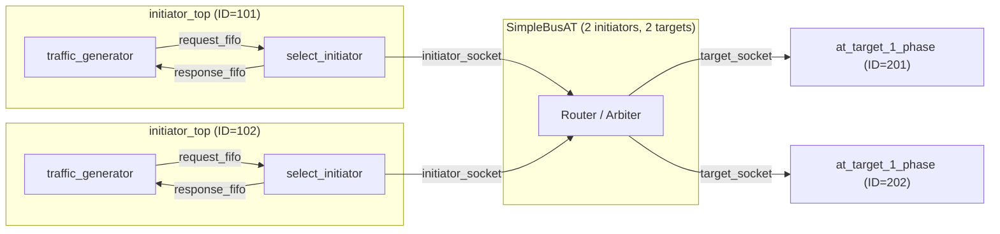
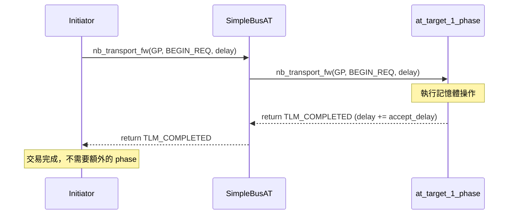

# at_1_phase -- AT 單階段協定範例

> **難度**: 中級 | **軟體類比**: Fire-and-forget RPC (類似 UDP) | **原始碼**: `ref/systemc/examples/tlm/at_1_phase/`

## 概述

`at_1_phase` 展示了 TLM-2.0 Approximately-Timed (AT) 模式中最簡單的協定：**單階段交易（1-phase transaction）**。Initiator 發送請求後，target 立即回傳 `TLM_COMPLETED`，交易就結束了。

### 軟體類比：UDP 封包發送

如果你寫過網路程式，這就像 **UDP 的 fire-and-forget**：

```python
# UDP: 送出去就不管了
sock.sendto(data, ("server", 8080))
# 不需要等待 ACK，立刻可以送下一筆
```

對比 HTTP（需要等回應）或 TCP（需要握手），1-phase 是最輕量的通訊模式。在模擬時，它犧牲了時序精確度，換取了更快的模擬速度。

### 為什麼需要 1-phase？

| 場景 | 適用協定 | 理由 |
| --- | --- | --- |
| 早期架構探索，只關心功能正確 | 1-phase | 最快的模擬速度 |
| 需要知道 bus 佔用時間 | 2-phase 或 4-phase | 需要更多同步點 |
| 精確模擬 pipeline 行為 | 4-phase | 需要完整的 handshake |

## 架構圖



## 交易時序圖



## 檔案列表

| 檔案 | 說明 | 文件連結 |
| --- | --- | --- |
| `src/at_1_phase.cpp` | `sc_main` 進入點 | [at-1-phase.md](at-1-phase.md) |
| `src/at_1_phase_top.cpp` | 系統頂層模組，負責元件實例化與連接 | [at-1-phase.md](at-1-phase.md) |
| `src/initiator_top.cpp` | Initiator 頂層模組 | [at-1-phase.md](at-1-phase.md) |
| `include/at_1_phase_top.h` | 頂層模組標頭檔 | [at-1-phase.md](at-1-phase.md) |
| `include/initiator_top.h` | Initiator 頂層標頭檔 | [at-1-phase.md](at-1-phase.md) |

## 核心概念速查

| TLM 概念 | 軟體對應 | 在本範例中的角色 |
| --- | --- | --- |
| `nb_transport_fw` | 非同步 RPC 呼叫（`sendAsync()`） | Initiator 向 target 發送請求 |
| `TLM_COMPLETED` | HTTP 200 OK（一次來回就結束） | Target 立即回傳完成狀態 |
| `BEGIN_REQ` | 請求發送（`socket.send()`） | 唯一使用的 phase |
| `tlm_generic_payload` | 通用的 request/response 物件（像 `HttpRequest`） | 攜帶地址、資料、指令 |
| `peq_with_get` | 定時任務佇列（`ScheduledExecutorService`） | Target 用它來排程延遲回應 |

## 學習路徑建議

1. 先讀 [at-1-phase.md](at-1-phase.md) 了解 1-phase 的完整實作
2. 接著看 [at_2_phase](../at_2_phase/_index.md) 了解如何加入回應階段
3. 最後看 [at_4_phase](../at_4_phase/_index.md) 了解完整的 4 階段握手
