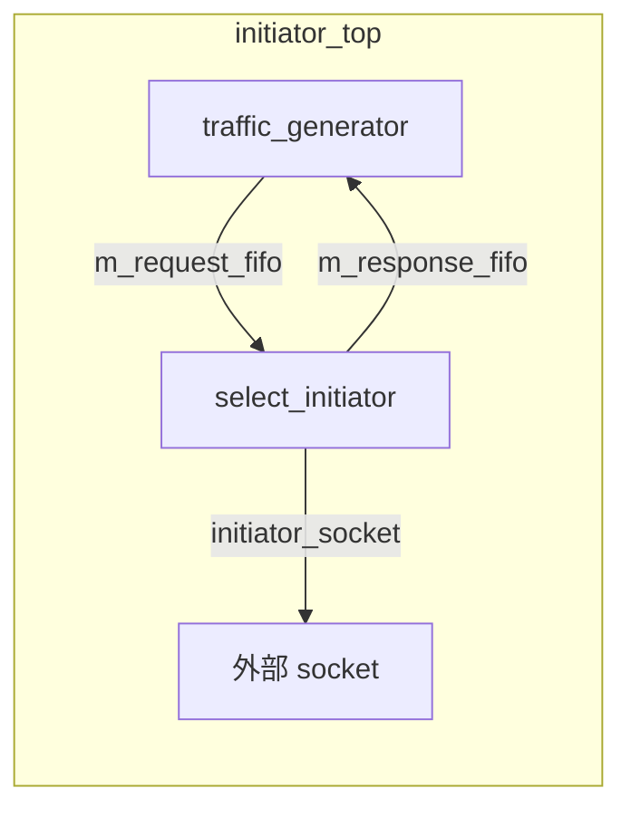

# at_1_phase -- 原始碼詳解

> **原始碼路徑**: `ref/systemc/examples/tlm/at_1_phase/`

## 軟體類比總覽

整個 `at_1_phase` 範例可以對應到一個簡單的**非同步訊息系統**：

| 元件 | 軟體類比 | 職責 |
| --- | --- | --- |
| `traffic_generator` | 測試用的 HTTP client（會自動產生一系列 request） | 產生讀/寫交易 |
| `select_initiator` | 非同步 HTTP client 的核心引擎 | 管理 `nb_transport_fw` 呼叫與回應處理 |
| `initiator_top` | 將 client 與 request generator 組合的 wrapper | 用 FIFO 連接 traffic_generator 和 select_initiator |
| `SimpleBusAT` | API Gateway / Load Balancer | 根據地址將請求路由到正確的 target |
| `at_target_1_phase` | 後端微服務（支援 fire-and-forget） | 接收請求、執行記憶體操作、立即回應 |

## 系統頂層：example_system_top

### 標頭檔 `include/at_1_phase_top.h`

```
example_system_top
  |-- SimpleBusAT<2, 2>       m_bus            (2 initiator ports, 2 target ports)
  |-- at_target_1_phase       m_at_target_1_phase_1   (ID=201)
  |-- at_target_1_phase       m_at_target_1_phase_2   (ID=202)
  |-- initiator_top           m_initiator_1            (ID=101)
  |-- initiator_top           m_initiator_2            (ID=102)
```

這就像一個有 2 個 client 和 2 個 server 的系統，中間透過一個 bus（路由器）連接。

### 建構式 `src/at_1_phase_top.cpp`

建構式做兩件事：

1. **實例化所有元件**，並設定各自的參數：
   - Target 的記憶體大小為 4KB，寬度為 4 bytes
   - `accept_delay` = 10ns（模擬 server 接受請求的延遲）
   - `read_response_delay` = 50ns, `write_response_delay` = 30ns
   - 每個 initiator 最多同時處理 2 個 active transactions

2. **綁定 socket 連接**（等同於設定網路路由表）：
   ```
   initiator_1 --> bus.target_socket[0]
   initiator_2 --> bus.target_socket[1]
   bus.initiator_socket[0] --> target_1.m_memory_socket
   bus.initiator_socket[1] --> target_2.m_memory_socket
   ```

### Target 參數（軟體對應）

| 參數 | 值 | 軟體類比 |
| --- | --- | --- |
| `memory_size` | 4096 bytes | 資料庫容量 |
| `memory_width` | 4 bytes | 一次讀寫的最大單位 |
| `accept_delay` | 10 ns | Server 接收請求到開始處理的延遲 |
| `read_response_delay` | 50 ns | 讀取操作的處理時間 |
| `write_response_delay` | 30 ns | 寫入操作的處理時間 |

## Initiator 頂層模組：initiator_top

### 標頭檔 `include/initiator_top.h`

`initiator_top` 是一個 **wrapper 模組**，它將 `traffic_generator`（產生請求的元件）和 `select_initiator`（實際發送 TLM 交易的元件）用 `sc_fifo` 連接起來。



軟體類比：這就像一個 **producer-consumer 架構**：
- `traffic_generator` 是 producer，不斷產生 request 放入 `request_fifo`
- `select_initiator` 是 consumer，從 `request_fifo` 取出 request 並發送
- 完成後，response 放入 `response_fifo` 返回給 traffic_generator

### 關鍵介面

`initiator_top` 繼承了 `tlm_bw_transport_if<>`（backward transport interface），但在這個範例中 `nb_transport_bw` 和 `invalidate_direct_mem_ptr` 都沒有實作。這是因為 socket 的階層式連接要求必須提供這些介面，但實際的 backward path 處理是在 `select_initiator` 內部完成的。

## Target 實作：at_target_1_phase（共用元件）

Target 的實作位於 `common/src/at_target_1_phase.cpp`，它是多個範例共用的元件。

### nb_transport_fw -- 核心邏輯

Target 收到 `BEGIN_REQ` 後有兩種處理路徑：

#### 路徑 1：立即完成（大多數情況）

```
if (request_count % 20 != 0):
    1. 立即執行記憶體操作
    2. delay_time += accept_delay
    3. return TLM_COMPLETED
```

軟體類比：同步 API 呼叫。Server 直接處理並回傳結果，像 `return Response.ok(result)`。

#### 路徑 2：延遲回應（每 20 個請求強制一次）

```
if (request_count % 20 == 0):
    1. 計算記憶體操作延遲
    2. 將交易放入 response PEQ（payload event queue）
    3. phase = END_REQ
    4. return TLM_UPDATED
```

軟體類比：非同步處理。Server 先回 `202 Accepted`，稍後透過 callback 送回結果。

這個「每 20 個請求做一次延遲回應」的設計是為了**展示 forced synchronization**：即使在 1-phase 模式下，偶爾也需要強制同步以確保模擬的準確性。

### begin_response_method -- 延遲回應處理

當交易被放入 `m_response_PEQ` 後，經過延遲時間到期時，`begin_response_method` 被觸發：

1. 從 PEQ 取出交易
2. 執行記憶體操作
3. 呼叫 `nb_transport_bw(GP, BEGIN_RESP, SC_ZERO_TIME)` 將回應送回 initiator

根據 initiator 的回應：
- `TLM_COMPLETED`：交易結束，等待 annotated delay
- `TLM_ACCEPTED`：需要等待 `END_RESP` 事件才能繼續

## sc_main 進入點

`src/at_1_phase.cpp` 非常簡單：

1. 啟用 reporting（日誌系統）
2. 實例化 `example_system_top`
3. 呼叫 `sc_start()` 開始模擬（traffic generator 完成後自動結束）

## 重點整理

| 概念 | 說明 |
| --- | --- |
| **1-phase 核心** | 大多數交易只需要 `BEGIN_REQ` + `TLM_COMPLETED`，一次來回完成 |
| **forced sync** | 每 20 個請求強制使用多步驟回應（`TLM_UPDATED`），展示同步機制 |
| **PEQ (Payload Event Queue)** | 類似 `DelayQueue`，用來排程延遲事件 |
| **FIFO 連接** | traffic_generator 與 initiator 之間用 `sc_fifo` 解耦 |
| **SimpleBusAT** | 根據地址範圍路由交易到對應的 target |
