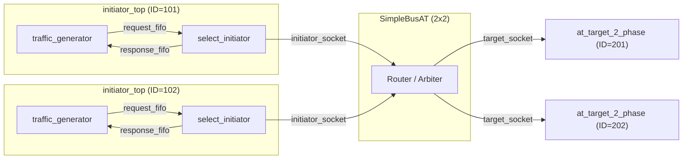
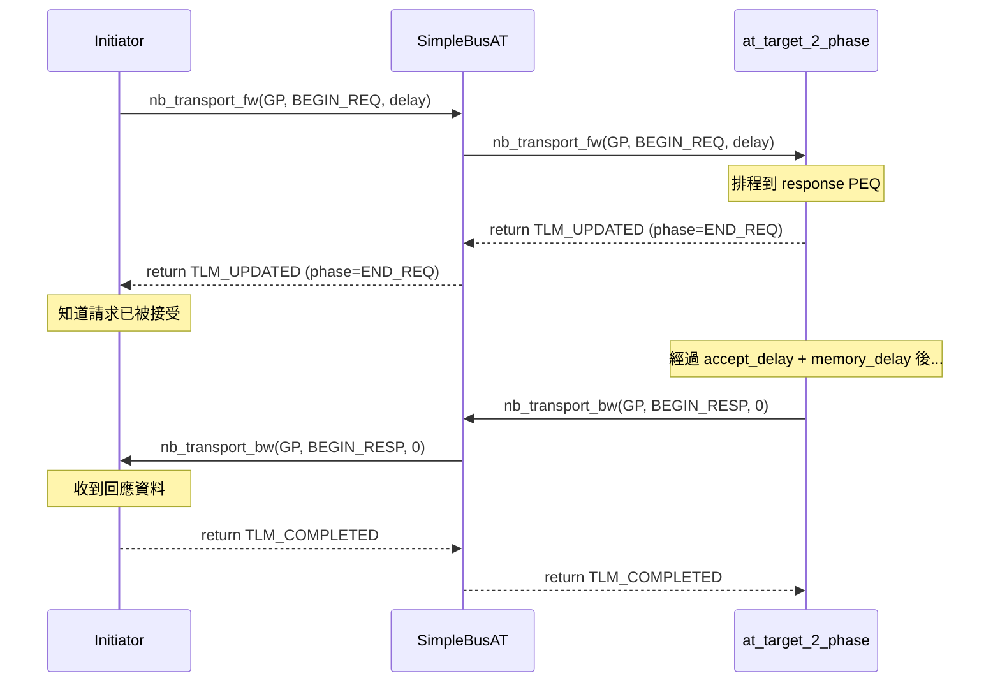

# at_2_phase -- AT 雙階段協定範例

> **難度**: 中級 | **軟體類比**: HTTP Request-Response | **原始碼**: `ref/systemc/examples/tlm/at_2_phase/`

## 概述

`at_2_phase` 展示了 TLM-2.0 AT 模式中的**雙階段交易協定**。與 1-phase 不同，2-phase 協定明確區分了「請求」和「回應」兩個階段：

- **Phase 1: BEGIN_REQ** -- Initiator 發送請求
- **Phase 2: BEGIN_RESP** -- Target 回傳回應

### 軟體類比：HTTP Request-Response

```python
# HTTP: 標準的 request-response 模式
response = await client.get("http://server/api/data")
#         ^                 ^
#         |                 Phase 1: BEGIN_REQ (送出請求)
#         Phase 2: BEGIN_RESP (收到回應)
```

與 1-phase（UDP fire-and-forget）的差異：
- 1-phase：送出去就完事了（`sendto()` 回來就代表完成）
- 2-phase：送出後需要**等待 server 回應**，中間 server 可以做非同步處理

### 為什麼需要 2-phase？

2-phase 允許 target 在 `BEGIN_REQ` 和 `BEGIN_RESP` 之間進行**非同步處理**。在這段時間裡：
- Initiator 知道 target 已經開始處理（收到 `END_REQ`）
- Target 可以花時間執行記憶體操作
- 完成後 target 主動回呼 `nb_transport_bw` 通知 initiator

## 架構圖



## 交易時序圖



## 檔案列表

| 檔案 | 說明 | 文件連結 |
| --- | --- | --- |
| `src/at_2_phase.cpp` | `sc_main` 進入點 | [at-2-phase.md](at-2-phase.md) |
| `src/at_2_phase_top.cpp` | 系統頂層模組 | [at-2-phase.md](at-2-phase.md) |
| `src/initiator_top.cpp` | Initiator 頂層模組 | [at-2-phase.md](at-2-phase.md) |
| `include/at_2_phase_top.h` | 頂層標頭檔 | [at-2-phase.md](at-2-phase.md) |
| `include/initiator_top.h` | Initiator 頂層標頭檔 | [at-2-phase.md](at-2-phase.md) |

## 核心概念速查

| TLM 概念 | 軟體對應 | 在本範例中的角色 |
| --- | --- | --- |
| `TLM_UPDATED` | `202 Accepted`（Server 已接受，稍後回應） | Target 告訴 initiator 請求已接受 |
| `END_REQ` | Server 收到完整 request body | Target 透過 return value 告知 request 階段結束 |
| `BEGIN_RESP` | Server 開始送 response body | Target 主動呼叫 `nb_transport_bw` 送回資料 |
| `nb_transport_bw` | Callback / WebSocket push | Target 完成處理後主動通知 initiator |
| `m_response_PEQ` | `ScheduledExecutorService` | 排程延遲後的回應處理 |

## 學習路徑建議

1. 如果還沒看過，建議先讀 [at_1_phase](../at_1_phase/_index.md)
2. 讀 [at-2-phase.md](at-2-phase.md) 了解雙階段的完整實作
3. 接著看 [at_4_phase](../at_4_phase/_index.md) 了解完整的 4 階段握手
