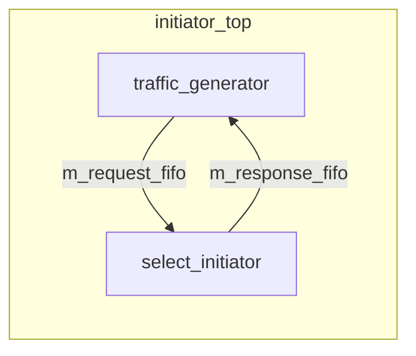

# at_2_phase -- 原始碼詳解

> **原始碼路徑**: `ref/systemc/examples/tlm/at_2_phase/`

## 軟體類比總覽

2-phase 協定就像 **HTTP 的 request-response 模式**，但拆成了明確的兩步：

```
Client (Initiator)                Server (Target)
     |                                |
     |--- POST /api/data ----------->|  Phase 1: BEGIN_REQ
     |                                |  (Server 開始處理...)
     |<-- 202 Accepted ---------------|  Target returns TLM_UPDATED + END_REQ
     |                                |
     |   (Server 處理中, 經過一段時間)  |
     |                                |
     |<-- 200 OK + response body -----|  Phase 2: BEGIN_RESP (via nb_transport_bw)
     |--- ACK -------------------->---|  Initiator returns TLM_COMPLETED
```

## 系統頂層：example_system_top

### 結構

與 `at_1_phase` 完全相同的拓撲結構（2 initiators, 1 bus, 2 targets），唯一的差異是 target 使用 `at_target_2_phase` 而非 `at_target_1_phase`。

```
example_system_top
  |-- SimpleBusAT<2, 2>       m_bus
  |-- at_target_2_phase       m_at_target_2_phase_1   (ID=201)
  |-- at_target_2_phase       m_at_target_2_phase_2   (ID=202)
  |-- initiator_top           m_initiator_1            (ID=101)
  |-- initiator_top           m_initiator_2            (ID=102)
```

Target 參數與 1-phase 相同：4KB 記憶體、accept_delay=10ns、read_response_delay=50ns、write_response_delay=30ns。

## Target 實作：at_target_2_phase（共用元件）

Target 的實作位於 `common/src/at_target_2_phase.cpp`。

### nb_transport_fw -- 核心差異

與 1-phase 最大的不同：**所有交易都走非同步路徑**，不會直接回傳 `TLM_COMPLETED`。

收到 `BEGIN_REQ` 後：

```
1. 計算記憶體操作延遲 (get_delay)
2. delay_time += accept_delay
3. 將交易放入 m_response_PEQ，延遲 = delay_time
4. 設定回傳 delay_time = accept_delay
5. phase = END_REQ
6. return TLM_UPDATED
```

軟體類比：

```python
async def handle_request(request):
    # 不馬上處理，放入任務佇列
    task_queue.schedule(process_request, request, delay=accept_delay + mem_delay)
    # 立刻回傳 "已接受"
    return Response(status=202, message="Accepted")
```

### 收到 END_RESP

當 initiator 送來 `END_RESP`（表示它已經收到並處理完回應），target 會：
1. 觸發 `m_end_resp_rcvd_event` 事件
2. 回傳 `TLM_COMPLETED`

這就像 HTTP client 的 TCP ACK -- 告訴 server「我已經收到你的 response 了」。

### begin_response_method -- 回應處理

當 PEQ 中的交易到期：

1. 從 `m_response_PEQ` 取出交易
2. **執行實際的記憶體操作**（`m_target_memory.operation()`）
3. 呼叫 `nb_transport_bw(GP, BEGIN_RESP, SC_ZERO_TIME)` 送回 initiator

根據 initiator 的回應：
- `TLM_COMPLETED`：initiator 直接完成，等待 annotated delay
- `TLM_ACCEPTED`：initiator 需要時間處理，target 等待 `m_end_resp_rcvd_event`

## Initiator 頂層模組：initiator_top

`initiator_top` 的結構和 1-phase 完全相同：



實際的 2-phase 協定處理邏輯在 `select_initiator`（共用元件）中。`select_initiator` 使用一個 `waiting_bw_path_map` 來追蹤每個進行中交易的狀態，根據收到的 phase 來決定下一步動作。

## 1-phase vs 2-phase 比較

| 面向 | 1-phase | 2-phase |
| --- | --- | --- |
| 交易步數 | 1 步（BEGIN_REQ -> TLM_COMPLETED） | 2 步（BEGIN_REQ -> END_REQ, BEGIN_RESP -> END_RESP） |
| Target 處理 | 同步（立即回傳結果） | 非同步（先接受，稍後回應） |
| nb_transport_bw 使用 | 僅在 forced sync 時使用 | **每次交易都使用** |
| 模擬精度 | 較低（無法區分 request 和 response timing） | 較高（可以獨立控制 request 和 response 的延遲） |
| 軟體類比 | UDP fire-and-forget | HTTP request-response |
| 適用場景 | 早期架構探索 | 需要知道 bus 佔用時間的場景 |

## 重點整理

| 概念 | 說明 |
| --- | --- |
| **2-phase 核心** | 所有交易都經過 BEGIN_REQ -> (END_REQ) -> BEGIN_RESP -> (END_RESP) |
| **TLM_UPDATED** | Target 在 `nb_transport_fw` 中回傳此值，表示 phase 已被推進到 END_REQ |
| **非同步回應** | Target 使用 PEQ 排程，稍後透過 `nb_transport_bw` 主動送回結果 |
| **END_RESP 規則** | Target 必須等到 initiator 確認 END_RESP 後，才能在同一 socket 上送下一個 BEGIN_RESP |
