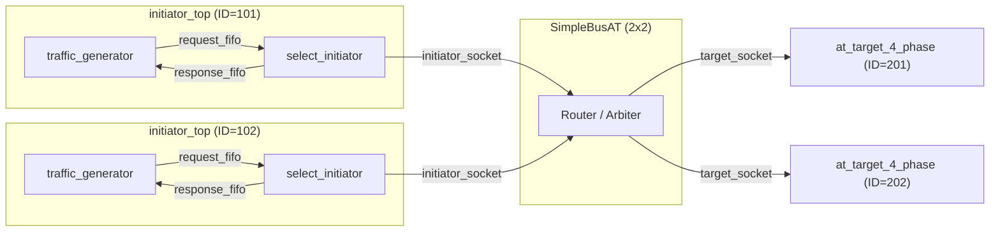
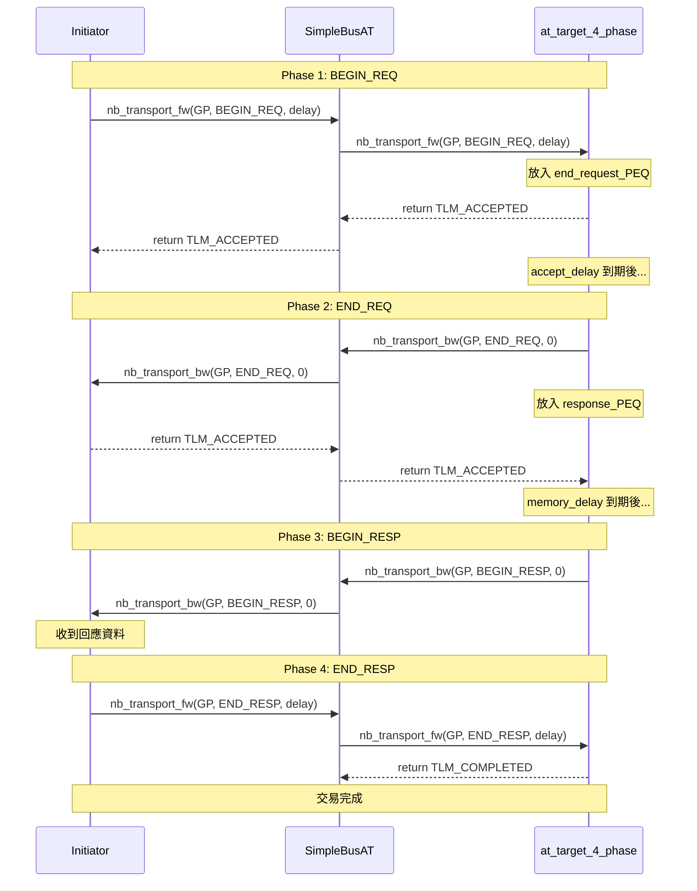

# at_4_phase -- AT 四階段協定範例

> **難度**: 中高級 | **軟體類比**: TCP 握手 + 資料傳輸 + 確認 | **原始碼**: `ref/systemc/examples/tlm/at_4_phase/`

## 概述

`at_4_phase` 展示了 TLM-2.0 AT 模式中最完整的協定：**四階段交易（4-phase transaction）**。這四個 phase 提供了最精確的時序建模，類似 TCP 的完整通訊流程。

### 四個 Phase

| Phase | 方向 | 軟體類比 |
| --- | --- | --- |
| `BEGIN_REQ` | Initiator -> Target | TCP SYN（發起連線/請求） |
| `END_REQ` | Target -> Initiator | TCP SYN-ACK（確認收到請求） |
| `BEGIN_RESP` | Target -> Initiator | HTTP Response（開始回傳資料） |
| `END_RESP` | Initiator -> Target | TCP ACK（確認收到資料） |

### 軟體類比：TCP + HTTP 完整流程

```
Client (Initiator)                    Server (Target)
     |                                     |
     |--- SYN (BEGIN_REQ) --------------->|  "我要讀取資料"
     |<-- SYN-ACK (END_REQ) -------------|  "收到，我開始處理"
     |                                     |  (Server 處理中...)
     |<-- Response (BEGIN_RESP) ----------|  "這是你要的資料"
     |--- ACK (END_RESP) --------------->|  "收到，謝謝"
     |                                     |
```

### 為什麼需要 4-phase？

4-phase 提供了**四個時序同步點**，讓模擬更精確：

- `BEGIN_REQ` -> `END_REQ`：模擬 **bus 佔用時間**（request 傳輸需要多久）
- `END_REQ` -> `BEGIN_RESP`：模擬 **target 處理時間**（記憶體存取需要多久）
- `BEGIN_RESP` -> `END_RESP`：模擬 **response 傳輸時間**（資料回傳需要多久）

## 架構圖



## 完整交易時序圖



## 檔案列表

| 檔案 | 說明 | 文件連結 |
| --- | --- | --- |
| `src/at_4_phase.cpp` | `sc_main` 進入點 | [at-4-phase.md](at-4-phase.md) |
| `src/at_4_phase_top.cpp` | 系統頂層模組 | [at-4-phase.md](at-4-phase.md) |
| `src/initiator_top.cpp` | Initiator 頂層模組 | [at-4-phase.md](at-4-phase.md) |
| `include/at_4_phase_top.h` | 頂層標頭檔 | [at-4-phase.md](at-4-phase.md) |
| `include/initiator_top.h` | Initiator 頂層標頭檔 | [at-4-phase.md](at-4-phase.md) |

## 核心概念速查

| TLM 概念 | 軟體對應 | 在本範例中的角色 |
| --- | --- | --- |
| `TLM_ACCEPTED` | `100 Continue` | Target 表示「收到，我會在處理完後主動通知你」 |
| `END_REQ` | TCP SYN-ACK | Target 確認請求接收完成 |
| `BEGIN_RESP` | HTTP Response 開始 | Target 開始傳送回應資料 |
| `END_RESP` | TCP ACK（對 response 的確認） | Initiator 確認回應接收完成 |
| `m_end_request_PEQ` | 第一階段延遲佇列 | 排程 END_REQ 的發送時間 |
| `m_response_PEQ` | 第二階段延遲佇列 | 排程 BEGIN_RESP 的發送時間 |

## 學習路徑建議

1. 建議先讀 [at_1_phase](../at_1_phase/_index.md) 和 [at_2_phase](../at_2_phase/_index.md)
2. 讀 [at-4-phase.md](at-4-phase.md) 了解四階段的完整實作
3. 接著看 [at_extension_optional](../at_extension_optional/_index.md) 了解如何在交易上附加自訂資料
