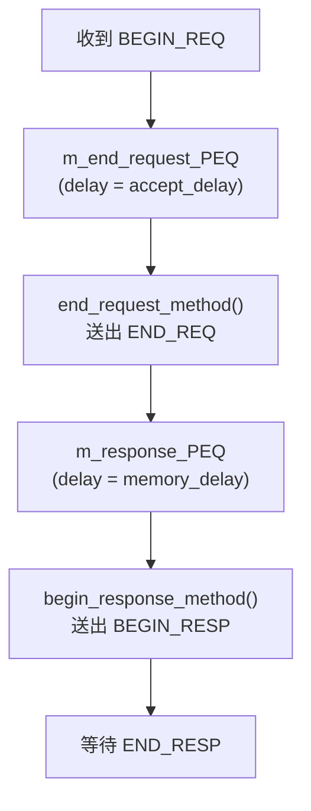
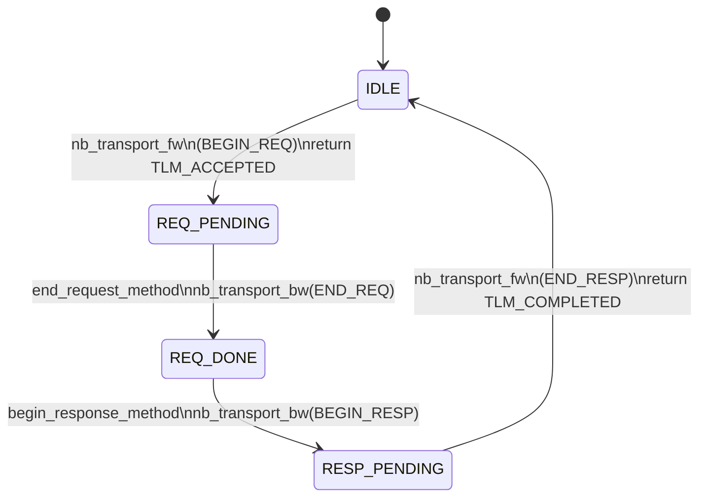

# at_4_phase -- 原始碼詳解

> **原始碼路徑**: `ref/systemc/examples/tlm/at_4_phase/`

## 軟體類比總覽

4-phase 協定就像一個**嚴謹的 RPC 框架**，每個步驟都有明確的確認：

| 步驟 | TLM Phase | 軟體類比 |
| --- | --- | --- |
| Client 送出請求 | `BEGIN_REQ` | gRPC client 送出 request |
| Server 確認收到 | `END_REQ` | Server 回 ACK（「我收到了，開始處理」） |
| Server 送回結果 | `BEGIN_RESP` | Server streaming response 開始 |
| Client 確認收到 | `END_RESP` | Client 回 ACK（「我拿到資料了」） |

## 系統頂層

與前兩個範例相同的拓撲，使用 `at_target_4_phase` 作為 target：

```
example_system_top
  |-- SimpleBusAT<2, 2>       m_bus
  |-- at_target_4_phase       m_at_target_4_phase_1   (ID=201)
  |-- at_target_4_phase       m_at_target_4_phase_2   (ID=202)
  |-- initiator_top           m_initiator_1            (ID=101)
  |-- initiator_top           m_initiator_2            (ID=102)
```

## Target 實作：at_target_4_phase（共用元件）

### 關鍵差異：兩個 PEQ

與 1-phase 和 2-phase 不同，4-phase target 使用**兩個** payload event queue：



軟體類比：這就像一個有兩個階段的 **任務管線（pipeline）**：

```python
# Stage 1: Request acceptance pipeline
async def accept_stage(request):
    await asyncio.sleep(accept_delay)  # 模擬接受延遲
    send_ack(request)                   # 送 END_REQ
    process_queue.put(request)          # 交給 Stage 2

# Stage 2: Response pipeline
async def response_stage():
    request = await process_queue.get()
    result = await memory.operation(request)  # 執行記憶體操作
    send_response(request, result)            # 送 BEGIN_RESP
    await wait_for_ack()                      # 等 END_RESP
```

### nb_transport_fw -- 收到 BEGIN_REQ

```
case BEGIN_REQ:
    1. PEQ_delay_time = delay + accept_delay
    2. m_end_request_PEQ.notify(gp, PEQ_delay_time)  // 排入第一個 PEQ
    3. return TLM_ACCEPTED  // 告訴 initiator："收到了，我會主動通知你"
```

注意與 2-phase 的差異：
- 2-phase 回傳 `TLM_UPDATED` + `END_REQ`（在回傳值中推進 phase）
- 4-phase 回傳 `TLM_ACCEPTED`（之後透過 `nb_transport_bw` 送 `END_REQ`）

### end_request_method -- 送出 END_REQ

當 `m_end_request_PEQ` 到期時：

```
1. 從 PEQ 取出交易
2. 計算記憶體操作延遲
3. 將交易放入 m_response_PEQ（第二個 PEQ）
4. 呼叫 nb_transport_bw(GP, END_REQ, 0) -- 通知 initiator 請求已接受
```

這一步在 2-phase 中是用 return value 完成的（`TLM_UPDATED` + `END_REQ`），但在 4-phase 中是透過**獨立的 backward call** 完成的，提供了更精確的時序控制。

### begin_response_method -- 送出 BEGIN_RESP

當 `m_response_PEQ` 到期時：

```
1. 從 PEQ 取出交易
2. 執行記憶體操作（m_target_memory.operation）
3. 呼叫 nb_transport_bw(GP, BEGIN_RESP, 0)
4. 根據回傳值:
   - TLM_COMPLETED: 交易結束
   - TLM_ACCEPTED: 等待 END_RESP 事件
```

### nb_transport_fw -- 收到 END_RESP

```
case END_RESP:
    1. m_end_resp_rcvd_event.notify(delay)
    2. return TLM_COMPLETED
```

## 完整的 4-Phase 狀態機



## Optional Extension 支援

`at_target_4_phase.cpp` 中有一段條件編譯的程式碼：

```cpp
#if (defined(USING_EXTENSION_OPTIONAL))
  extension_initiator_id *extension_pointer;
  gp.get_extension(extension_pointer);
  if (extension_pointer) {
    msg << "data: " << extension_pointer->m_initiator_id;
  }
#endif
```

當編譯時定義 `USING_EXTENSION_OPTIONAL`，target 會嘗試從 generic payload 中讀取 `extension_initiator_id` 擴展資料。這個功能在 [at_extension_optional](../at_extension_optional/_index.md) 範例中被使用。

## 1-phase vs 2-phase vs 4-phase 比較

| 面向 | 1-phase | 2-phase | 4-phase |
| --- | --- | --- | --- |
| Phase 數量 | 1 | 2 | 4 |
| `nb_transport_bw` 呼叫次數 | 0-1 | 1 | 2 (END_REQ + BEGIN_RESP) |
| PEQ 數量 | 1 | 1 | 2 |
| 可區分的時序區間 | 無 | request vs response | request transfer, processing, response transfer |
| 模擬速度 | 最快 | 中等 | 較慢（但最精確） |
| 適用場景 | 功能驗證 | 效能估算 | 精確時序分析 |

## 重點整理

| 概念 | 說明 |
| --- | --- |
| **兩個 PEQ** | `m_end_request_PEQ` 排程 END_REQ，`m_response_PEQ` 排程 BEGIN_RESP |
| **TLM_ACCEPTED** | Target 在 BEGIN_REQ 時回傳此值，表示不推進 phase，稍後會主動通知 |
| **END_REQ** | 透過 `nb_transport_bw` 送出，而非 return value（與 2-phase 不同） |
| **END_RESP 規則** | Target 必須等到 END_RESP 才能釋放資源，開始處理下一筆交易 |
| **Optional extension** | 透過條件編譯支援擴展資料（用於 at_extension_optional 範例） |
