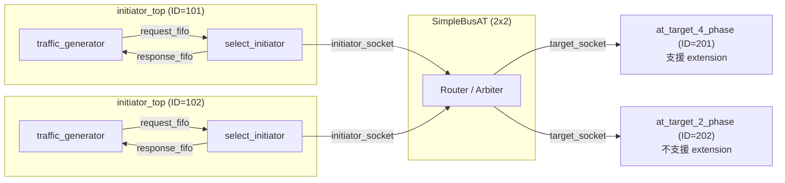
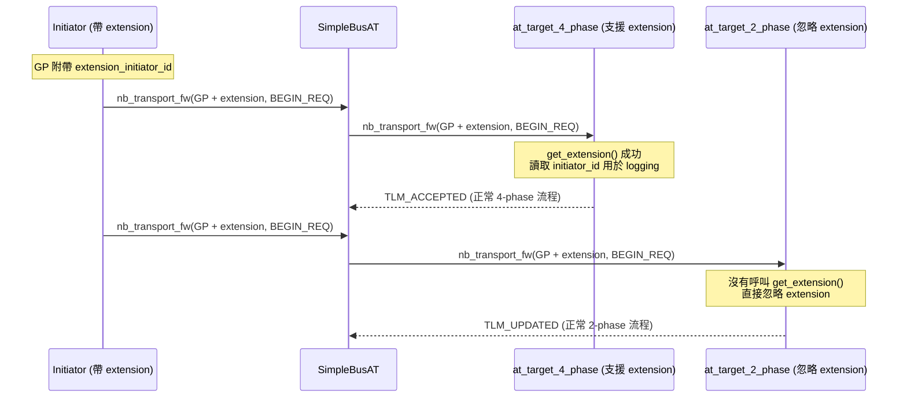

# at_extension_optional -- AT 可選擴展欄位範例

> **難度**: 中高級 | **軟體類比**: HTTP Optional Headers | **原始碼**: `ref/systemc/examples/tlm/at_extension_optional/`

## 概述

`at_extension_optional` 展示了如何在 TLM-2.0 的 `tlm_generic_payload` 上附加**可選的擴展資料（optional extension）**。就像 HTTP 請求可以帶 optional headers 一樣，TLM 交易也可以帶額外的 metadata。

### 軟體類比：HTTP Optional Headers

```python
# 標準的 HTTP 請求（沒有額外 header）
response = requests.get("http://api.example.com/data")

# 帶有 optional header 的 HTTP 請求
response = requests.get("http://api.example.com/data",
    headers={"X-Initiator-Id": "client-101"})  # optional!
```

關鍵特性：
- 如果 server 認識這個 header -> 可以利用它（例如做 logging、routing）
- 如果 server 不認識這個 header -> **直接忽略**，不影響正常功能
- 兩種 server 可以共存於同一系統中

## 架構圖



注意：這個範例刻意混用了 **4-phase target**（支援讀取 extension）和 **2-phase target**（忽略 extension），展示了 optional extension 的互操作性。

## 交易時序圖



## 檔案列表

| 檔案 | 說明 | 文件連結 |
| --- | --- | --- |
| `src/at_extension_optional.cpp` | `sc_main` 進入點 | [at-extension-optional.md](at-extension-optional.md) |
| `src/at_extension_optional_top.cpp` | 系統頂層模組 | [at-extension-optional.md](at-extension-optional.md) |
| `src/initiator_top.cpp` | Initiator 頂層模組 | [at-extension-optional.md](at-extension-optional.md) |
| `include/at_extension_optional_top.h` | 頂層標頭檔 | [at-extension-optional.md](at-extension-optional.md) |
| `include/initiator_top.h` | Initiator 頂層標頭檔 | [at-extension-optional.md](at-extension-optional.md) |

## 核心概念速查

| TLM 概念 | 軟體對應 | 在本範例中的角色 |
| --- | --- | --- |
| `tlm_extension` | HTTP custom header / gRPC metadata | 附加在 generic payload 上的可選資料 |
| `get_extension()` | `request.headers.get("X-Custom")` | Target 嘗試讀取 extension，可能為 null |
| `set_extension()` | `request.headers["X-Custom"] = value` | Initiator 在送出前附加 extension |
| `clone()` / `copy_from()` | Deep copy（extension 必須支援複製） | Bus 路由時可能需要複製 payload |
| `USING_EXTENSION_OPTIONAL` | Feature flag / compile-time toggle | 條件編譯開關 |

## 學習路徑建議

1. 建議先讀 [at_4_phase](../at_4_phase/_index.md) 和 [at_2_phase](../at_2_phase/_index.md)
2. 讀 [at-extension-optional.md](at-extension-optional.md) 了解 extension 機制
3. 接著看 [at_mixed_targets](../at_mixed_targets/_index.md) 了解更多混合 target 的場景
