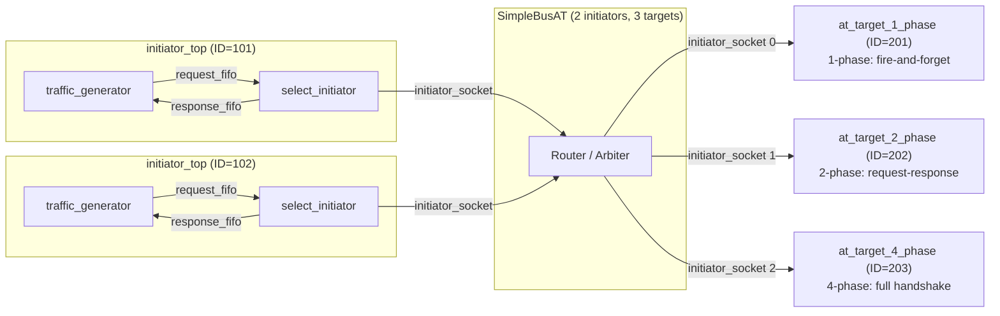

# at_mixed_targets -- AT 混合 Target 類型範例

> **難度**: 中高級 | **軟體類比**: 微服務架構中不同 API 風格的服務共存 | **原始碼**: `ref/systemc/examples/tlm/at_mixed_targets/`

## 概述

`at_mixed_targets` 展示了一個系統中**同時使用三種不同 phase 協定的 target**。就像一個微服務架構中，不同的後端服務可以使用不同的通訊風格（REST、gRPC、WebSocket），但前端 client 都透過同一個 API Gateway 存取。

### 軟體類比：微服務架構

```
API Gateway (SimpleBusAT)
  |
  |-- /api/fast     --> Service A (REST, fire-and-forget)     = 1-phase target
  |-- /api/standard --> Service B (REST, request-response)    = 2-phase target
  |-- /api/precise  --> Service C (gRPC, bidirectional stream) = 4-phase target
```

每個服務有不同的通訊協定，但 client 不需要知道細節 -- API Gateway 負責處理差異。

### 為什麼這很重要？

在真實的硬體系統中，一條 bus 上通常連接著不同類型的裝置：
- **快速記憶體**（SRAM）：一次就能完成存取 -> 適合 1-phase
- **一般記憶體**（DRAM）：需要等待回應 -> 適合 2-phase
- **複雜外設**（DMA controller）：需要精確的 handshake -> 適合 4-phase

這個範例證明了 TLM-2.0 的 **AT 協定可以互操作**：同一個 initiator 可以和不同 phase 數量的 target 通訊。

## 架構圖



注意：Bus 的模板參數是 `SimpleBusAT<2, 3>`（2 個 initiator port，**3 個 target port**）。

## 檔案列表

| 檔案 | 說明 | 文件連結 |
| --- | --- | --- |
| `src/at_mixed_targets.cpp` | `sc_main` 進入點 | [at-mixed-targets.md](at-mixed-targets.md) |
| `src/at_mixed_targets_top.cpp` | 系統頂層模組 | [at-mixed-targets.md](at-mixed-targets.md) |
| `src/initiator_top.cpp` | Initiator 頂層模組 | [at-mixed-targets.md](at-mixed-targets.md) |
| `include/at_mixed_targets_top.h` | 頂層標頭檔 | [at-mixed-targets.md](at-mixed-targets.md) |
| `include/initiator_top.h` | Initiator 頂層標頭檔 | [at-mixed-targets.md](at-mixed-targets.md) |

## 核心概念速查

| TLM 概念 | 軟體對應 | 在本範例中的角色 |
| --- | --- | --- |
| `SimpleBusAT<2, 3>` | API Gateway with 3 backends | 路由到 3 個不同類型的 target |
| `select_initiator` | 通用 HTTP client（自動適應 server 回應） | 根據 target 的回傳值適應不同的 phase 協定 |
| `m_simulation_limit` | Test timeout | 模擬時間上限（10,000 ns） |
| `SC_THREAD(limit_thread)` | `setTimeout(shutdown, 10000)` | 確保模擬不會無限執行 |

## 學習路徑建議

1. 建議先依序讀完 [at_1_phase](../at_1_phase/_index.md)、[at_2_phase](../at_2_phase/_index.md)、[at_4_phase](../at_4_phase/_index.md)
2. 讀 [at-mixed-targets.md](at-mixed-targets.md) 了解混合系統的實作
3. 接著看 [at_ooo](../at_ooo/_index.md) 了解 out-of-order 處理
