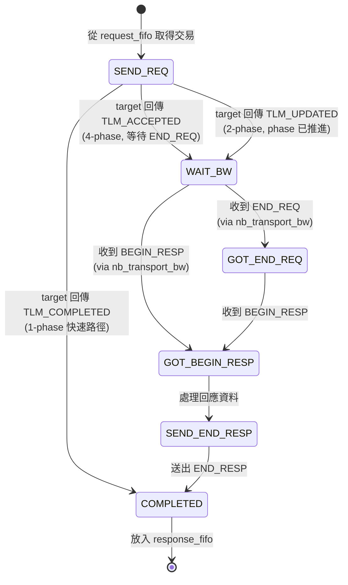

# at_mixed_targets -- 原始碼詳解

> **原始碼路徑**: `ref/systemc/examples/tlm/at_mixed_targets/`

## 軟體類比總覽

這個範例就像一個 **API Gateway 後面接了不同風格的微服務**：

| 元件 | 軟體類比 | 協定 |
| --- | --- | --- |
| `at_target_1_phase` (ID=201) | Redis Cache（快速回應） | 1-phase: fire-and-forget |
| `at_target_2_phase` (ID=202) | REST API Server | 2-phase: request-response |
| `at_target_4_phase` (ID=203) | gRPC Service（完整串流） | 4-phase: full handshake |
| `SimpleBusAT<2, 3>` | Nginx / API Gateway | 根據地址路由到不同後端 |
| `select_initiator` | 智慧型 HTTP Client | 根據 server 回應自動適應協定 |

## 系統頂層

### 結構

```
example_system_top
  |-- SimpleBusAT<2, 3>       m_bus            (2 initiators, 3 targets)
  |-- sc_time                 m_simulation_limit (10,000 ns)
  |-- at_target_1_phase       m_at_target_1_phase_1   (ID=201)
  |-- at_target_2_phase       m_at_target_2_phase_1   (ID=202)
  |-- at_target_4_phase       m_at_target_4_phase_1   (ID=203)
  |-- initiator_top           m_initiator_1            (ID=101)
  |-- initiator_top           m_initiator_2            (ID=102)
```

### 地址映射

```
Initiator 1 (ID=101):
  base_address_1 = 0x0000000000000100  -> 會被路由到某個 target
  base_address_2 = 0x0000000010000100  -> 會被路由到某個 target

Initiator 2 (ID=102):
  base_address_1 = 0x0000000010000200  -> 不同的地址範圍
  base_address_2 = 0x0000000020000200  -> 不同的地址範圍
```

Bus 根據地址範圍決定將交易路由到哪個 target。這就像 Nginx 的 `location` 規則：

```nginx
location /fast/    { proxy_pass http://service-1phase; }
location /normal/  { proxy_pass http://service-2phase; }
location /precise/ { proxy_pass http://service-4phase; }
```

### 模擬時間限制

這個範例新增了一個**模擬時間限制機制**：

```cpp
SC_THREAD(limit_thread);

void example_system_top::limit_thread(void) {
    sc_core::wait(SC_ZERO_TIME);           // 等待模擬初始化
    sc_core::wait(m_simulation_limit);     // 等待 10,000 ns
    sc_core::sc_stop();                    // 強制停止模擬
}
```

軟體類比：`setTimeout(() => process.exit(), 10000)` -- 設定一個 watchdog timer，防止模擬因為混合 target 的複雜互動而死鎖或無限執行。

## Initiator 如何適應不同的 Target

`select_initiator`（共用元件）是這個範例能運作的關鍵。它的 `nb_transport_bw` 和 `initiator_thread` 實作了一個**狀態機**，能夠自動適應 target 回傳的不同 phase：



### 關鍵設計

`select_initiator` 使用一個 `waiting_bw_path_map`（`std::map<payload*, phase_enum>`）來追蹤每個交易的狀態。這讓它能夠同時處理多個交易，且每個交易可能處於不同的 phase。

軟體對應：這就像一個 **Promise/Future map**：

```python
# 追蹤每個進行中的請求
pending_requests: Dict[int, asyncio.Future] = {}

async def send_request(request):
    future = asyncio.Future()
    pending_requests[request.id] = future
    transport.send(request)
    response = await future  # 等待 callback 完成
    return response

def on_response(request_id, response):
    pending_requests[request_id].set_result(response)
```

## 三種 Target 的行為差異

當 initiator 發送 `nb_transport_fw(GP, BEGIN_REQ, delay)` 時：

### at_target_1_phase (ID=201)

```
大多數情況:
  -> 執行記憶體操作
  -> return TLM_COMPLETED (delay += accept_delay)
  -> 交易結束 (1 步)

每 20 次:
  -> 放入 PEQ
  -> return TLM_UPDATED (phase = END_REQ)
  -> 稍後 nb_transport_bw(BEGIN_RESP) (2 步)
```

### at_target_2_phase (ID=202)

```
  -> 放入 response_PEQ
  -> return TLM_UPDATED (phase = END_REQ)
  -> 稍後 nb_transport_bw(BEGIN_RESP) (2 步)
```

### at_target_4_phase (ID=203)

```
  -> 放入 end_request_PEQ
  -> return TLM_ACCEPTED
  -> 稍後 nb_transport_bw(END_REQ) (step 2)
  -> 稍後 nb_transport_bw(BEGIN_RESP) (step 3)
  -> 等待 nb_transport_fw(END_RESP) (step 4)
```

## 回應延遲比較

所有 target 使用相同的延遲參數：

| 參數 | 值 |
| --- | --- |
| `accept_delay` | 10 ns |
| `read_response_delay` | 50 ns |
| `write_response_delay` | 30 ns |

但由於 phase 數量不同，實際的交易完成時間會有差異：
- 1-phase：最快（只有 accept_delay + memory_delay）
- 2-phase：中等（多了一次 backward call 的延遲）
- 4-phase：最慢（多了 END_REQ 和 END_RESP 的開銷）

## 重點整理

| 概念 | 說明 |
| --- | --- |
| **協定互操作性** | 同一個 initiator 可以和不同 phase 數量的 target 通訊 |
| **SimpleBusAT<2, 3>** | 支援 2 個 initiator 和 3 個 target 的 AT bus |
| **select_initiator 狀態機** | 根據 target 的回傳值自動適應 1/2/4-phase 協定 |
| **模擬時間限制** | 使用 `SC_THREAD` + `sc_stop()` 防止無限執行 |
| **地址路由** | Bus 根據地址範圍將交易路由到不同的 target |
