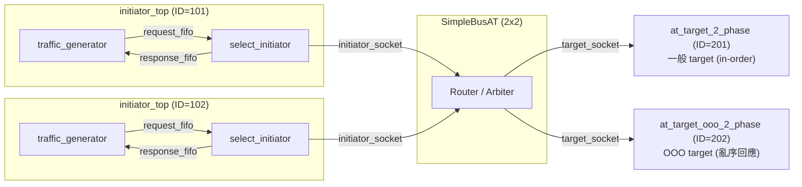
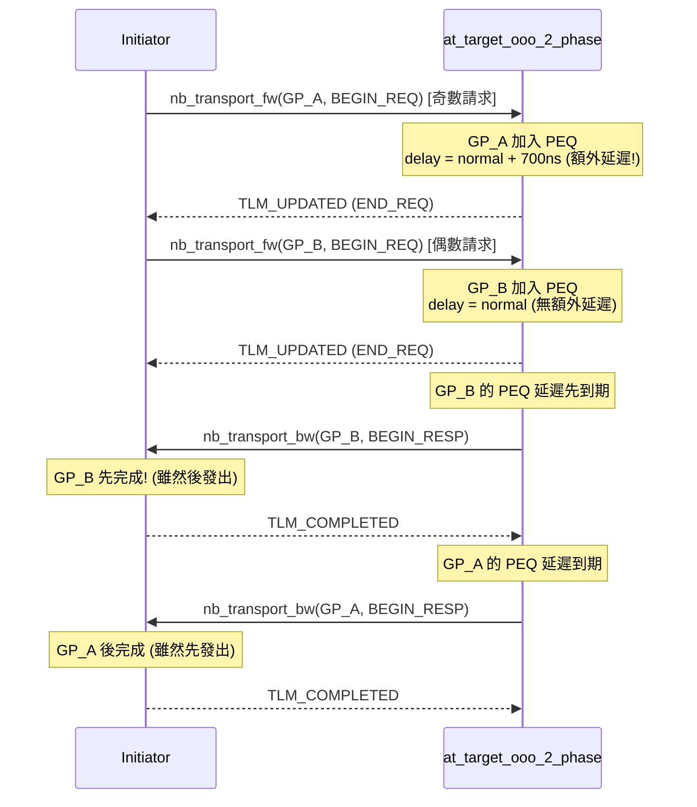

# at_ooo -- AT 亂序完成範例

> **難度**: 高級 | **軟體類比**: `Promise.race()` / async 回應以任意順序到達 | **原始碼**: `ref/systemc/examples/tlm/at_ooo/`

## 概述

`at_ooo` 展示了 TLM-2.0 AT 模式中的**亂序（Out-of-Order）交易完成**。在這個範例中，先發出的請求不一定先完成 -- 就像你同時發出多個 API 請求，回應可能以任意順序回來。

### 軟體類比：Promise.all 但回應順序不保證

```javascript
// 同時發出 3 個 API 請求
const p1 = fetch("/api/slow");    // 需要 700ms
const p2 = fetch("/api/fast");    // 需要 100ms
const p3 = fetch("/api/medium");  // 需要 300ms

// 回應到達順序: p2 (100ms), p3 (300ms), p1 (700ms)
// 不是發送順序: p1, p2, p3
```

或者用 Python 的 `asyncio`：

```python
async def main():
    tasks = [
        fetch_slow(),    # 第 1 個發出，但最後完成
        fetch_fast(),    # 第 2 個發出，但最先完成
        fetch_medium(),  # 第 3 個發出，中間完成
    ]
    # asyncio.as_completed 按完成順序回傳
    for coro in asyncio.as_completed(tasks):
        result = await coro
        print(f"Got result: {result}")
```

### 為什麼需要 OOO？

在真實的硬體系統中，不同的存取操作有不同的延遲：
- **快取命中（cache hit）**：幾個 clock cycle
- **快取未命中（cache miss）**：需要存取主記憶體，數百個 clock cycle
- **I/O 裝置存取**：可能需要數千個 clock cycle

如果所有請求都必須按順序完成（in-order），後面的快速請求必須等前面的慢請求完成，浪費了效能。**OOO 允許快速的請求先完成**，大幅提升系統吞吐量。

```
In-order (低效率):
  Request A (慢) ----[============================]
  Request B (快) --                                --[===]
  Request C (快) --                                       --[===]
                                                              ^-- 全部完成

Out-of-order (高效率):
  Request A (慢) ----[============================]
  Request B (快) ----[===]
  Request C (快) ----[===]
                                ^-- 全部完成 (更快!)
```

## 架構圖



## 亂序時序圖



## 檔案列表

| 檔案 | 說明 | 文件連結 |
| --- | --- | --- |
| `src/at_ooo.cpp` | `sc_main` 進入點 | [at-ooo.md](at-ooo.md) |
| `src/at_ooo_top.cpp` | 系統頂層模組 | [at-ooo.md](at-ooo.md) |
| `src/at_target_ooo_2_phase.cpp` | OOO target 實作 | [at-ooo.md](at-ooo.md) |
| `src/initiator_top.cpp` | Initiator 頂層模組 | [at-ooo.md](at-ooo.md) |
| `include/at_ooo_top.h` | 頂層標頭檔 | [at-ooo.md](at-ooo.md) |
| `include/at_target_ooo_2_phase.h` | OOO target 標頭檔 | [at-ooo.md](at-ooo.md) |
| `include/initiator_top.h` | Initiator 頂層標頭檔 | [at-ooo.md](at-ooo.md) |

## 核心概念速查

| TLM 概念 | 軟體對應 | 在本範例中的角色 |
| --- | --- | --- |
| Out-of-Order | `Promise.race()` / `asyncio.as_completed` | 回應不按請求順序回傳 |
| `m_delay_for_out_of_order` | 人為增加的延遲（模擬慢速操作） | 700ns 額外延遲造成奇數請求變慢 |
| `m_request_count` | 請求計數器 | 用 `count % 2` 決定是否加入額外延遲 |
| `peq_with_get` | Priority queue (按時間排序) | 較短延遲的交易會先被觸發 |

## 學習路徑建議

1. 建議先讀 [at_2_phase](../at_2_phase/_index.md)（OOO target 基於 2-phase 協定）
2. 讀 [at-ooo.md](at-ooo.md) 了解 OOO 的完整實作
3. 思考：在你的軟體專案中，哪些場景可以從 out-of-order 處理中獲益？
