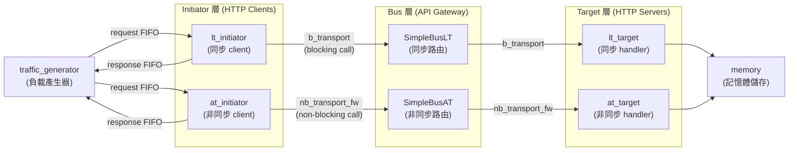

## 概觀

`common/` 目錄是所有 TLM 範例的共用元件庫。就像軟體專案中的 shared library，它提供了一組可重複使用的 HTTP client（initiator）、HTTP server（target）、API gateway（bus）與測試工具（traffic generator）。

每個 TLM 範例（如 `lt/`, `at_2_phase/`, `at_4_phase/` 等）都從這個元件庫中選取適合的組件來組裝系統。

### 軟體類比

| TLM 概念 | 軟體類比 |
|-----------|----------|
| Initiator | HTTP client（發送請求的一方） |
| Target | HTTP server / request handler（處理請求的一方） |
| Bus | API gateway / reverse proxy（如 nginx，負責路由） |
| Transaction (GP) | HTTP request/response 物件 |
| Socket | 雙向連線端點（類似 gRPC bidirectional channel） |
| DMI | 記憶體映射（如 `mmap`），繞過正常傳輸路徑的快速存取 |

## 架構圖

## 檔案清單

### Initiator 元件（請求發起方）

| 檔案 | 類型 | 說明 | 文件 |
|------|------|------|------|
| `lt_initiator.h/.cpp` | LT | 基本同步 initiator，使用 `b_transport` | [LT Initiators](lt-initiators.md) |
| `lt_dmi_initiator.h/.cpp` | LT+DMI | 支援 DMI 快速存取的同步 initiator | [LT Initiators](lt-initiators.md) |
| `lt_td_initiator.h/.cpp` | LT+TD | 支援 temporal decoupling 的同步 initiator | [LT Initiators](lt-initiators.md) |
| `at_initiator_explicit.h/.cpp` | AT | 明確管理所有 phase 的非同步 initiator | [AT Initiators](at-initiators.md) |
| `at_initiator_annotated.h/.cpp` | AT | 使用 annotated timing 簡化 phase 管理 | [AT Initiators](at-initiators.md) |
| `at_initiator_temporal_decoupling.h/.cpp` | AT+TD | 結合非同步協定與 temporal decoupling | [AT Initiators](at-initiators.md) |
| `select_initiator.h/.cpp` | AT | 能自動識別並處理 2/3/4 phase 協定的 initiator | [Infrastructure](infrastructure.md) |

### Target 元件（請求處理方）

| 檔案 | 類型 | 說明 | 文件 |
|------|------|------|------|
| `lt_target.h/.cpp` | LT | 基本同步 target，處理 `b_transport` | [LT Targets](lt-targets.md) |
| `lt_dmi_target.h/.cpp` | LT+DMI | 支援 DMI 指標提供的同步 target | [LT Targets](lt-targets.md) |
| `lt_synch_target.h/.cpp` | LT | 強制同步的 target（在 `b_transport` 內呼叫 `wait`） | [LT Targets](lt-targets.md) |
| `at_target_1_phase.h/.cpp` | AT | 單一 timing point 的非同步 target | [AT Targets](at-targets.md) |
| `at_target_1_phase_dmi.h/.cpp` | AT+DMI | 單一 timing point + DMI 支援 | [AT Targets](at-targets.md) |
| `at_target_2_phase.h/.cpp` | AT | 兩階段協定的非同步 target | [AT Targets](at-targets.md) |
| `at_target_4_phase.h/.cpp` | AT | 完整四階段協定的非同步 target | [AT Targets](at-targets.md) |

### 記憶體元件

| 檔案 | 說明 | 文件 |
|------|------|------|
| `memory.h/.cpp` | 通用記憶體實作，支援 read/write | [Memory](memory.md) |
| `dmi_memory.h/.cpp` | DMI 記憶體管理器，直接指標操作 | [Memory](memory.md) |

### 基礎設施元件

| 檔案 | 說明 | 文件 |
|------|------|------|
| `traffic_generator.h/.cpp` | 流量產生器，產生 write-then-read 測試模式 | [Infrastructure](infrastructure.md) |
| `extension_initiator_id.h/.cpp` | Generic payload 擴展，附加 initiator ID 字串 | [Infrastructure](infrastructure.md) |
| `reporting.h` + `report.cpp` | 統一的日誌輸出巨集與輔助函式 | [Infrastructure](infrastructure.md) |

### Bus 模型

| 檔案 | 說明 | 文件 |
|------|------|------|
| `models/SimpleBusLT.h` | LT 模式的簡單 bus（同步路由） | [Bus Models](bus-models.md) |
| `models/SimpleBusAT.h` | AT 模式的簡單 bus（非同步路由） | [Bus Models](bus-models.md) |

## 核心 TLM 概念速查

詳細說明請參閱 [TLM 規格解說](spec.md)。

- **LT (Loosely-Timed)**：使用 `b_transport` 的同步呼叫模式，像是 `await fetch()` -- 呼叫後阻塞直到完成
- **AT (Approximately-Timed)**：使用 `nb_transport_fw` / `nb_transport_bw` 的非同步模式，像是有進度回呼的非同步 HTTP 請求
- **Phase**：AT 協定中的步驟（`BEGIN_REQ` -> `END_REQ` -> `BEGIN_RESP` -> `END_RESP`），類似 TCP 握手階段
- **DMI (Direct Memory Interface)**：繞過正常傳輸路徑的快速記憶體存取，類似 `mmap` 或 kernel bypass
- **Temporal Decoupling**：允許 initiator 累積本地時間再同步，類似批次處理模式
- **Generic Payload (GP)**：標準化的交易物件，包含地址、資料、命令等，類似 HTTP request 物件
