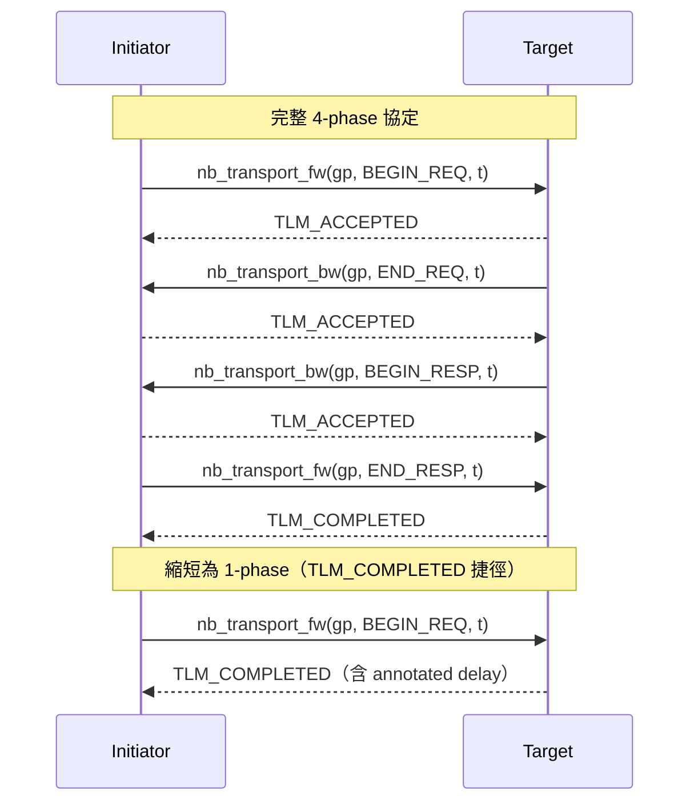
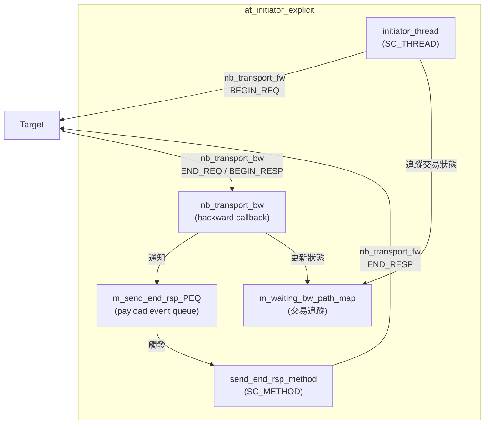
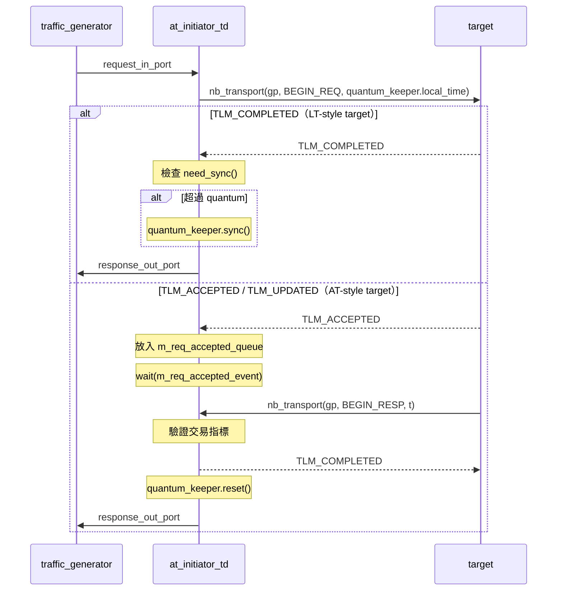
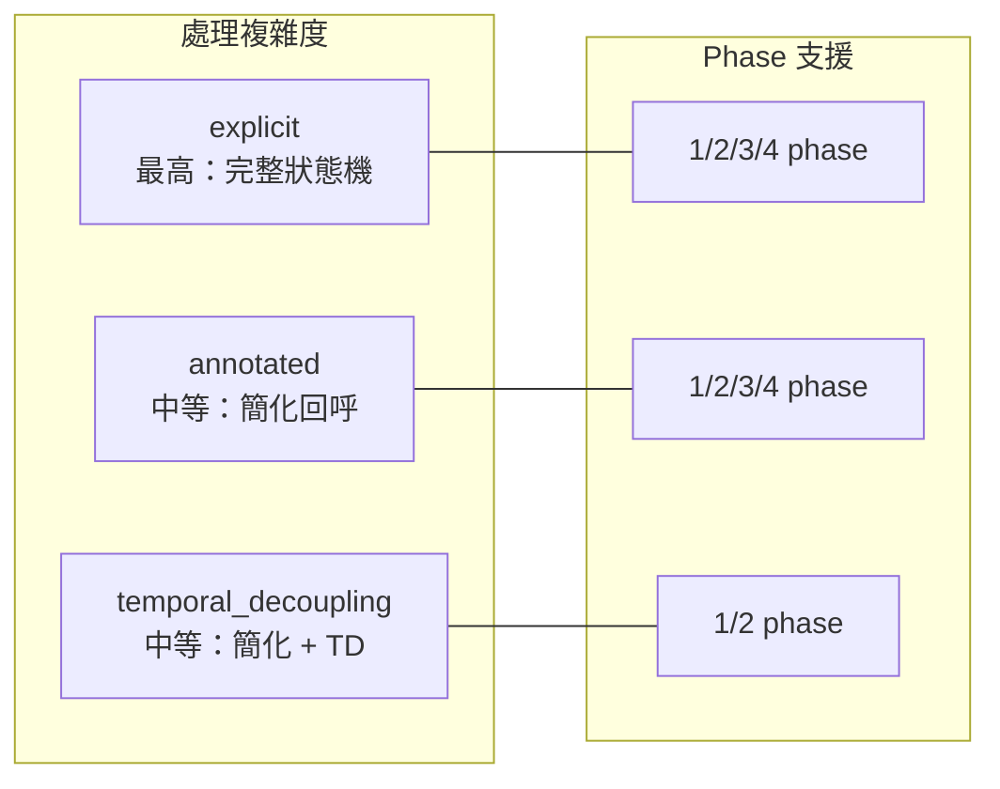

## 概觀

AT (Approximately-Timed) initiator 使用 **non-blocking transport** (`nb_transport_fw` / `nb_transport_bw`) 來發送交易。與 LT 的同步模式不同，AT 將一筆交易拆分成多個 phase，透過前向（forward）和後向（backward）路徑在 initiator 與 target 之間來回通訊。

### 軟體類比

AT 協定就像 HTTP/2 的多路復用請求 -- 你可以在還沒收到第一個請求的回應之前就發出第二個請求，而且每個請求都有明確的進度回呼：

```javascript
// AT 類比：非同步 HTTP 請求 + 進度回呼
const controller = new AbortController();
fetch('/api/data', { signal: controller.signal })
  .on('request-sent', () => { /* BEGIN_REQ 完成 */ })
  .on('request-accepted', () => { /* END_REQ，可以發下一個請求了 */ })
  .on('response-start', (data) => { /* BEGIN_RESP，收到回應開頭 */ })
  .on('response-end', () => { /* END_RESP，交易完成 */ });
```

## AT 協定的 Phase 模型



### 回傳值 (tlm_sync_enum) 的意義

| 回傳值 | 意義 | 軟體類比 |
|--------|------|----------|
| `TLM_COMPLETED` | 交易立即完成 | HTTP 200 OK（一次性回應） |
| `TLM_ACCEPTED` | 請求被接收，等待後續回呼 | HTTP 202 Accepted（非同步處理） |
| `TLM_UPDATED` | 請求被接收，且 phase 已被更新 | HTTP 100 Continue（帶附加資訊） |

## at_initiator_explicit -- 明確管理 Phase

**檔案**：`include/at_initiator_explicit.h`, `src/at_initiator_explicit.cpp`

這個 initiator **明確地**（explicitly）處理所有可能的 phase 轉換。它自己實作 `tlm_bw_transport_if` 介面，手動管理後向路徑上的所有回呼。

### 架構



### 關鍵成員

- **`m_waiting_bw_path_map`** -- 以 `std::map<gp*, previous_phase_enum>` 追蹤每筆進行中交易的狀態
- **`m_send_end_rsp_PEQ`** -- Payload Event Queue，用來排程 END_RESP 的發送時機
- **`m_enable_next_request_event`** -- 當 target 回應後，通知 `initiator_thread` 可以發送下一筆請求

### 工作流程

`initiator_thread` 發出 `nb_transport_fw(gp, BEGIN_REQ, delay)` 後，根據回傳值處理：

1. **`TLM_COMPLETED`** -- 1-phase 交易，直接 `wait(delay)` 然後完成
2. **`TLM_UPDATED`** --
   - 如果 phase 變成 `END_REQ`：交易進入等待回應狀態，加入 `m_waiting_bw_path_map`
   - 如果 phase 變成 `BEGIN_RESP`：直接排程 END_RESP
3. **`TLM_ACCEPTED`** -- 加入 map，等待 `m_enable_next_request_event`

`nb_transport_bw` 處理後向路徑回呼：

- **`END_REQ`**：通知 `m_enable_next_request_event`，更新 map 中的狀態
- **`BEGIN_RESP`**：將交易排入 `m_send_end_rsp_PEQ`，如果之前沒收到 END_REQ 也通知 enable event

`send_end_rsp_method`（SC_METHOD，敏感於 PEQ event）：
- 從 PEQ 取出交易，發送 `nb_transport_fw(gp, END_RESP, delay)`
- 期望收到 `TLM_COMPLETED`，然後將交易送回 traffic generator

## at_initiator_annotated -- Annotated Timing 風格

**檔案**：`include/at_initiator_annotated.h`, `src/at_initiator_annotated.cpp`

與 `at_initiator_explicit` 的 **header 完全相同**，差異在 `.cpp` 中對 `BEGIN_RESP` 的處理方式。

### Explicit vs Annotated 的差異

核心差異在 `nb_transport_bw` 處理 `BEGIN_RESP` 時：

| 方面 | explicit | annotated |
|------|----------|-----------|
| END_RESP 發送方式 | 排入 PEQ，由 `send_end_rsp_method` 用 `nb_transport_fw` 發送 | 直接在 `nb_transport_bw` 中修改 phase 為 `END_RESP`，回傳 `TLM_COMPLETED` |
| 回傳值 | `TLM_ACCEPTED` | `TLM_COMPLETED`（phase = END_RESP, delay = m_end_rsp_delay） |
| 交易完成時機 | 下一個 delta cycle（經過 PEQ 排程） | 立即在 callback 中完成 |
| 複雜度 | 較高，需要額外的 PEQ 排程 | 較低，在 callback 中一步完成 |

```cpp
// explicit 風格 -- BEGIN_RESP 處理
case tlm::BEGIN_RESP:
    m_send_end_rsp_PEQ.notify(transaction_ref, m_end_rsp_delay);  // 排程
    status = tlm::TLM_ACCEPTED;  // 稍後再發 END_RESP
    break;

// annotated 風格 -- BEGIN_RESP 處理
case tlm::BEGIN_RESP:
    phase  = tlm::END_RESP;           // 直接修改 phase
    delay  = m_end_rsp_delay;         // 設定 annotated delay
    status = tlm::TLM_COMPLETED;      // 一步完成
    response_out_port->write(&transaction_ref);  // 立即回傳
    break;
```

### 軟體類比

- **Explicit** 就像用 message queue 排程回應確認 -- 收到回應後，放一個「請發送確認」的 message，由另一個 worker 處理
- **Annotated** 就像直接在回呼函式中完成所有處理 -- 「收到回應了，確認完成，附帶一個 delay 參數」

## at_initiator_temporal_decoupling -- TD 風格

**檔案**：`include/at_initiator_temporal_decoupling.h`, `src/at_initiator_temporal_decoupling.cpp`

將 AT 非同步協定與 temporal decoupling（時間解耦）結合。使用 `tlm_quantumkeeper` 累積本地時間，減少與全域時鐘的同步次數。

### 與其他 AT initiator 的差異

| 方面 | explicit / annotated | temporal_decoupling |
|------|---------------------|---------------------|
| 後向介面 | `tlm_bw_transport_if<>` | `tlm_bw_nb_transport_if<>` |
| 時間管理 | 使用 `wait()` 同步 | 使用 `tlm_quantumkeeper` |
| nb_transport 呼叫 | `nb_transport_fw` (TLM-2.0) | `nb_transport`（舊式介面） |
| TLM_COMPLETED 處理 | `wait(delay)` | `m_QuantumKeeper.sync()` （僅在超過 quantum 時） |
| TLM_ACCEPTED 處理 | 追蹤 map + event | 簡單 queue + event |

### 工作流程



### 關鍵成員

- **`m_QuantumKeeper`** -- 管理本地時間累積，quantum 設為 500 ns
- **`m_req_accepted_queue`** -- 追蹤被 ACCEPTED 的交易（使用 `std::queue` 而非 `std::map`，因為只支援循序處理）
- **`m_req_accepted_event`** -- 當收到 `BEGIN_RESP` 回呼時，通知阻塞中的 `initiator_thread`

## 三者比較



| 特性 | explicit | annotated | temporal_decoupling |
|------|----------|-----------|---------------------|
| 適用場景 | 需要精確控制每個 phase | 需要較簡潔的程式碼 | 需要高模擬速度 |
| 交易追蹤 | `std::map` + enum | `std::map` + enum | `std::queue` |
| END_RESP 時機 | 排程到下一個 delta cycle | 在 callback 中立即完成 | 在 callback 中立即完成 |
| 時間同步 | 每筆交易 | 每筆交易 | 超過 quantum 才同步 |
| 程式碼複雜度 | 高 | 中 | 中 |
