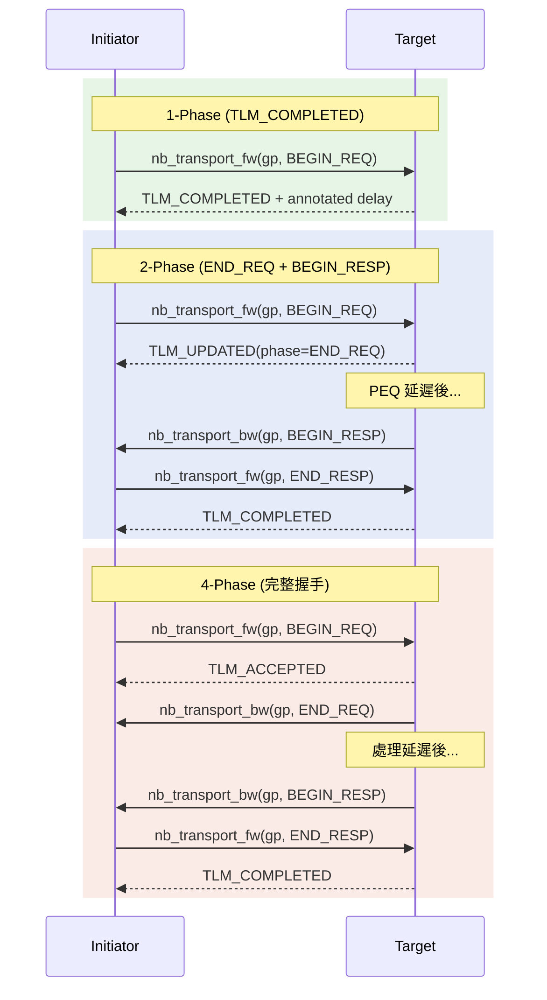
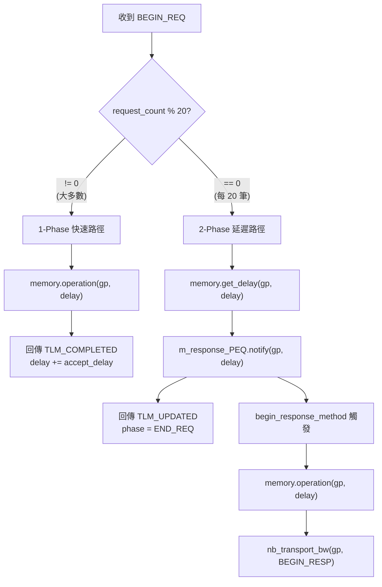
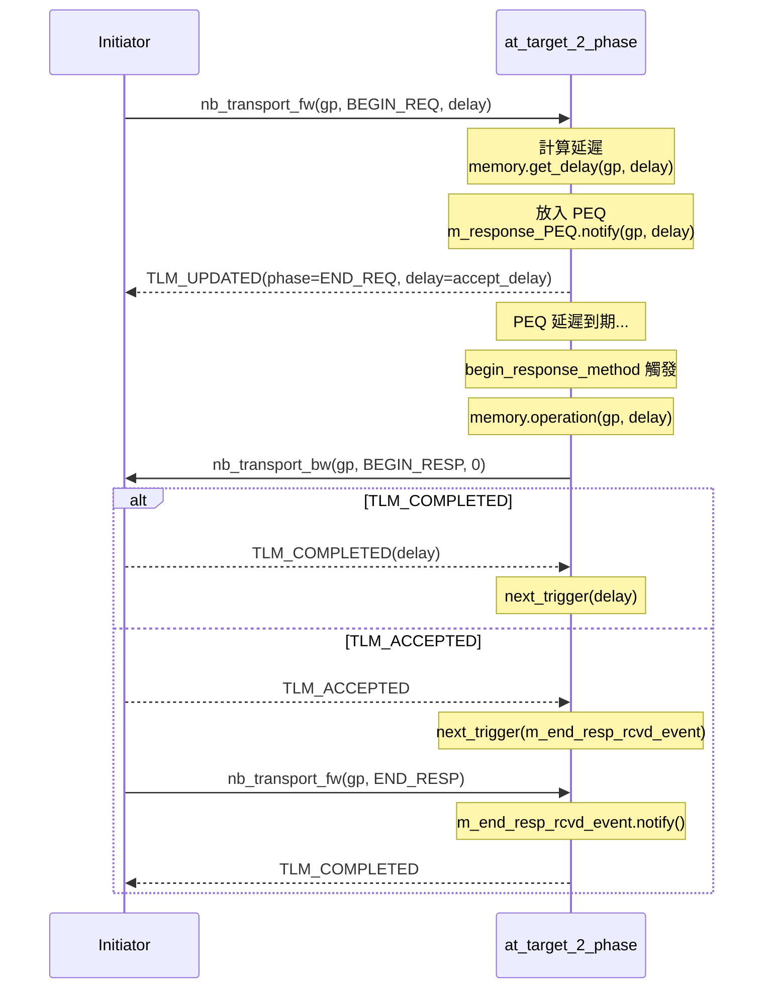
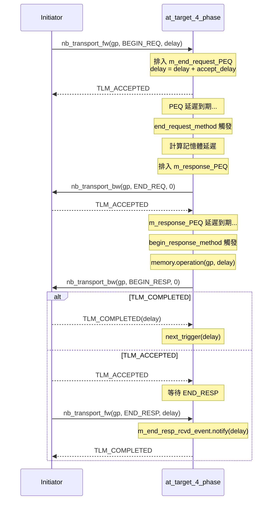
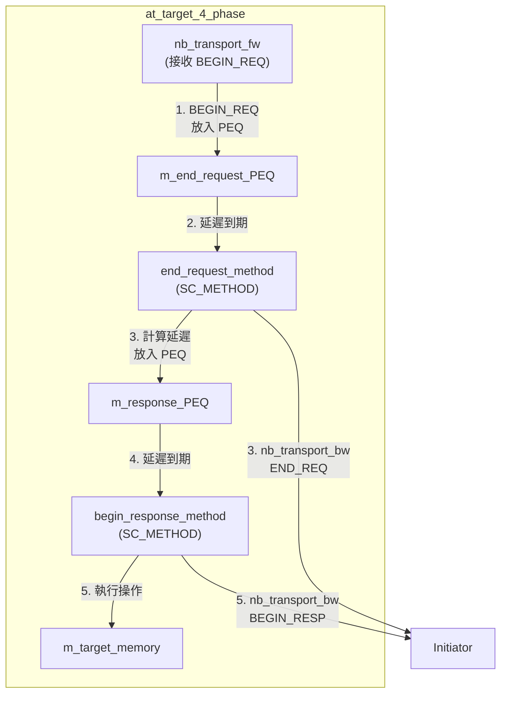

## 概觀

AT (Approximately-Timed) target 使用 `nb_transport_fw` 接收請求，並透過 `nb_transport_bw` 回傳結果。不同的 target 實作了不同的 phase 協定，提供從簡單到完整的時序精確度選項。

### 軟體類比：HTTP 協定演進

| AT Target | 軟體類比 | 特點 |
|-----------|----------|------|
| `at_target_1_phase` | HTTP/1.0 | 收到請求立即回應，一步完成 |
| `at_target_2_phase` | HTTP/1.1 | 分 request 和 response 兩個階段 |
| `at_target_4_phase` | HTTP/2 | 完整的 request-accept-response-confirm 流程 |

## Phase 協定比較



## 共同架構

所有 AT target 都繼承 `tlm_fw_transport_if<>` 並實作以下介面：

- **`nb_transport_fw`** -- 處理來自 initiator 的前向請求
- **`begin_response_method`**（SC_METHOD）-- 從 PEQ 取出交易，透過 `nb_transport_bw` 發回結果
- **`m_response_PEQ`**（`peq_with_get`）-- Payload Event Queue，用於延遲排程回應
- **`m_target_memory`**（`memory` 類型）-- 實際的記憶體讀寫操作

## at_target_1_phase -- 混合模式 Target

**檔案**：`include/at_target_1_phase.h`, `src/at_target_1_phase.cpp`

這個 target 支援**兩種**回應模式，根據請求計數器切換：

- **前 19 筆**（`m_request_count % 20 != 0`）：直接回傳 `TLM_COMPLETED`（1-phase 模式）
- **每第 20 筆**：回傳 `TLM_UPDATED`（phase = END_REQ），然後排程 `BEGIN_RESP`（2-phase 模式）

### 工作流程



### 為什麼混合兩種模式？

這個設計展示了一個重要的 TLM 概念：**initiator 必須能處理來自同一個 target 的不同回應模式**。在真實硬體中，某些操作可能立即完成（如 cache hit），某些需要多步驟（如 cache miss 後的 memory 存取）。

## at_target_1_phase_dmi -- 1-Phase + DMI

**檔案**：`include/at_target_1_phase_dmi.h`, `src/at_target_1_phase_dmi.cpp`

與 `at_target_1_phase` 相同的邏輯，但額外支援 DMI。header 檔實際上重複使用了 `at_target_1_phase.h`（兩者的 header guard 相同：`__AT_TARGET_1_PHASE_H__`）。

`.cpp` 檔的實作與 `at_target_1_phase.cpp` 完全相同，是為了讓不同的範例連結不同的 `.o` 檔案。

## at_target_2_phase -- 標準兩階段 Target

**檔案**：`include/at_target_2_phase.h`, `src/at_target_2_phase.cpp`

所有請求都走 **2-phase 路徑**（不像 `at_target_1_phase` 有快速路徑）。

### 工作流程



### 關鍵差異

與 `at_target_1_phase` 相比：

- **沒有**快速路徑（所有請求都走 PEQ）
- `nb_transport_fw` 在 `BEGIN_REQ` 時 **不執行** memory operation（只計算延遲）
- Memory operation 推遲到 `begin_response_method` 中執行

## at_target_4_phase -- 完整四階段 Target

**檔案**：`include/at_target_4_phase.h`, `src/at_target_4_phase.cpp`

實作完整的 4-phase 協定，是最精確的時序模型。

### 工作流程



### 架構特點



與 2-phase 的關鍵差異：

| 方面 | 2-phase | 4-phase |
|------|---------|---------|
| PEQ 數量 | 1 (`m_response_PEQ`) | 2 (`m_end_request_PEQ` + `m_response_PEQ`) |
| SC_METHOD 數量 | 1 (`begin_response_method`) | 2 (`end_request_method` + `begin_response_method`) |
| BEGIN_REQ 回傳 | `TLM_UPDATED`（phase = END_REQ） | `TLM_ACCEPTED`（END_REQ 稍後回傳） |
| END_REQ 發送方式 | 內嵌在 `nb_transport_fw` 回傳值 | 獨立的 `nb_transport_bw` 呼叫 |
| 時序分離 | request/response 兩個時間點 | accept/end_request/begin_response/end_response 四個時間點 |

## 四種 AT Target 的整體比較

| 特性 | 1-phase | 1-phase DMI | 2-phase | 4-phase |
|------|---------|-------------|---------|---------|
| Phase 數量 | 混合 1/2 | 混合 1/2 | 固定 2 | 固定 4 |
| PEQ 數量 | 1 | 1 | 1 | 2 |
| SC_METHOD 數量 | 1 | 1 | 1 | 2 |
| DMI 支援 | 否 | 是（stub） | 否 | 否 |
| 快速路徑 | 是（19/20 筆） | 是（19/20 筆） | 否 | 否 |
| 時序精確度 | 低~中 | 低~中 | 中 | 高 |
| Extension 支援 | 否 | 否 | 否 | 有（選用） |
| 適用場景 | 混合模式測試 | DMI + AT 測試 | 標準 AT 驗證 | 精確時序模型 |

### Extension 支援 (at_target_4_phase)

`at_target_4_phase` 在編譯時可選擇支援 `extension_initiator_id` 擴展：

```cpp
#ifdef USING_EXTENSION_OPTIONAL
extension_initiator_id *extension_pointer;
gp.get_extension(extension_pointer);
if (extension_pointer) {
    // 可讀取 extension_pointer->m_initiator_id
}
#endif
```

這展示了 TLM generic payload 的擴展機制 -- 類似 HTTP headers，允許在標準 payload 上附加自訂資訊。
